# System Design — A Complete Engineering Handbook

**Everything that goes into designing a large-scale system: the method, the building blocks, the failure modes, and the trade-offs — explained with diagrams.**


Most system design material is a list of technologies. This is not that.

This repository is about **the reasoning**: why a system has the shape it has, what
each component actually buys you, what it costs, and the conditions under which the
right answer flips to the opposite answer. A cache is not "good" — a cache is a bet
that reads outnumber writes and that stale data is survivable. A queue is not
"good" — a queue converts a latency problem into an ordering problem. Every
component in this handbook is presented as a trade, never as a recommendation.

Every diagram is Mermaid and renders natively on GitHub. Sources are also kept
standalone in [`diagrams/`](diagrams/) so you can drop them into slides or docs.

> **Companion repository.** Storage internals — indexes, transactions, locks,
> replication, partitioning and sharding at the engine level — live in
> [Database-Design](https://github.com/ahmedselimmansor-ctrl/Database-Design).
> This handbook treats the database as a component; that one opens it up.

---

## Who this is for

| You are | Read this way |
|---|---|
| **Preparing for an interview** | §1 (method) → §33 (playbook) → [`docs/11-case-studies.md`](docs/11-case-studies.md). Do the case studies with a timer. |
| **Designing something real** | §2–§4 first — get the requirements and the numbers honest before choosing anything. Then jump to the sections your numbers implicate. |
| **Reviewing someone's design** | §32 (anti-patterns) and §27 (resilience). Most bad designs are not wrong, they are unfalsifiable. |
| **Learning the field** | Straight through. Each section assumes only the ones before it. |

---

## Table of contents

**Part I — Method**
- [1. How to design a system](#1-how-to-design-a-system)
- [2. Requirements](#2-requirements)
- [3. Capacity estimation](#3-capacity-estimation)
- [4. Numbers every engineer should know](#4-numbers-every-engineer-should-know)

**Part II — Structure**
- [5. The shape of a large system](#5-the-shape-of-a-large-system)
- [6. The scaling ladder](#6-the-scaling-ladder)
- [7. Load balancing](#7-load-balancing)
- [8. Caching](#8-caching)
- [9. Content delivery networks](#9-content-delivery-networks)

**Part III — Data**
- [10. Choosing a data store](#10-choosing-a-data-store)
- [11. CAP, PACELC and consistency models](#11-cap-pacelc-and-consistency-models)
- [12. Replication and partitioning](#12-replication-and-partitioning)
- [13. Consistent hashing](#13-consistent-hashing)

**Part IV — Communication**
- [14. Asynchronous processing and queues](#14-asynchronous-processing-and-queues)
- [15. Delivery semantics and the outbox](#15-delivery-semantics-and-the-outbox)
- [16. Services and boundaries](#16-services-and-boundaries)
- [17. Protocols](#17-protocols)
- [18. API design](#18-api-design)
- [19. Rate limiting](#19-rate-limiting)

**Part V — Correctness in a distributed world**
- [20. Distributed transactions and sagas](#20-distributed-transactions-and-sagas)
- [21. Consensus, leaders and quorums](#21-consensus-leaders-and-quorums)
- [22. Idempotency](#22-idempotency)
- [23. Unique ID generation](#23-unique-id-generation)

**Part VI — Specialised subsystems**
- [24. Search](#24-search)
- [25. Object and blob storage](#25-object-and-blob-storage)
- [26. Observability and SLOs](#26-observability-and-slos)

**Part VII — Operating it**
- [27. Resilience patterns](#27-resilience-patterns)
- [28. Multi-region and disaster recovery](#28-multi-region-and-disaster-recovery)
- [29. Deployment and release](#29-deployment-and-release)
- [30. Security](#30-security)
- [31. Cost](#31-cost)

**Part VIII — Judgement**
- [32. Anti-patterns](#32-anti-patterns)
- [33. The interview playbook](#33-the-interview-playbook)
- [34. Case studies](#34-case-studies)
- [35. Glossary](#35-glossary)

### Deep dives

| Document | What it covers |
|---|---|
| [docs/01-the-method.md](docs/01-the-method.md) | The full design procedure, requirement elicitation, capacity math longhand |
| [docs/02-scalability-and-load-balancing.md](docs/02-scalability-and-load-balancing.md) | Universal Scalability Law, LB algorithms, health checking, connection draining, service discovery |
| [docs/03-caching-and-cdn.md](docs/03-caching-and-cdn.md) | Cache patterns, eviction, invalidation, stampede protection, CDN internals, HTTP cache headers |
| [docs/04-data-and-consistency.md](docs/04-data-and-consistency.md) | CAP proof sketch, PACELC, the full consistency hierarchy, session guarantees, CRDTs |
| [docs/05-messaging-and-async.md](docs/05-messaging-and-async.md) | Queue vs log, Kafka mechanics, delivery semantics, outbox, DLQ, backpressure, ordering |
| [docs/06-microservices-and-apis.md](docs/06-microservices-and-apis.md) | Decomposition, DDD boundaries, REST/gRPC/GraphQL, versioning, pagination, BFF, service mesh |
| [docs/07-distributed-transactions-and-consensus.md](docs/07-distributed-transactions-and-consensus.md) | 2PC, 3PC, sagas, Raft in detail, quorums, leases, clocks, FLP |
| [docs/08-resilience-and-failure.md](docs/08-resilience-and-failure.md) | Timeouts, retries, jitter, circuit breakers, bulkheads, shedding, chaos, failure taxonomy |
| [docs/09-observability-and-operations.md](docs/09-observability-and-operations.md) | Metrics/logs/traces, SLI/SLO/error budgets, alerting, on-call, incident response, postmortems |
| [docs/10-security.md](docs/10-security.md) | AuthN vs AuthZ, OAuth2/OIDC, JWT pitfalls, secrets, zero trust, OWASP, DDoS, multi-tenancy |
| [docs/11-case-studies.md](docs/11-case-studies.md) | Ten designs worked end to end: shortener, feed, chat, rate limiter, and more |
| [docs/12-interview-playbook.md](docs/12-interview-playbook.md) | Minute-by-minute structure, scoring rubric, phrases that signal seniority |
| [docs/13-numbers-and-cheatsheets.md](docs/13-numbers-and-cheatsheets.md) | Latency table, unit math, QPS/storage/bandwidth formulas, decision tables |

---

## Part I — Method

## 1. How to design a system

There is a procedure. It is not creative, and following it mechanically will beat
improvisation almost every time. The failure mode of untrained designers is
**jumping to components** — "we'll use Kafka and Redis" — before anyone has
established what the system must do or how big it is.

The order matters because each step's output is the next step's input. You cannot
choose a data store before you know the read/write ratio. You cannot know the
read/write ratio before you know the access patterns. You cannot know the access
patterns before you know the features.

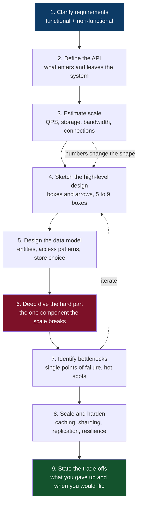

### 1.1 The three questions behind every decision

Whenever you place a box on the diagram, you should be able to answer:

| Question | Why it matters |
|---|---|
| **What does this buy me?** | If you cannot name the specific property gained — lower p99, higher availability, decoupled deploys — the component is decoration. |
| **What does it cost?** | Every component adds a failure mode, an operational burden, a consistency wrinkle, and a bill. |
| **What would make me remove it?** | If no realistic change in requirements would remove the component, you have not understood it. |

### 1.2 The single most useful habit

**Say the number out loud.** "Ten thousand writes per second" and "ten writes per
second" are different systems with almost no overlap in design. Most disagreements
in design reviews evaporate the moment somebody computes the actual load. A
surprising fraction of systems that people want to shard fit comfortably on one
machine with an index.

---

## 2. Requirements

### 2.1 Functional vs non-functional

**Functional** requirements say what the system does. **Non-functional**
requirements say how well, and they are what actually determine architecture. A
system that stores messages is easy; a system that stores messages with a p99 of
50 ms across three continents, never loses one, and stays up during a data centre
fire is an architecture.

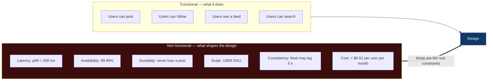

### 2.2 The non-functional checklist

Walk this list explicitly. Each line has a design consequence.

| Property | Ask | Typical consequence if strict |
|---|---|---|
| **Latency** | p50, p95, p99, p999 — and for which operation? | Caching, read replicas, edge compute, precomputation |
| **Throughput** | Peak QPS, not average. Peak-to-average ratio? | Horizontal scaling, queues, autoscaling headroom |
| **Availability** | 99.9% (8.8 h/yr) vs 99.99% (52 min/yr) vs 99.999% (5 min/yr) | Redundancy at every tier, multi-AZ then multi-region |
| **Durability** | Is losing one record acceptable? Ever? | Replication factor, sync commits, backups, WAL |
| **Consistency** | Must a read reflect the write that just happened? | Strong reads, leader routing, or explicit staleness budget |
| **Freshness** | How stale may derived data be? | Batch vs streaming, cache TTL |
| **Scale trajectory** | 10x in a year? 100x? | Design for 10x, plan for 100x, do not build for 1000x |
| **Read/write ratio** | 100:1? 1:1? | Read-heavy → cache and replicas. Write-heavy → partitioning, LSM stores |
| **Data size** | Total, and per record | Fits in RAM? On one disk? Determines everything |
| **Access pattern** | Point lookups, ranges, aggregations, full scans? | Index design, store choice |
| **Security & compliance** | PII? GDPR? Data residency? PCI? | Regional storage, encryption, audit logs, deletion pipelines |
| **Cost** | Budget per user, per request, per GB | Storage tiering, cache hit ratio targets, instance choice |

### 2.3 Availability arithmetic

Availability composes **multiplicatively** through serial dependencies. This is the
most under-appreciated fact in system design.

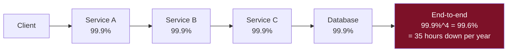

Four nines-and-a-half components in series produce a three-nines system. The fixes:

- **Reduce serial depth.** Every hop you remove multiplies availability back up.
- **Make dependencies non-critical.** If service C failing degrades rather than
  breaks the response, it leaves the availability product.
- **Add redundancy in parallel.** Two independent 99% replicas in parallel give
  `1 − 0.01² = 99.99%` — *provided the failures are truly independent*, which
  correlated failures (shared power, shared config push, shared dependency)
  routinely violate.

| Nines | Downtime per year | Downtime per month | What it demands |
|---|---|---|---|
| 99% | 3.65 days | 7.2 hours | A single server and a pager |
| 99.9% | 8.77 hours | 43.8 minutes | Redundancy, health checks, fast restarts |
| 99.99% | 52.6 minutes | 4.4 minutes | Multi-AZ, automated failover, canary deploys |
| 99.999% | 5.26 minutes | 26 seconds | Multi-region active-active, no manual step in any recovery path |

> **Rule of thumb.** Each additional nine costs roughly an order of magnitude more
> — in money, in complexity, and in the number of things engineers may no longer do
> casually. Ask what the business actually loses per minute of downtime before
> committing to a target.

---

## 3. Capacity estimation

The point of estimation is not precision. It is **discovering the shape of the
problem** — whether data fits in memory, whether one machine suffices, whether
bandwidth or storage dominates the bill.

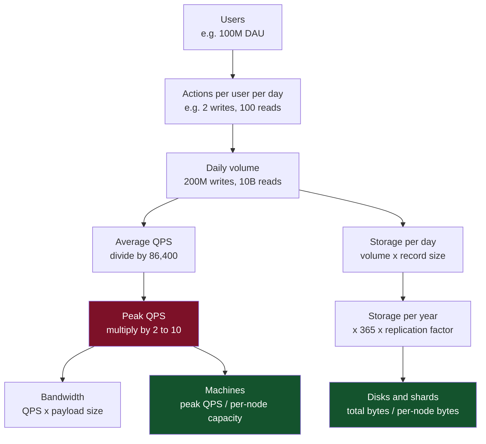

### 3.1 The four quantities

1. **QPS** — `daily_actions ÷ 86,400` for the average; multiply by the peak factor.
   86,400 ≈ 10⁵, so *one action per user per day for 1 M users ≈ 12 QPS*. Memorise
   that anchor and scale from it.
2. **Storage** — `records/day × bytes/record × retention_days × replication_factor`.
   Add 20–40% for indexes and per-row overhead; add more for a write-amplifying
   engine.
3. **Bandwidth** — `QPS × payload_bytes`, computed separately for ingress and
   egress. Egress is usually the one with a price tag.
4. **Memory** — the working set you intend to cache. Under a Zipfian access
   distribution, 20% of the keys typically absorb 80% of the reads, so caching the
   hot 20% often buys a hit ratio in the high 80s.

### 3.2 A worked example — a Twitter-shaped service

```
Users:            300 M total, 150 M DAU
Writes:           2 tweets/user/day        → 300 M tweets/day
Reads:            50 timeline views/day    → 7.5 B reads/day

Write QPS   = 300M / 86,400              ≈ 3,500 /s   (peak x3 ≈ 10,500 /s)
Read QPS    = 7.5B / 86,400              ≈ 87,000 /s  (peak x3 ≈ 260,000 /s)
Read:write ratio                          ≈ 25:1      → read-optimised design

Tweet size  = 280 chars (~560 B UTF-8) + 200 B metadata ≈ 800 B
Storage/day = 300M x 800 B               ≈ 240 GB/day
Storage/yr  = 240 GB x 365               ≈ 88 TB/year  (x3 replicas ≈ 264 TB)
Media       = 10% of tweets x 2 MB       ≈ 60 TB/day   → media dominates by 250x

Egress      = 260k reads/s x 20 tweets x 800 B ≈ 4.2 GB/s ≈ 34 Gbps
Cache       = 20% of a day's tweets in RAM ≈ 48 GB → trivially affordable
```

The estimate has already produced four architectural conclusions before a single
component was named:

- The system is **read-dominated 25:1** → precompute timelines, cache aggressively.
- **Media is 250× the text volume** → media belongs in object storage behind a CDN,
  never in the database.
- Text is **88 TB/year** → too big for one node long-term, so partition by user or
  time, but small enough that this is not exotic.
- The hot working set is **tens of GB** → a cache tier will genuinely work.

> The full longhand version of this, with the unit conversions spelled out, is in
> [`docs/01-the-method.md`](docs/01-the-method.md) and
> [`docs/13-numbers-and-cheatsheets.md`](docs/13-numbers-and-cheatsheets.md).

### 3.3 Estimation discipline

- **Round hard.** 86,400 → 100,000. 1 M → 10⁶. You want an exponent, not a digit.
- **Peak, never average.** Systems die at peak. Peak-to-average is 2–3× for global
  consumer traffic, 5–10× for regional or event-driven traffic, and can exceed 100×
  for scheduled events — ticket sales, tax deadlines, flash sales.
- **State the assumption.** "Assuming 2 posts per user per day" is a fact your
  reviewer can challenge. A bare number is not.
- **Sanity-check against a machine.** A modern server handles roughly 10k–50k
  simple HTTP requests/s, a Postgres node maybe 5k–20k simple transactions/s, a
  Redis node 100k+ ops/s. If your requirement is 300 QPS, you do not have a
  distributed systems problem.

---

## 4. Numbers every engineer should know

The point of this table is **relative magnitude**. Memory is ~100× faster than a
local SSD; an SSD is ~100× faster than a spinning disk seek; a cross-continent
round trip is ~1000× an SSD read and is bounded by physics, not engineering.

| Operation | Latency | Relative to 1 ns = 1 second |
|---|---|---|
| L1 cache reference | 1 ns | 1 second |
| Branch mispredict | 3 ns | 3 seconds |
| L2 cache reference | 4 ns | 4 seconds |
| Mutex lock/unlock | 17 ns | 17 seconds |
| Main memory reference | 100 ns | 1.7 minutes |
| Compress 1 KB (Snappy) | 2 µs | 33 minutes |
| Read 1 MB sequentially from memory | 3 µs | 50 minutes |
| SSD random read | 16 µs | 4.4 hours |
| Read 1 MB sequentially from SSD | 49 µs | 13.6 hours |
| Round trip within same datacenter | 500 µs | 5.8 days |
| Read 1 MB sequentially from disk | 825 µs | 9.5 days |
| Disk seek | 2 ms | 23 days |
| Round trip CA → Netherlands → CA | 150 ms | 4.8 years |

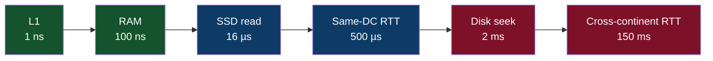

### 4.1 The consequences

- **Cross-region synchronous calls are a design decision, not a detail.** 150 ms is
  the speed of light in fibre plus routing. No amount of optimisation removes it.
  If a user-facing request makes two of them serially, your p99 starts at 300 ms.
- **Chatty is worse than fat.** Ten sequential 1 ms calls cost more than one 5 ms
  call returning ten times the data. Batch, or parallelise with a fan-out.
- **Memory is a different universe from disk.** If your working set fits in RAM,
  say so early — it removes entire subsystems from the design.
- **Sequential beats random by orders of magnitude**, on SSD as well as disk. This
  single fact is why log-structured storage, append-only logs, and columnar formats
  exist.

### 4.2 Capacity anchors

| Resource | Realistic single-node figure |
|---|---|
| Commodity server | 32–128 cores, 128 GB–2 TB RAM, 1–10 Gbps NIC |
| NVMe SSD | 1–8 TB, 100k–1M IOPS, 2–7 GB/s sequential |
| HTTP requests (simple, per node) | 10k–50k /s |
| Relational DB (per node, simple TX) | 5k–20k /s |
| Redis (per node) | 100k–1M ops/s |
| Kafka (per broker) | 100k–1M msgs/s, hundreds of MB/s |
| A single TCP connection | ~65k ephemeral ports per source IP per destination |

---

## Part II — Structure

## 5. The shape of a large system

Almost every internet-scale system converges on the same layered anatomy. The
details differ wildly; the *layers* almost never do. Learn this shape and you have
a default answer to "draw the high-level architecture" that is never wrong, only
incomplete.

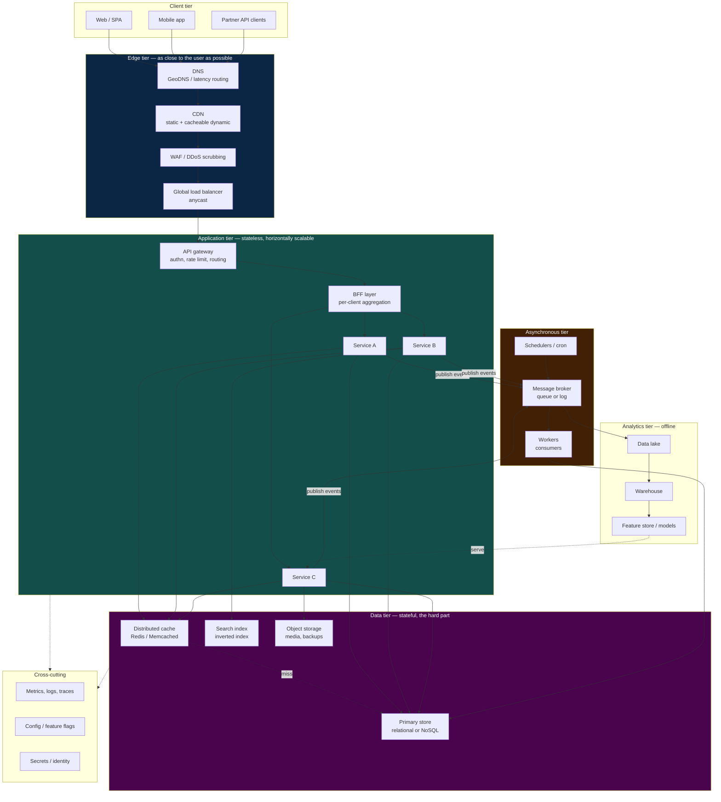

### 5.1 The one structural rule

> **Push state down and out.** Keep the application tier stateless so any request
> can land on any node; concentrate state in systems purpose-built to manage it.

Statelessness is what makes the application tier trivially scalable, trivially
deployable, and trivially recoverable — a node that holds nothing can be killed at
any moment. Everything difficult in this handbook lives in the data tier for
exactly that reason.

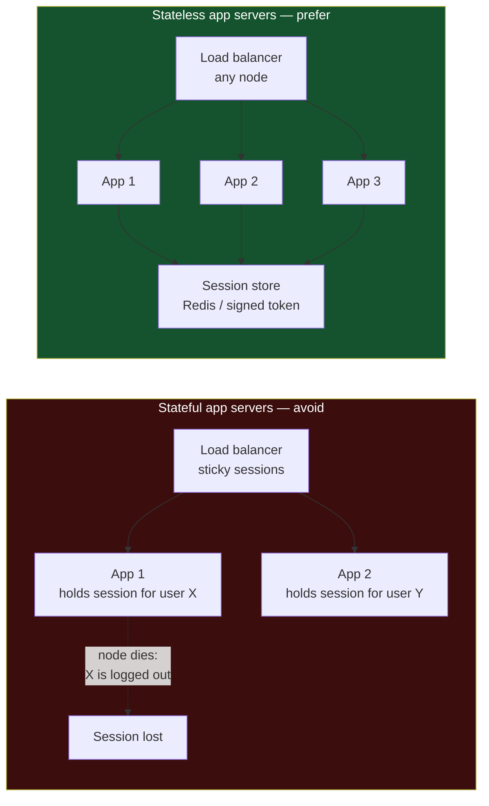

Where state genuinely must be local — a WebSocket connection, an in-memory game
room, a stream processing operator's window — isolate it into a dedicated tier with
explicit membership, routing and rebalancing, and do not let it contaminate the
ordinary request path.

---

## 6. The scaling ladder

Systems do not leap to a final architecture. They climb a ladder, and **each rung is
a response to a specific measured bottleneck**. Skipping rungs is how teams end up
operating Kubernetes and Kafka to serve 200 requests per second.

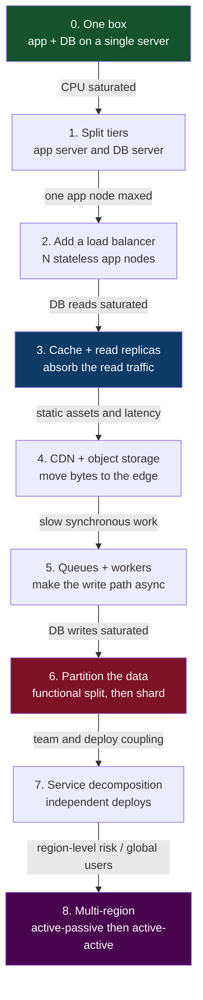

| Rung | Buys you | Costs you |
|---|---|---|
| 1. Split tiers | Independent resource scaling | A network hop |
| 2. Load balancer + N nodes | Horizontal capacity, node-failure tolerance | Statelessness discipline, LB as an SPOF until it too is redundant |
| 3. Cache + replicas | Order-of-magnitude read capacity | Staleness, invalidation bugs, replication lag |
| 4. CDN + blob store | Latency, egress cost, origin offload | Cache purge complexity, another vendor |
| 5. Queues + workers | Smoothed spikes, faster responses | Eventual consistency, ordering, DLQs, duplicate handling |
| 6. Sharding | Write capacity beyond one node | Cross-shard queries and transactions, rebalancing, hot shards |
| 7. Microservices | Team autonomy, independent deploys | Distributed debugging, network failure everywhere, data duplication |
| 8. Multi-region | Survive a region, serve global users | Conflict resolution, cross-region cost, ferocious operational complexity |

### 6.1 Vertical vs horizontal

| | Vertical (scale up) | Horizontal (scale out) |
|---|---|---|
| Method | Bigger machine | More machines |
| Ceiling | Hard — largest instance available | Effectively unbounded |
| Complexity | Near zero — no code changes | High — distribution, coordination, partial failure |
| Fault tolerance | None; one machine is one failure | Inherent, if the design is stateless |
| Cost curve | Superlinear at the top end | Roughly linear, plus coordination overhead |
| Use when | Early, or for stateful stores that are hard to distribute | Stateless tiers, and any tier past the vertical ceiling |

The pragmatic sequence is **scale up until it is expensive, then scale out** — and
for databases specifically, scale up considerably longer than instinct suggests. A
single modern database server with fast NVMe and 1 TB of RAM will carry workloads
that teams routinely try to shard prematurely.

### 6.2 Why adding nodes stops helping

Throughput does not scale linearly with node count. The **Universal Scalability
Law** captures why: contention over shared resources gives sublinear returns, and
the coherency cost of keeping nodes consistent with each other eventually makes
throughput *decrease*.

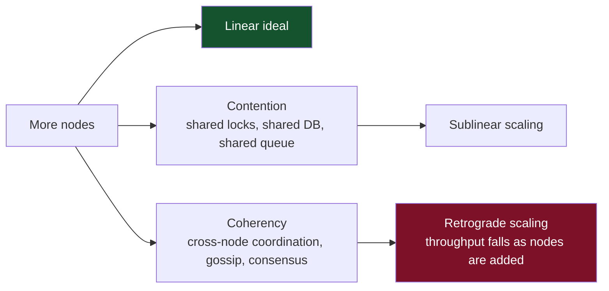

The practical lesson: **find and remove the serialised resource**. A global lock, a
single sequence generator, a shared primary database, or a coordination service on
the hot path will cap the entire system regardless of how many application nodes
you run. Derivation and the σ/κ parameters are in
[`docs/02-scalability-and-load-balancing.md`](docs/02-scalability-and-load-balancing.md).

---

## 7. Load balancing

A load balancer distributes traffic across a pool of backends, removes unhealthy
ones, and is the point at which a fleet becomes a service.

### 7.1 Layer 4 vs Layer 7

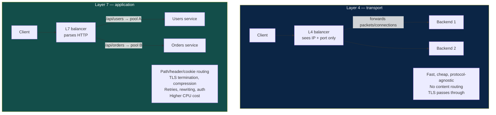

Real systems use both: an L4 layer (or anycast) for raw connection distribution and
DDoS absorption at the edge, and an L7 layer inside for routing, retries and
observability.

### 7.2 Algorithms

| Algorithm | How it works | Best for | Weakness |
|---|---|---|---|
| **Round robin** | Next backend in rotation | Uniform requests, uniform nodes | Ignores actual load; one slow node still gets its share |
| **Weighted round robin** | Rotation weighted by capacity | Heterogeneous hardware | Static weights drift from reality |
| **Least connections** | Fewest active connections wins | Variable request durations | A node that fails *fast* looks idle and attracts traffic |
| **Least response time** | Lowest latency × connections | Latency-sensitive services | Needs accurate, recent measurements |
| **Power of two choices** | Sample 2 at random, pick the less loaded | Large fleets — near-optimal, no global state | Slightly worse than true least-loaded |
| **IP hash / consistent hash** | Hash a key to a backend | Cache affinity, sticky routing | Uneven distribution; rebalancing on membership change |
| **Random** | Uniform random pick | Baseline, huge fleets | No load awareness at all |

> **Power of two choices** deserves special mention: sampling two backends at random
> and choosing the less loaded gives you nearly the benefit of global least-loaded
> with none of the coordination. It is the default in most modern service meshes.

### 7.3 Health checks and draining

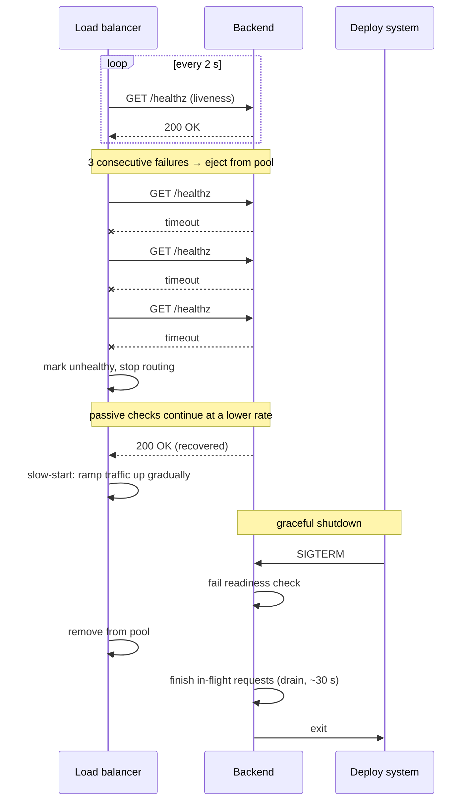

Three distinct checks matter, and conflating them causes outages:

- **Liveness** — is the process alive? Failure → restart it.
- **Readiness** — can it serve traffic *right now*? Failure → remove from the pool
  but do not kill. Used during warm-up, cache priming, and drain.
- **Deep/dependency health** — can it reach its database? Use with great care: if
  every node reports unhealthy because a shared dependency blipped, the balancer
  removes the entire fleet and converts a partial degradation into a total outage.
  Most mature systems make the deep check *report* but not *evict*, or apply a
  minimum-healthy-fraction rule that refuses to eject below, say, 50% of the pool.

### 7.4 Getting traffic to the balancer

| Mechanism | How | Notes |
|---|---|---|
| **DNS round robin** | Multiple A records | Free and simple. Client and resolver caching make failover slow and uneven; TTLs are advisory at best. |
| **GeoDNS / latency-based DNS** | Resolver location decides the answer | Standard for multi-region. Same caching caveats. |
| **Anycast** | One IP advertised from many locations; BGP picks | Sub-second regional failover, excellent for DDoS absorption. Route flaps can break long-lived connections. |
| **Client-side balancing** | Client fetches the backend list and chooses | No extra hop; ideal for internal gRPC. Requires smart clients and a discovery service. |
| **Service mesh sidecar** | Per-pod proxy does discovery, LB, retries, mTLS | Uniform policy and telemetry. Real resource and latency overhead. |

---

## 8. Caching

Caching is the highest-leverage optimisation in most systems and the most common
source of subtle bugs. A cache is a **bet that the same data will be read again
soon, and that a slightly old answer is acceptable**. When either half of that bet
is wrong, the cache is at best useless and at worst incorrect.

### 8.1 The cache hierarchy

There is never one cache. There are seven, and a request may be served by any of
them.

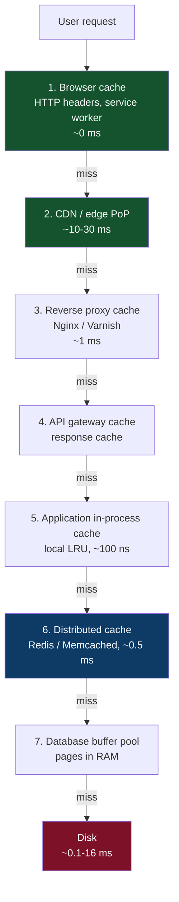

Each layer trades **freshness for speed** and **hit ratio for coherence**. The
further from the origin, the faster the hit and the harder the invalidation.

### 8.2 Read patterns

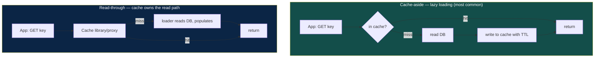

**Cache-aside** keeps the application in control and survives a cache outage — a
dead cache degrades to slow, not broken. Its costs are boilerplate at every call
site and a window where a concurrent write can be overwritten by a stale read
populating the cache. **Read-through** centralises the logic and eliminates
duplicated code, at the price of coupling the application to a cache that is now on
the critical path.

### 8.3 Write patterns

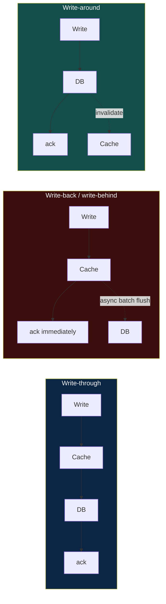

| Pattern | Latency | Durability | Consistency | Use when |
|---|---|---|---|---|
| **Write-through** | Slower writes | Safe | Cache always fresh | Read-after-write matters and writes are modest |
| **Write-back** | Fastest writes | **Data loss on cache failure** | Cache is the source of truth until flushed | Counters, metrics, sessions — tolerable loss, huge write volume |
| **Write-around** | Normal | Safe | Cache may be cold | Write-heavy data rarely read soon after writing |
| **Write-invalidate** | Normal | Safe | Next read repopulates | The pragmatic default — pairs with cache-aside |

> **Prefer invalidate over update.** Writing the new value into the cache looks
> tidier but reintroduces a race: two concurrent writers can leave the cache holding
> the older value permanently. Deleting the key is idempotent and self-healing —
> the next read repopulates from the source of truth.

### 8.4 Eviction

| Policy | Rule | Good for | Bad for |
|---|---|---|---|
| **LRU** | Evict least recently used | General purpose | A full scan flushes the whole cache |
| **LFU** | Evict least frequently used | Stable hot sets | Slow to adapt; old hot keys linger |
| **TinyLFU / W-TinyLFU** | Frequency sketch admits only worthy entries | Best modern general default | More complex |
| **FIFO** | Evict oldest inserted | Trivially cheap | Ignores access entirely |
| **TTL only** | Evict on expiry | Predictable staleness bound | Memory unbounded until expiry |
| **Random** | Evict a random entry | Surprisingly decent, no bookkeeping | No locality awareness |

Always set a TTL, even with an eviction policy, and even when you invalidate
explicitly. TTL is the **backstop that bounds the damage of a missed
invalidation** — the bug you will eventually have.

### 8.5 The four cache failure modes


| Failure | Fix |
|---|---|
| **Stampede** | Per-key mutex or single-flight so exactly one loader runs; or **probabilistic early expiration** — refresh with probability rising as the TTL approaches; or serve stale while refreshing in the background |
| **Penetration** | Cache the negative result with a short TTL; front with a **Bloom filter** of existing keys; validate input before querying |
| **Avalanche** | **Jitter the TTL** — `ttl = base ± rand(0, 0.2 × base)`. One line, entire class of outage removed |
| **Hot key** | Replicate the key across N shards with a random suffix; add a local in-process cache in front of the distributed one; for extreme cases, serve from the edge |

### 8.6 What not to cache

- Data whose staleness has legal or financial consequences — balances, permissions,
  inventory at the point of sale.
- Data read once — caching it is pure overhead.
- Anything so cheap to compute that the cache round trip costs more.
- Per-user data with no reuse, unless you are caching it *at* the user.

---

## 9. Content delivery networks

A CDN is a globally distributed cache that terminates the user's connection at a
nearby point of presence. It reduces latency (fewer kilometres), reduces origin
load (most requests never reach you), and absorbs volumetric attacks.

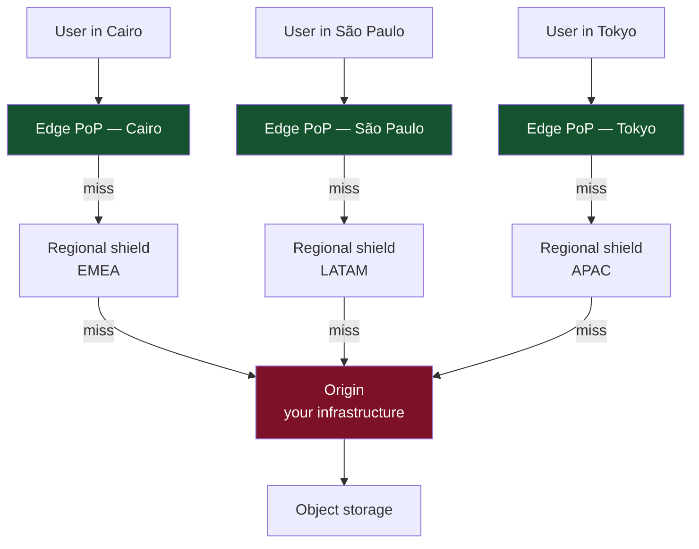

The **shield tier** matters more than people expect: without it, 200 edge PoPs each
miss independently and your origin sees 200× the miss traffic. With it, the edges
collapse onto a handful of regional caches and the origin sees a fraction of that.

### 9.1 Push vs pull

| | Pull (origin pull) | Push |
|---|---|---|
| How | First request for a URL fetches from origin and caches | You upload content to the CDN ahead of time |
| Best for | Large catalogues, long tail, unpredictable demand | Small sets of guaranteed-hot assets, big launches |
| First-request latency | Slow (a cache miss) | Fast |
| Operational cost | Zero — it self-manages | You must manage distribution and expiry |

### 9.2 Cache keys and invalidation

The **cache key** is normally scheme + host + path + a chosen subset of query
parameters. Getting it wrong is a top-tier CDN bug:

- Include tracking parameters (`utm_source`) and your hit ratio collapses — every
  campaign creates a distinct object.
- Ignore parameters that change the response (`?size=large`) and you serve wrong
  content to everybody.
- Vary on `Accept-Encoding` and `Accept-Language` where relevant; vary on `Cookie`
  almost never, since it shatters the cache per user.

**Invalidation** has three strategies, and the third is the right default:

| Strategy | Mechanism | Verdict |
|---|---|---|
| TTL expiry | Wait it out | Simple; too slow for corrections |
| Purge / ban | API call to evict a URL or tag | Necessary escape hatch; propagation takes seconds to minutes |
| **Content-hash URLs** | `app.9f2c1a.js` — new content, new URL | **Best.** Immutable objects, `Cache-Control: max-age=31536000, immutable`, zero invalidation, atomic deploys |

### 9.3 HTTP caching headers

| Header | Meaning |
|---|---|
| `Cache-Control: max-age=N` | Fresh for N seconds |
| `Cache-Control: s-maxage=N` | Fresh for N seconds in *shared* caches only — lets you cache at the CDN while telling browsers not to |
| `Cache-Control: no-cache` | May store, **must revalidate** before use |
| `Cache-Control: no-store` | Never store — for genuinely sensitive responses |
| `Cache-Control: private` | Browser only; never a shared cache |
| `Cache-Control: immutable` | Never revalidate; content will never change at this URL |
| `stale-while-revalidate=N` | Serve stale for N s while refreshing in the background — a latency win almost nobody uses |
| `stale-if-error=N` | Serve stale for N s if the origin is failing — free availability |
| `ETag` / `If-None-Match` | Validator; enables a 304 with no body |
| `Vary: Accept-Encoding` | Key the cache on the listed request headers |

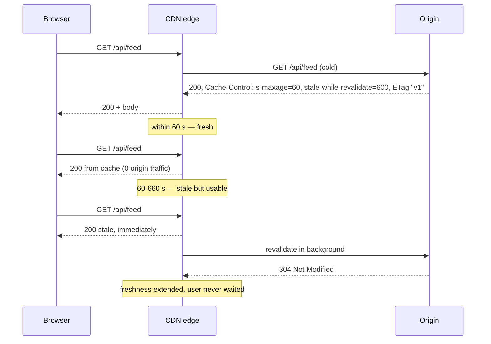

### 9.4 Beyond static assets

Modern CDNs cache far more than images:

- **Cacheable API responses** — public, non-personalised endpoints with short
  `s-maxage`. A 10-second TTL on a homepage feed can remove 95% of origin traffic.
- **Edge compute** — auth checks, A/B bucketing, header rewriting, personalisation
  by fragment, all executed at the PoP without a trip to origin.
- **Origin shielding and connection reuse** — the CDN maintains warm TLS
  connections to your origin, removing handshake cost from every request.
- **Security** — TLS termination, WAF rules, bot management, and volumetric DDoS
  absorption, all before traffic reaches your network.

---

## Part III — Data

## 10. Choosing a data store

The choice follows from the **access pattern**, not from familiarity or fashion.
Write the queries you need to serve before you name a database.

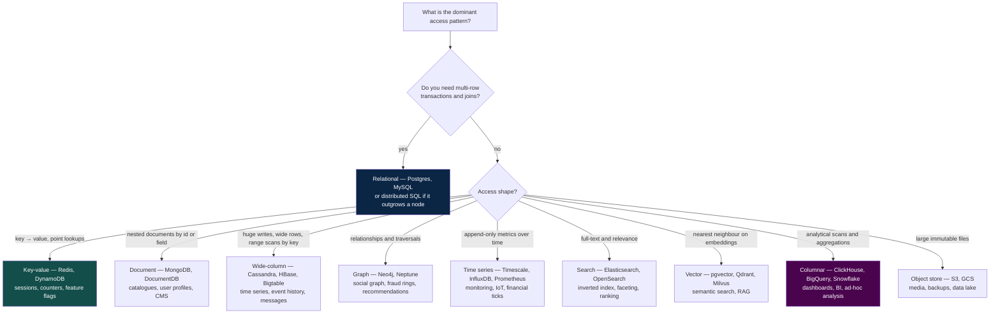

### 10.1 The honest defaults

- **Start relational.** Postgres handles JSON documents, full-text search, geospatial
  queries, time series (via Timescale) and vectors (via pgvector) competently. One
  system you understand deeply beats four you understand shallowly. Introduce a
  specialised store when a *measured* limit forces it.
- **Polyglot persistence is a cost, not a badge.** Each additional store is another
  backup regime, another failure mode, another on-call runbook, another consistency
  boundary, and another thing to keep in sync.
- **The read model may differ from the write model.** Writing to Postgres and
  projecting into Elasticsearch or a cache is a normal, healthy pattern — provided
  you own the synchronisation explicitly (see §15, the outbox).

### 10.2 SQL vs NoSQL, without the tribalism

| Dimension | Relational | NoSQL family |
|---|---|---|
| Schema | Enforced, migrations required | Flexible, application enforces |
| Joins | Native and optimised | Usually absent — denormalise or join in the app |
| Transactions | Full ACID across rows and tables | Often single-item or single-partition only |
| Scaling writes | Vertical, then sharding (manual or via distributed SQL) | Horizontal by design |
| Query flexibility | Ad-hoc queries via a planner | Queries must match how the data was laid out |
| Modelling driver | Normalise around entities | **Model around queries** — one table per access pattern |

> The genuine distinction is not "SQL vs NoSQL". It is **"does the store give me
> multi-key atomicity and a query planner, or do I trade those for horizontal
> write scaling?"** Everything else is packaging.

---

## 11. CAP, PACELC and consistency models

### 11.1 CAP

During a **network partition**, a distributed system must choose: refuse to answer
(preserving **C**onsistency) or answer with possibly stale data (preserving
**A**vailability). Partition tolerance is not optional — networks partition — so
CAP is really a binary choice that only applies *while partitioned*.

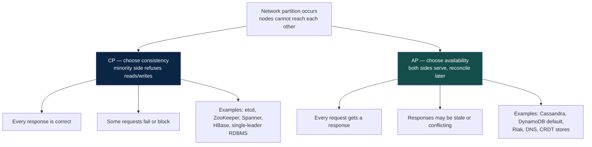

### 11.2 PACELC — the more useful formulation

> **If Partition, choose Availability or Consistency; Else, choose Latency or
> Consistency.**

CAP describes the rare case. PACELC describes the other 99.99% of the time: even
with a perfectly healthy network, waiting for a quorum acknowledgement costs
latency, and skipping the wait costs consistency. **Most consistency decisions are
latency decisions in disguise.**

| System | Partition | Else | Reading |
|---|---|---|---|
| Google Spanner | PC | EC | Consistent always; pays latency via TrueTime waits |
| DynamoDB (default) | PA | EL | Fast and available; eventually consistent reads |
| DynamoDB (strong reads) | PC | EC | Opt in per request, roughly double the read cost |
| Cassandra (`QUORUM`) | PA | EC | Tunable per query |
| Cassandra (`ONE`) | PA | EL | Fastest, weakest |
| MySQL async replication | PC | EL | Primary is consistent; replicas lag |
| MongoDB (`majority`) | PC | EC | Configurable per operation |

### 11.3 The consistency spectrum

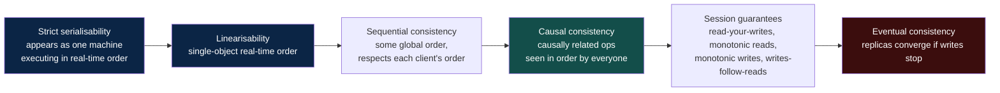

**Stronger to the left; cheaper and faster to the right.** Choose per operation,
not per system:

| Operation | Needs |
|---|---|
| Account balance shown at withdrawal | Linearisable |
| "Am I allowed to do this?" permission check | Linearisable, or a short bounded-staleness cache with fail-closed semantics |
| Posting a comment, then seeing your own comment | Read-your-writes (a session guarantee) |
| Someone else's follower count | Eventual — nobody is harmed by a 5-second lag |
| A social feed | Eventual, with causal ordering so a reply never appears before its parent |

### 11.4 The four session guarantees

These are the ones users actually notice, and they are far cheaper than full
linearisability:

| Guarantee | Violation the user sees |
|---|---|
| **Read-your-writes** | "I posted and it vanished" |
| **Monotonic reads** | "The comment was there, I refreshed, now it's gone" |
| **Monotonic writes** | Edits applied out of order |
| **Writes-follow-reads** | A reply appears before the message it replies to |

The standard implementations: pin a session to one replica; route reads to the
leader for a short window after a write; or carry a **version token** (an LSN,
timestamp, or vector) with the client and require the replica to have caught up to
it before answering.

---

## 12. Replication and partitioning

Two orthogonal axes. **Replication** copies the same data to multiple nodes —
availability and read scale. **Partitioning** splits different data across nodes —
write and storage scale. Real systems do both.

```mermaid
flowchart TD
    subgraph rep["Replication — same data, many nodes"]
        R1["Node 1<br/>rows 1-1000"]
        R2["Node 2<br/>rows 1-1000"]
        R3["Node 3<br/>rows 1-1000"]
    end
    subgraph part["Partitioning — different data, many nodes"]
        P1["Node 1<br/>rows 1-333"]
        P2["Node 2<br/>rows 334-666"]
        P3["Node 3<br/>rows 667-1000"]
    end
    subgraph both["Both — the real world"]
        B1["Shard A<br/>leader + 2 followers"]
        B2["Shard B<br/>leader + 2 followers"]
        B3["Shard C<br/>leader + 2 followers"]
    end
    rep -->|"survives node loss<br/>scales reads"| both
    part -->|"scales writes<br/>scales storage"| both
    style both fill:#134e4a,color:#fff
```

### 12.1 Replication topologies

```mermaid
flowchart TD
    subgraph SL["Single leader"]
        SLW["Writes"] --> SLL["Leader"]
        SLL -->|"replicate"| SLF1["Follower 1"]
        SLL -->|"replicate"| SLF2["Follower 2"]
        SLF1 --> SLR["Reads"]
        SLF2 --> SLR
    end
    subgraph ML["Multi leader"]
        MLA["Leader — US"] <-->|"bidirectional"| MLB["Leader — EU"]
        MLB <--> MLC["Leader — APAC"]
        MLA <--> MLC
        MLN["Conflicts are inevitable<br/>needs a resolution policy"]
    end
    subgraph LL["Leaderless — quorum"]
        LLW["Write to W nodes"] --> LLN1["Node 1"] & LLN2["Node 2"] & LLN3["Node 3"]
        LLR["Read from R nodes<br/>R + W &gt; N ⇒ overlap"] --> LLN1
    end
    style SL fill:#0b2545,color:#fff
    style ML fill:#3b0d0d,color:#fff
    style LL fill:#134e4a,color:#fff
```

| Topology | Writes | Conflicts | Use when |
|---|---|---|---|
| **Single leader** | One node accepts writes | Impossible by construction | Default. Almost every relational deployment |
| **Multi leader** | Several nodes accept writes | Frequent — need LWW, CRDTs or app logic | Multi-region write locality, offline-capable clients |
| **Leaderless** | Any node, quorum-based | Resolved on read via versions | Extreme availability, e.g. Dynamo, Cassandra |

**Synchronous vs asynchronous** replication is the durability/latency knob:

| Mode | On leader failure | Write latency |
|---|---|---|
| Async | Committed writes can be **lost** | Fast — local commit only |
| Sync (all replicas) | No loss | Slow, and one slow replica blocks everything |
| **Semi-sync (≥1 replica)** | No loss if one replica survives | The standard compromise |

**Replication lag** is the practical hazard: a user writes to the leader, reads
from a follower, and their own change is missing. Mitigations are the session
guarantees from §11.4.

### 12.2 Partitioning strategies

```mermaid
flowchart TD
    subgraph RG["Range partitioning"]
        RG1["A-F → node 1"]
        RG2["G-M → node 2"]
        RG3["N-Z → node 3"]
        RGN["Range scans are efficient<br/>Sequential keys create hot spots"]
    end
    subgraph HS["Hash partitioning"]
        HS1["hash(key) % N → node"]
        HSN["Even distribution<br/>Range scans require fan-out<br/>Resizing moves nearly everything"]
    end
    subgraph CM["Composite — hash + range"]
        CM1["hash(user_id) picks the node"]
        CM2["timestamp orders within the node"]
        CMN["Even spread AND efficient<br/>per-user time range scans"]
    end
    style CM fill:#14532d,color:#fff
    style RG fill:#0b2545,color:#fff
```

**Composite keys are the pattern worth internalising.** Cassandra and DynamoDB are
built on it: a partition key that hashes evenly, plus a clustering/sort key that
gives you ordered scans *within* a partition. You get distribution and range
queries simultaneously.

### 12.3 Choosing a partition key

The single highest-consequence decision in a sharded system, and the hardest to
reverse.

| Criterion | Why |
|---|---|
| **High cardinality** | `country` has ~200 values and cannot spread across 1000 shards |
| **Even distribution** | Any key correlated with popularity produces hot shards |
| **Present in most queries** | If the key is absent, every query scatters to every shard |
| **Stable** | A changing partition key means deleting and reinserting across nodes |

Classic mistakes: partitioning by timestamp (all writes hit today's shard),
partitioning by an auto-increment id (all writes hit the newest shard), and
partitioning by tenant when one tenant is 60% of the data.

**The celebrity problem** — one key legitimately receives a disproportionate share
of traffic. Remedies: append a random suffix to spread one logical key over N
physical partitions and fan out on read; give the outlier a dedicated shard; or
serve it from cache and never touch the partition at all.

---

## 13. Consistent hashing

Naïve `hash(key) % N` is catastrophic under membership change: going from 4 nodes
to 5 remaps roughly **80% of all keys**. For a cache, that is a total miss storm
into the origin; for a datastore, it is a full data reshuffle.

Consistent hashing maps both keys and nodes onto a ring. A key belongs to the first
node clockwise from it. Adding or removing a node moves only the keys in that
node's arc — on average **K/N keys**, not K.

```mermaid
flowchart TD
    subgraph ring["The hash ring — 0 to 2^32"]
        direction LR
        N1["Node A<br/>position 0"]
        K1["key: user:42<br/>→ Node B"]
        N2["Node B<br/>position 90"]
        K2["key: user:77<br/>→ Node C"]
        N3["Node C<br/>position 180"]
        K3["key: user:13<br/>→ Node D"]
        N4["Node D<br/>position 270"]
        K4["key: user:99<br/>→ Node A (wraps)"]
        N1 --> K1 --> N2 --> K2 --> N3 --> K3 --> N4 --> K4 --> N1
    end
    style ring fill:#0b2545,color:#fff
```

```mermaid
flowchart LR
    subgraph before["Before — 4 nodes"]
        B["Node C owns arc 90-180"]
    end
    subgraph after["After — add Node E at 135"]
        A1["Node E owns 90-135"]
        A2["Node C owns 135-180"]
        A3["Every other arc is untouched"]
    end
    before -->|"only keys in 90-135 move"| after
    style after fill:#14532d,color:#fff
```

### 13.1 Virtual nodes

With a handful of physical nodes, random ring positions produce badly uneven arcs —
one node may own three times its fair share. The fix is **virtual nodes**: each
physical node claims many positions on the ring (typically 100–500).

```mermaid
flowchart TD
    P["3 physical nodes"] --> V["Each claims 150 ring positions"]
    V --> R["450 small arcs, interleaved"]
    R --> B1["Load variance drops sharply"]
    R --> B2["Removing a node spreads its load<br/>across ALL survivors, not just the next one"]
    R --> B3["Heterogeneous capacity:<br/>a bigger machine claims more positions"]
    style R fill:#14532d,color:#fff
```

### 13.2 Replication on the ring

For a replication factor of 3, a key is stored on the first node clockwise **plus
the next two distinct physical nodes** — skipping additional virtual nodes that map
back to a machine already holding the data, and preferring nodes in different racks
or availability zones so that one rack losing power does not take all three copies.

### 13.3 Alternatives

| Algorithm | Property | Trade-off |
|---|---|---|
| **Consistent hashing + vnodes** | Minimal movement, flexible weights | Needs a ring structure and lookups |
| **Rendezvous (HRW) hashing** | Pick `argmax(hash(key, node))` — no ring, minimal movement, trivially weighted | O(N) per lookup unless optimised |
| **Jump consistent hash** | 5 lines of code, no memory, perfectly even | Nodes can only be added/removed at the **end** of the range |
| **Maglev hashing** | Fixed lookup table, very fast, near-perfect balance | Table rebuild on membership change |

Consistent hashing appears in far more places than sharded databases: Memcached
client libraries, CDN request routing, service mesh load balancing with session
affinity, and partition assignment in Kafka-style consumer groups.

---

## Part IV — Communication

## 14. Asynchronous processing and queues

The insight: **most work does not need to happen before you answer the user.** An
upload needs to be stored; the thumbnailing, virus scan, transcoding, indexing and
notification do not need to block the 200 response.

```mermaid
flowchart TD
    subgraph sync["Synchronous — user waits for everything"]
        S1["POST /upload"] --> S2["Store file<br/>200 ms"] --> S3["Generate thumbnails<br/>3 s"] --> S4["Virus scan<br/>2 s"] --> S5["Index for search<br/>500 ms"] --> S6["Notify followers<br/>1 s"] --> S7["Respond<br/>total 6.7 s"]
    end
    subgraph async["Asynchronous — user waits for the essential part"]
        A1["POST /upload"] --> A2["Store file<br/>200 ms"] --> A3["Publish event"] --> A4["Respond 202<br/>total 210 ms"]
        A3 --> Q["Message broker"]
        Q --> W1["Thumbnailer"]
        Q --> W2["Scanner"]
        Q --> W3["Indexer"]
        Q --> W4["Notifier"]
    end
    style sync fill:#3b0d0d,color:#fff
    style async fill:#14532d,color:#fff
```

### 14.1 What a queue actually buys — and costs

| Buys | Costs |
|---|---|
| **Decoupling** — producer does not know consumers | Eventual consistency; the work is not done when you reply |
| **Load levelling** — a 10× spike becomes queue depth, not failure | Latency is now unbounded under backlog |
| **Retries and durability** — failures are retried, not lost | Duplicate delivery must be handled |
| **Independent scaling** — add consumers for slow stages | Ordering is hard, sometimes impossible |
| **Backpressure** — the queue absorbs the mismatch | A whole new system to operate and monitor |

> The tell of a mature design: it names what the user *sees* while the async work is
> pending. "202 Accepted plus a status endpoint", "optimistic UI with rollback", or
> "the item appears greyed out until processing completes". Async without a UX story
> is an unfinished design.

### 14.2 Queue vs log

This is the distinction most people blur, and it changes what is possible.

```mermaid
flowchart TD
    subgraph q["Message queue — RabbitMQ, SQS"]
        QP["Producer"] --> QQ["Queue"]
        QQ -->|"message deleted<br/>after ack"| QC1["Consumer 1"]
        QQ --> QC2["Consumer 2"]
        QN["Competing consumers<br/>Message consumed once, then gone<br/>Per-message ack and redelivery<br/>Cannot replay history"]
    end
    subgraph l["Distributed log — Kafka, Pulsar, Kinesis"]
        LP["Producer"] --> LL["Partitioned append-only log<br/>messages retained by time or size"]
        LL --> LG1["Consumer group A<br/>offset 1042"]
        LL --> LG2["Consumer group B<br/>offset 87"]
        LN["Messages persist after reading<br/>Each group has its own offset<br/>Replay from any point<br/>Ordering guaranteed per partition"]
    end
    style q fill:#0b2545,color:#fff
    style l fill:#134e4a,color:#fff
```

| Need | Choose |
|---|---|
| Distribute tasks to a worker pool | **Queue** |
| Per-message retry, DLQ, delay, priority | **Queue** |
| Multiple independent consumers of the same events | **Log** |
| Replay history — new service, bug fix, rebuild a projection | **Log** |
| Strict ordering within an entity | **Log**, keyed by that entity |
| Event sourcing, CDC, stream processing | **Log** |
| Very high throughput with sequential I/O | **Log** |

### 14.3 Log mechanics

```mermaid
flowchart TD
    subgraph topic["Topic: orders — 4 partitions"]
        P0["Partition 0<br/>0 1 2 3 4 5 →"]
        P1["Partition 1<br/>0 1 2 3 →"]
        P2["Partition 2<br/>0 1 2 3 4 5 6 →"]
        P3["Partition 3<br/>0 1 2 →"]
    end
    PR["Producer<br/>partition = hash(order_id) % 4"] --> P0 & P1 & P2 & P3

    subgraph cg["Consumer group: billing — 2 consumers"]
        C1["Consumer 1<br/>owns P0, P1"]
        C2["Consumer 2<br/>owns P2, P3"]
    end
    P0 & P1 --> C1
    P2 & P3 --> C2

    N["Ordering holds WITHIN a partition, never across<br/>Parallelism is capped at the partition count<br/>Same key ⇒ same partition ⇒ ordered per entity"]
    style N fill:#422006,color:#fff
```

Consequences worth stating explicitly:

- **Partition count is your maximum consumer parallelism.** Ten partitions means a
  group can never usefully exceed ten consumers. Increasing partitions later
  reshuffles key-to-partition mapping and breaks ordering across the boundary — so
  over-provision partitions modestly at creation time.
- **Ordering requires key affinity.** If events for `order_42` must be processed in
  order, `order_42` must be the partition key.
- **Consumer lag is the health metric.** Not queue depth, not CPU — *lag*, measured
  in both messages and seconds behind.
- **Rebalancing is a stall.** When a consumer joins or dies, the group pauses to
  reassign partitions. Frequent rebalances (from long processing times exceeding
  the poll interval) look like a broker problem but are an application problem.

---

## 15. Delivery semantics and the outbox

### 15.1 The three semantics

```mermaid
flowchart TD
    subgraph amo["At-most-once"]
        A1["Send, do not retry"] --> A2["Fast, simple"] --> A3["Messages CAN be lost"]
    end
    subgraph alo["At-least-once"]
        B1["Send, retry until acked"] --> B2["Never lost"] --> B3["Duplicates ARE possible"]
    end
    subgraph eo["Exactly-once"]
        C1["Impossible end-to-end<br/>across arbitrary systems"] --> C2["Achievable as:<br/>at-least-once delivery<br/>+ idempotent processing"]
    end
    style amo fill:#3b0d0d,color:#fff
    style alo fill:#134e4a,color:#fff
    style eo fill:#0b2545,color:#fff
```

> **"Exactly-once" is a property of the effect, not of the transport.** Brokers can
> offer exactly-once *within their own boundary* (Kafka transactions across
> consume-process-produce inside Kafka). The moment the side effect leaves that
> boundary — a charge, an email, a row in another database — you are back to
> at-least-once, and correctness has to come from **idempotency** (§22).

**At-least-once plus idempotent consumers** is the correct default for essentially
every business system.

### 15.2 The dual-write problem

The most common correctness bug in event-driven architectures:

```mermaid
sequenceDiagram
    participant S as Service
    participant DB as Database
    participant MQ as Broker

    Note over S,MQ: The broken pattern
    S->>DB: INSERT order
    DB-->>S: committed
    S--xMQ: publish OrderCreated  ✗ crash / network failure
    Note over S,MQ: Order exists, nobody was told.<br/>No payment, no email, no shipment.

    Note over S,MQ: The other broken ordering
    S->>MQ: publish OrderCreated
    MQ-->>S: acked
    S--xDB: INSERT order  ✗ fails
    Note over S,MQ: Downstream acts on an order that does not exist.
```

There is no ordering of two independent systems that is safe. You cannot make two
commits atomic without a distributed transaction, and you do not want one.

### 15.3 The transactional outbox

Write the event **into the same database transaction** as the state change. A
separate relay publishes it afterwards. Now there is exactly one commit, so either
both happen or neither does.

```mermaid
sequenceDiagram
    participant S as Service
    participant DB as Database
    participant R as Relay / CDC
    participant MQ as Broker
    participant C as Consumer

    S->>DB: BEGIN
    S->>DB: INSERT INTO orders ...
    S->>DB: INSERT INTO outbox (event, payload, created_at)
    S->>DB: COMMIT
    Note over DB: One atomic commit — both rows or neither

    loop poll, or tail the WAL via CDC
        R->>DB: SELECT unpublished FROM outbox
        R->>MQ: publish
        MQ-->>R: ack
        R->>DB: mark published (or delete)
    end

    MQ->>C: deliver (possibly more than once)
    C->>C: check dedup key → idempotent apply
```

Notes that matter in practice:

- The relay is **at-least-once by construction** — it can publish and crash before
  marking. Consumers must be idempotent. This is fine and expected.
- **CDC (change data capture)** tailing the write-ahead log is strictly better than
  polling: no query load, lower latency, guaranteed ordering. Debezium is the usual
  implementation.
- The **inbox pattern** is the mirror image on the consumer side: record the
  processed message id in the same transaction as the effect, and skip anything you
  have already recorded.

### 15.4 Retries, DLQs and poison messages

```mermaid
flowchart TD
    M["Message"] --> C["Consumer"]
    C -->|"success"| A["Ack, done"]
    C -->|"transient failure"| R{"Retries left?"}
    R -->|"yes"| B["Requeue with exponential backoff + jitter<br/>1s, 2s, 4s, 8s..."] --> C
    R -->|"no"| D["Dead letter queue"]
    C -->|"permanent failure<br/>malformed, unknown schema"| D
    D --> AL["Alert — DLQ depth &gt; 0 is a real page"]
    D --> I["Inspect, fix, replay"]
    style D fill:#7d1128,color:#fff
    style AL fill:#7d1128,color:#fff
```

- **Separate transient from permanent failures.** Retrying a malformed payload
  10,000 times burns capacity and blocks the partition behind it. Permanent
  failures go straight to the DLQ.
- **Always jitter the backoff.** Synchronised retries from thousands of consumers
  are a self-inflicted DDoS on a service that is already struggling.
- **A non-empty DLQ is an incident**, not a metric. Alert on it, and keep a tested
  replay path — an untested replay path is not a recovery plan.

### 15.5 Backpressure

When producers outpace consumers, something must give. The failure mode of ignoring
this is unbounded memory growth followed by an OOM kill of the component that was
still working.

| Strategy | Behaviour | Use when |
|---|---|---|
| **Buffer** | Absorb in the queue | Spikes are short and bounded |
| **Block / throttle producer** | Slow the source down | Producer can wait — internal pipelines |
| **Shed load** | Reject with 429/503 | User-facing; a fast rejection beats a slow timeout |
| **Sample / degrade** | Drop low-value work first | Telemetry, analytics, non-critical events |
| **Autoscale consumers** | Add capacity on lag | Elastic infrastructure and a scale-out-capable workload |

The essential rule: **every buffer must be bounded**. An unbounded queue does not
prevent failure, it defers and amplifies it.

---

## 16. Services and boundaries

### 16.1 Monolith, modular monolith, microservices

```mermaid
flowchart TD
    subgraph M["Monolith"]
        M1["Single deployable<br/>Single database<br/>In-process calls"]
        M2["+ Simple, fast, transactional<br/>+ Easy refactoring, one deploy<br/>− Coupled deploys and scaling<br/>− Any bug can take down everything"]
    end
    subgraph MM["Modular monolith"]
        MM1["Single deployable<br/>Enforced internal module boundaries<br/>Separate schemas per module"]
        MM2["+ Monolith simplicity, service discipline<br/>+ Boundaries provable before extraction<br/>− Still one deploy and one runtime"]
    end
    subgraph MS["Microservices"]
        MS1["Many deployables<br/>Database per service<br/>Network calls"]
        MS2["+ Independent deploy and scale<br/>+ Team autonomy, fault isolation<br/>− Distributed debugging, latency<br/>− Data consistency becomes your job"]
    end
    M -->|"when teams and deploys collide"| MM -->|"when a boundary proves stable AND needs independence"| MS
    style MM fill:#14532d,color:#fff
```

> **Start with a modular monolith.** It gives you the boundaries without the
> distribution. Extract a service when you have a *specific* reason — an
> independent scaling profile, a team that needs to deploy on its own cadence, a
> different technology requirement, or a fault-isolation need — and never merely
> because the codebase feels large.

**Conway's Law** is the underrated force here: your architecture will mirror your
communication structure whether you plan for it or not. Service boundaries that cut
across team boundaries generate permanent coordination overhead.

### 16.2 Finding boundaries

The right seams come from the domain, not from the nouns in the code.

```mermaid
flowchart TD
    subgraph good["Good boundaries — cohesive, autonomous"]
        G1["Ordering<br/>owns orders, order items, status"]
        G2["Payments<br/>owns transactions, refunds, payment methods"]
        G3["Inventory<br/>owns stock levels, reservations"]
        G4["Shipping<br/>owns shipments, carriers, tracking"]
    end
    subgraph bad["Bad boundaries — anaemic layers"]
        B1["Database service"]
        B2["Business logic service"]
        B3["Validation service"]
        B4["Every feature touches all four"]
    end
    style good fill:#14532d,color:#fff
    style bad fill:#7d1128,color:#fff
```

Tests for a good boundary:

- **It owns its data.** No other service reads its tables directly. Ever. Shared
  databases turn microservices into a distributed monolith with worse latency.
- **Most changes are local.** If a typical feature requires coordinated deploys of
  four services, the boundaries are wrong.
- **It can be described in one sentence** without the word "and".
- **It has a meaningful failure mode.** If it goes down, something specific and
  nameable stops working.

### 16.3 Orchestration vs choreography

```mermaid
flowchart TD
    subgraph orch["Orchestration — a central coordinator"]
        O["Order orchestrator"] --> O1["Payment service"]
        O --> O2["Inventory service"]
        O --> O3["Shipping service"]
        ON["+ Flow visible in one place<br/>+ Easy to reason about and debug<br/>− Coordinator is a coupling point"]
    end
    subgraph chor["Choreography — react to events"]
        C1["Order service"] -->|"OrderCreated"| CB["Event bus"]
        CB --> C2["Payment service"]
        C2 -->|"PaymentCaptured"| CB
        CB --> C3["Inventory service"]
        C3 -->|"StockReserved"| CB
        CB --> C4["Shipping service"]
        CN["+ Fully decoupled, easy to extend<br/>− No single view of the flow<br/>− Emergent behaviour, hard to debug"]
    end
    style orch fill:#0b2545,color:#fff
    style chor fill:#134e4a,color:#fff
```

Practical guidance: **orchestrate business-critical flows with money or legal
consequences** — you need to see the state machine and query it. **Choreograph
notifications and side effects** — analytics, emails, cache warming, search
indexing — where adding a consumer should not require changing the producer.

---

## 17. Protocols

```mermaid
flowchart TD
    Q["What is the interaction?"]
    Q -->|"public API, cacheable, broad clients"| REST["REST / HTTP+JSON"]
    Q -->|"internal service-to-service, low latency"| GRPC["gRPC / Protobuf"]
    Q -->|"client picks the fields, many screens"| GQL["GraphQL"]
    Q -->|"bidirectional, low latency, persistent"| WS["WebSocket"]
    Q -->|"server → client stream only"| SSE["Server-Sent Events"]
    Q -->|"client can poll but wants freshness"| LP["Long polling"]
    Q -->|"fire and forget, decoupled"| MSG["Messaging"]
    style GRPC fill:#134e4a,color:#fff
    style REST fill:#0b2545,color:#fff
```

| Protocol | Transport | Payload | Strengths | Weaknesses |
|---|---|---|---|---|
| **REST** | HTTP/1.1, HTTP/2 | JSON | Universal, cacheable, debuggable, no tooling needed | Verbose, over/under-fetching, no schema by default |
| **gRPC** | HTTP/2 | Protobuf | Fast, small, streaming, generated typed clients, strict schema | Not browser-native without a proxy, binary is harder to debug |
| **GraphQL** | HTTP | JSON | One round trip for a whole screen, no over-fetching, strong typing | Hard to cache at HTTP level, N+1 resolver risk, query-cost attacks |
| **WebSocket** | TCP upgrade | Anything | True bidirectional, low overhead per message | Stateful connections, scaling and reconnect logic, proxies interfere |
| **SSE** | HTTP | Text | Dead simple, auto-reconnect, works through proxies | One direction only, connection-count limits on HTTP/1.1 |
| **Long polling** | HTTP | JSON | Works everywhere, no special infrastructure | Wasteful, latency floor, connection churn |

### 17.1 Real-time delivery compared

```mermaid
sequenceDiagram
    participant C as Client
    participant S as Server

    Note over C,S: Short polling — simple, wasteful
    loop every 5 s
        C->>S: GET /messages?since=X
        S-->>C: [] (usually empty)
    end

    Note over C,S: Long polling — server holds the request
    C->>S: GET /messages?since=X
    Note over S: hold up to 30 s
    S-->>C: [msg] as soon as one exists
    C->>S: immediately re-issue

    Note over C,S: SSE — one persistent stream, server pushes
    C->>S: GET /stream  (Accept: text/event-stream)
    S-->>C: event: message
    S-->>C: event: message

    Note over C,S: WebSocket — full duplex
    C->>S: HTTP Upgrade
    S-->>C: 101 Switching Protocols
    C->>S: send
    S-->>C: push
```

Rule of thumb: **SSE for one-way feeds** (notifications, live scores, progress
bars), **WebSocket when the client also talks back frequently** (chat, collaborative
editing, multiplayer, trading). WebSocket costs you: connection state, sticky
routing or a shared pub/sub fabric, heartbeats, reconnection with resume tokens,
and a hard per-node connection ceiling to plan around.

---

## 18. API design

### 18.1 Resource design

| Do | Do not |
|---|---|
| `GET /users/42/orders` | `GET /getUserOrders?id=42` |
| Plural nouns for collections | Verbs in paths |
| `POST /orders/42/cancel` for state transitions that are not CRUD | Pretend everything is CRUD |
| Return the created resource plus `Location` on 201 | Return a bare `{"ok": true}` |
| Nest at most one level deep | `/a/1/b/2/c/3/d/4` |

### 18.2 The essentials

**Pagination** — never return an unbounded collection.

| Style | Mechanism | Verdict |
|---|---|---|
| Offset/limit | `?offset=1000&limit=20` | Simple, jumps to any page. **Degrades badly at depth** — the DB still scans the skipped rows — and drifts when rows are inserted mid-pagination |
| **Cursor/keyset** | `?after=<opaque_cursor>&limit=20` | **Preferred.** Constant time at any depth, stable under concurrent inserts. No random page access |

**Idempotency** — any unsafe operation that a client might retry needs an
`Idempotency-Key` header (see §22).

**Versioning** — `/v1/` in the path is the least clever and most operable option;
header-based (`Accept: application/vnd.api+json;version=2`) is purer and harder to
debug. Whichever you choose, the real discipline is **additive change**: adding
optional fields never breaks a client; removing a field, changing a type, or
tightening validation always does.

**Errors** — return a machine-readable code and a stable shape, ideally
[RFC 7807](https://datatracker.ietf.org/doc/html/rfc7807) `application/problem+json`:

```json
{
  "type": "https://api.example.com/errors/insufficient-funds",
  "title": "Insufficient funds",
  "status": 402,
  "detail": "Account balance 12.50 is below the required 40.00",
  "instance": "/accounts/42/transfers/9981",
  "request_id": "01J8Z9X3QK7"
}
```

Always include a **request id** and log it — it is the single thing that makes
support tractable.

**Status codes that carry meaning**

| Code | Use for |
|---|---|
| 200 / 201 / 204 | Success / created / success-with-no-body |
| 202 | Accepted for async processing — pair with a status URL |
| 400 | Malformed request |
| 401 / 403 | Not authenticated / authenticated but not permitted |
| 404 | Not found — also use to hide existence from unauthorised callers |
| 409 | Conflict — optimistic concurrency failure, duplicate resource |
| 422 | Well-formed but semantically invalid |
| 429 | Rate limited — **must** include `Retry-After` |
| 500 / 503 | Our fault / temporarily unavailable, retry later |

### 18.3 The API gateway

```mermaid
flowchart LR
    C["Clients"] --> GW["API gateway"]
    GW --> F1["TLS termination"]
    GW --> F2["AuthN — verify token"]
    GW --> F3["Rate limiting and quotas"]
    GW --> F4["Request routing"]
    GW --> F5["Request/response transformation"]
    GW --> F6["Aggregation / fan-out"]
    GW --> F7["Logging, tracing, metrics"]
    GW --> S1["Service A"] & S2["Service B"] & S3["Service C"]
    style GW fill:#0b2545,color:#fff
```

The warning attached to gateways: **they accumulate business logic**. Once
transformation and aggregation live in the gateway, it becomes a shared component
every team must change and nobody owns — a distributed monolith with a single
deployment bottleneck. Keep it to cross-cutting concerns; put per-client
aggregation in a **BFF** (backend for frontend) owned by the client team instead.

---

## 19. Rate limiting

Rate limiting protects capacity, enforces fairness between tenants, and blunts
abuse. Four algorithms, each with a distinct failure characteristic.

```mermaid
flowchart TD
    subgraph tb["Token bucket — allows bursts"]
        T1["Bucket holds up to B tokens"] --> T2["Refill at R tokens/sec"] --> T3["Request costs 1 token"] --> T4["Empty ⇒ reject"]
        T5["Burst up to B, sustained rate R<br/>Most widely used"]
    end
    subgraph lb["Leaky bucket — smooths output"]
        L1["Requests enter a queue"] --> L2["Drain at a fixed rate"] --> L3["Queue full ⇒ reject"]
        L4["Perfectly smooth downstream load<br/>Adds queueing latency"]
    end
    subgraph fw["Fixed window — simple, flawed"]
        F1["Count per calendar minute"] --> F2["Reset at the boundary"]
        F3["2x the limit can straddle a boundary<br/>Cheap: one counter per key"]
    end
    subgraph sw["Sliding window — accurate"]
        S1["Log of timestamps, or<br/>weighted blend of two windows"] --> S2["No boundary spike"]
        S3["Log is exact but memory-heavy<br/>Counter blend is the practical choice"]
    end
    style tb fill:#14532d,color:#fff
    style fw fill:#3b0d0d,color:#fff
```

| Algorithm | Bursts | Memory per key | Accuracy | Verdict |
|---|---|---|---|---|
| Token bucket | Allowed up to B | 2 numbers | Good | **Default choice** |
| Leaky bucket | Absorbed as delay | Queue | Good | Use when the downstream needs a smooth rate |
| Fixed window | Up to 2× at boundaries | 1 counter | Poor | Only when precision genuinely does not matter |
| Sliding log | None | O(requests) | Exact | Expensive; low-volume, high-value limits |
| **Sliding window counter** | Minimal | 2 counters | Very good | Best accuracy-per-byte; what most gateways ship |

### 19.1 Distributed rate limiting

```mermaid
flowchart TD
    subgraph naive["Per-node limits — wrong"]
        N1["10 nodes x 100 rps each"] --> N2["Effective limit is 1000 rps, not 100"]
    end
    subgraph central["Centralised counter"]
        C1["All nodes INCR a shared Redis key<br/>with a Lua script for atomicity"] --> C2["Exact, but adds a hop<br/>and Redis is now on the critical path"]
    end
    subgraph hybrid["Local buckets + async reconciliation"]
        H1["Each node holds a share of the budget"] --> H2["Periodically rebalances shares<br/>against a central view"] --> H3["Approximate, fast, degrades gracefully"]
    end
    style naive fill:#7d1128,color:#fff
    style hybrid fill:#14532d,color:#fff
```

### 19.2 Design details that matter

- **Choose the key deliberately.** By API key for quotas, by user id for fairness,
  by IP for anonymous abuse (with care — NAT and mobile carriers put thousands of
  users behind one address), by endpoint for expensive operations. Usually several
  tiers at once.
- **Always return `Retry-After`** plus `X-RateLimit-Limit`, `-Remaining`, `-Reset`.
  A client that cannot see the limit cannot cooperate with it.
- **Fail open or fail closed — decide deliberately.** If the limiter's backing store
  is down, allowing all traffic risks a stampede; blocking all traffic is a
  self-inflicted outage. For abuse protection, fail closed; for capacity smoothing,
  fail open with a local fallback bucket.
- **Rate limiting is not load shedding.** Rate limiting is a per-client contract
  applied always; load shedding is a system-wide response to overload that drops
  the least valuable work regardless of who sent it. Mature systems have both.

---

## Part V — Correctness in a distributed world

## 20. Distributed transactions and sagas

A single-node transaction gives you atomicity for free. Across services, atomicity
must be constructed — and every construction is a trade.

### 20.1 Two-phase commit

```mermaid
sequenceDiagram
    participant C as Coordinator
    participant A as Participant A
    participant B as Participant B

    Note over C,B: Phase 1 — prepare
    C->>A: PREPARE
    C->>B: PREPARE
    A->>A: write to log, LOCK resources
    B->>B: write to log, LOCK resources
    A-->>C: VOTE YES
    B-->>C: VOTE YES

    Note over C,B: Phase 2 — commit
    C->>C: durably record decision: COMMIT
    C->>A: COMMIT
    C->>B: COMMIT
    A-->>C: ACK (locks released)
    B-->>C: ACK (locks released)

    Note over C,B: The failure that defines 2PC
    Note over A,B: If the coordinator dies after PREPARE,<br/>participants hold locks indefinitely.<br/>2PC is a BLOCKING protocol.
```

2PC gives real atomicity. Its costs are severe enough that it is rare between
services: locks are held across the network for the full protocol duration, it
blocks on coordinator failure, availability is the product of every participant's
availability, and throughput collapses under contention. Use it *within* a
controlled boundary — a distributed database's internal commit, an XA transaction
across two databases you own — and essentially never across service or
organisational boundaries.

### 20.2 Sagas

A saga replaces atomicity with **a sequence of local transactions, each with a
compensating action**. There is no isolation: intermediate states are visible. In
exchange, nothing is ever locked across the network.

```mermaid
flowchart TD
    subgraph fwd["Forward path"]
        T1["T1: create order<br/>status = PENDING"] --> T2["T2: reserve inventory"] --> T3["T3: authorise payment"] --> T4["T4: create shipment"] --> T5["T5: confirm order<br/>status = CONFIRMED"]
    end
    subgraph comp["Compensating path — on failure at T4"]
        C4["T4 fails"] --> C3["C3: void payment authorisation"] --> C2["C2: release inventory reservation"] --> C1["C1: cancel order<br/>status = CANCELLED"]
    end
    T4 -.->|"failure"| C4
    style fwd fill:#134e4a,color:#fff
    style comp fill:#7d1128,color:#fff
```

**Compensations are not rollbacks.** You cannot un-send an email; you send an
apology. You cannot un-charge a card atomically; you issue a refund, which is a new
transaction with its own record. Designing compensations is a *business* exercise
as much as a technical one.

| Requirement of every saga step | Why |
|---|---|
| **Idempotent** | Steps and compensations will be retried |
| **Compensatable, or last** | Once a non-compensatable step runs (a physical shipment leaves), the saga can only go forward |
| **Persistent state** | The saga's position must survive a crash — store it, do not hold it in memory |
| **Timeout on every step** | A step that never answers must eventually be treated as failed and compensated |
| **Semantic lock or status field** | `PENDING` tells the rest of the system this entity is mid-flight |

### 20.3 Ordering steps

Put the **most likely to fail** and **easiest to compensate** steps first, and the
irreversible ones last. Validate everything cheap before you take any action that
costs money or moves atoms.

```mermaid
flowchart LR
    V["Validate<br/>free, reversible"] --> R["Reserve<br/>cheap, easy to release"] --> A["Authorise payment<br/>reversible via void"] --> P["Capture payment<br/>reversible via refund — costly"] --> S["Ship goods<br/>irreversible"]
    style V fill:#14532d,color:#fff
    style S fill:#7d1128,color:#fff
```

### 20.4 The alternatives table

| Approach | Atomicity | Isolation | Availability | Use when |
|---|---|---|---|---|
| Single-node transaction | Full | Full | One node's | The data fits one store — **always prefer this** |
| 2PC / XA | Full | Full | Product of all | Inside a system you fully control |
| **Saga** | Eventual | **None** | High | Cross-service business processes |
| Event sourcing + projections | Per-aggregate | Per-aggregate | High | Audit requirements, temporal queries, replay |
| Reservation pattern | Two-step: reserve then confirm | Semantic | High | Inventory, seats, payments |
| Do nothing, reconcile later | None | None | Highest | Low-value, high-volume; a batch job fixes drift |

---

## 21. Consensus, leaders and quorums

Consensus is how a set of nodes agrees on one value despite failures. It underpins
leader election, configuration management, distributed locks, and the commit
protocols of distributed databases.

### 21.1 Quorums

```mermaid
flowchart TD
    N["N = 5 replicas"] --> W["W = 3 write quorum"]
    N --> R["R = 3 read quorum"]
    W --> O["R + W &gt; N  ⇒  read and write sets overlap<br/>⇒ every read sees the latest write"]
    O --> T1["W = N, R = 1<br/>fast reads, slow writes<br/>read-heavy workloads"]
    O --> T2["W = 1, R = N<br/>fast writes, slow reads<br/>write-heavy workloads"]
    O --> T3["W = R = ⌈(N+1)/2⌉<br/>balanced — the usual choice"]
    style O fill:#14532d,color:#fff
```

For consensus protocols specifically, a **majority quorum** (⌊N/2⌋+1) is what
matters: any two majorities of the same set must share at least one member, which
is precisely what prevents two leaders from both believing they are authoritative.
This is why consensus clusters have an odd size — 5 nodes tolerate 2 failures, and
6 nodes also tolerate only 2 while costing more and being slower.

### 21.2 Raft

```mermaid
stateDiagram-v2
    [*] --> Follower
    Follower --> Candidate: election timeout<br/>no heartbeat from a leader
    Candidate --> Candidate: split vote<br/>randomised timeout, retry
    Candidate --> Leader: receives votes from a majority
    Candidate --> Follower: discovers a leader<br/>or a higher term
    Leader --> Follower: discovers a higher term
    Leader --> Leader: send heartbeats<br/>replicate log entries
```

```mermaid
sequenceDiagram
    participant C as Client
    participant L as Leader
    participant F1 as Follower 1
    participant F2 as Follower 2

    C->>L: write x = 5
    L->>L: append to local log (uncommitted)
    par replicate
        L->>F1: AppendEntries(x=5, term, prevIndex)
        L->>F2: AppendEntries(x=5, term, prevIndex)
    end
    F1-->>L: ack
    Note over L: majority reached (leader + F1 of 3)
    L->>L: mark COMMITTED, apply to state machine
    L-->>C: success
    F2-->>L: ack (late — fine)
    L->>F1: next heartbeat carries commitIndex
    L->>F2: next heartbeat carries commitIndex
```

Raft's guarantees rest on a few rules worth remembering: **terms** are a logical
clock that makes stale leaders detectable; a candidate only wins if its log is at
least as up to date as the voter's, which guarantees committed entries are never
lost; and **randomised election timeouts** break split votes without extra
messages. Paxos solves the same problem and is used in Spanner and Chubby; Raft was
designed to be teachable and now dominates new systems (etcd, Consul, CockroachDB,
TiKV).

### 21.3 What consensus costs

Consensus requires a majority round trip for every write. Within one datacentre
that is sub-millisecond and fine. **Across regions, it is 50–200 ms per write, and
that is a floor.** This is why you use consensus for the control plane — leader
election, cluster membership, configuration, locks — and keep it off the data hot
path unless you specifically need linearisable writes.

**FLP impossibility** states that in a fully asynchronous system with even one
faulty process, no deterministic algorithm guarantees consensus. Practical systems
sidestep it with timeouts and randomisation: they trade guaranteed termination for
termination *with probability 1*, which is enough.

### 21.4 Distributed locks — read this before using one

```mermaid
sequenceDiagram
    participant A as Client A
    participant B as Client B
    participant L as Lock service
    participant R as Resource

    A->>L: acquire(lock, ttl=30s)
    L-->>A: granted, token 41
    A->>A: long GC pause / network partition — 40 s
    Note over L: TTL expires, lock auto-released
    B->>L: acquire(lock, ttl=30s)
    L-->>B: granted, token 42
    B->>R: write (token 42)  ✓
    A->>R: write (token 41)  ✗ rejected — stale token
    Note over R: The FENCING TOKEN is what makes this safe.<br/>A lock with a TTL and no fencing token is not a lock.
```

A distributed lock without fencing tokens provides *mutual exclusion most of the
time*, which is not a correctness property. If the protected operation can tolerate
occasional double execution, you did not need the lock. If it cannot, you need the
resource itself to reject stale tokens — which usually means the resource needs a
monotonic version, at which point optimistic concurrency is often simpler than a
lock service.

---

## 22. Idempotency

**An idempotent operation produces the same result whether applied once or many
times.** In a distributed system every request may be delivered more than once —
retries, at-least-once queues, client double-taps, load balancer retries, a
response lost after the server committed. Idempotency is what makes that safe.

```mermaid
sequenceDiagram
    participant C as Client
    participant S as Service
    participant DB as Database

    C->>S: POST /payments  Idempotency-Key: 7f3a-...
    S->>DB: INSERT idempotency_keys(key, status=IN_PROGRESS)<br/>UNIQUE constraint on key
    DB-->>S: inserted — first time
    S->>S: charge the card
    S->>DB: store response body, status=COMPLETED
    S-->>C: 201 Created

    Note over C,S: network drops the response, client retries
    C->>S: POST /payments  Idempotency-Key: 7f3a-...  (same body)
    S->>DB: INSERT idempotency_keys(...)
    DB-->>S: UNIQUE VIOLATION — already exists
    S->>DB: read stored response
    S-->>C: 201 Created (identical body, no second charge)

    Note over C,S: concurrent duplicate while still IN_PROGRESS
    C->>S: POST /payments  Idempotency-Key: 7f3a-...
    S-->>C: 409 Conflict — request in progress, retry shortly
```

### 22.1 How to make things idempotent

| Technique | Example |
|---|---|
| **Natural idempotency** | `SET status = 'shipped'` — applying it twice changes nothing. Prefer absolute assignment to relative mutation |
| **Idempotency key** | Client-generated UUID stored with a unique constraint; the constraint, not application logic, is what enforces it |
| **Conditional write** | `UPDATE ... WHERE version = 42` — the second attempt matches zero rows |
| **Dedup table / inbox** | Record processed message ids in the same transaction as the effect |
| **Upsert** | `INSERT ... ON CONFLICT DO NOTHING`, or a deterministic primary key derived from the payload |

### 22.2 Details that get missed

- **Store the response, not just the key.** A retry must return the *same* answer,
  including the resource id. Returning 200-with-nothing on retry breaks clients.
- **Hash the request body against the key.** If the same key arrives with a
  different payload, that is a client bug — return 422, do not silently return the
  old result.
- **Expire keys.** 24 hours to 7 days is typical. Unbounded growth is a slow leak.
- **Handle the in-flight case.** Two concurrent requests with one key: the second
  should get a 409 or block, never a second execution.
- **Uniqueness must be enforced by the database.** "Check then insert" in
  application code is a race, not a guarantee.

---

## 23. Unique ID generation

At scale, `AUTO_INCREMENT` fails: it needs a single coordinator, which caps write
throughput and blocks sharding.

| Approach | Bytes | Sortable | Coordination | Notes |
|---|---|---|---|---|
| Auto-increment | 8 | Yes | Single point | Simple, does not shard, leaks volume |
| UUIDv4 | 16 | **No** | None | Random — destroys B-tree locality, bloats indexes |
| **UUIDv7** | 16 | **Yes** | None | Timestamp-prefixed. The modern default for most systems |
| ULID | 16 | Yes | None | Same idea, base32, lexicographically sortable as text |
| **Snowflake** | 8 | Yes | Worker id assignment | Compact, fast, time-ordered. Needs coordinated worker ids and monotonic clocks |
| DB ticket server | 8 | Yes | Central | Simple; a scaling and availability bottleneck |
| Segment / hi-lo | 8 | Yes | Central, batched | Allocate ranges of 10k ids at a time — amortises coordination nicely |

### 23.1 Snowflake layout

```mermaid
flowchart LR
    S["64-bit id"] --> A["1 bit<br/>unused / sign"]
    S --> B["41 bits<br/>milliseconds since a custom epoch<br/>≈ 69 years of range"]
    S --> C["10 bits<br/>worker id<br/>1024 workers"]
    S --> D["12 bits<br/>sequence within the same ms<br/>4096 ids/ms/worker"]
    D --> R["4,096,000 ids per second per worker<br/>Roughly time-ordered globally"]
    style B fill:#0b2545,color:#fff
    style R fill:#14532d,color:#fff
```

**Failure modes to design for:** clock skew between workers breaks global ordering;
a backwards NTP step can produce duplicate ids, so the generator must refuse to
issue ids while the clock is behind its last-seen timestamp; and worker id
assignment needs a real mechanism — ZooKeeper/etcd registration, or a stable
ordinal from a StatefulSet — because two workers sharing an id silently produce
collisions.

### 23.2 Why sortability matters

A time-ordered id makes every insert land at the **right edge of the B-tree index**,
so the hot pages stay in memory and writes stay sequential. Random UUIDv4 keys
scatter inserts across the entire index, causing page splits, write amplification,
and a working set the size of the whole index. Switching a high-volume table from
UUIDv4 to UUIDv7 is one of the highest-value one-line changes available.

The counter-argument: sequential ids **leak information** — a competitor can
estimate your order volume by placing two orders. If that matters, expose an opaque
external id (a random UUID or an HMAC of the internal id) while keeping the
sortable id as the internal primary key.

---

## Part VI — Specialised subsystems

## 24. Search

`LIKE '%term%'` does not scale, cannot rank, and cannot handle typos, stemming or
synonyms. Real search is a different data structure: an **inverted index** mapping
each term to the documents containing it.

```mermaid
flowchart TD
    subgraph fwd["Forward index — what a database has"]
        D1["doc1 → 'the quick brown fox'"]
        D2["doc2 → 'the lazy brown dog'"]
    end
    subgraph inv["Inverted index — what search needs"]
        T1["quick → [doc1]"]
        T2["brown → [doc1, doc2]"]
        T3["fox → [doc1]"]
        T4["lazy → [doc2]"]
        T5["dog → [doc2]"]
    end
    fwd -->|"analysis: tokenise, lowercase,<br/>remove stopwords, stem"| inv
    inv --> Q["Query 'brown fox'<br/>intersect postings lists<br/>→ doc1 scores highest"]
    style inv fill:#134e4a,color:#fff
```

### 24.1 The pipeline

```mermaid
flowchart LR
    subgraph ing["Indexing — write path"]
        S["Source of truth<br/>primary database"] -->|"CDC / outbox"| P["Ingest pipeline"]
        P --> AN["Analysis<br/>tokenise → normalise → stem → synonyms"]
        AN --> IX["Inverted index<br/>sharded, replicated"]
    end
    subgraph qry["Querying — read path"]
        Q1["User query"] --> Q2["Query analysis<br/>same analyser as indexing"]
        Q2 --> Q3["Retrieval<br/>candidate set from the index"]
        Q3 --> Q4["Scoring<br/>BM25 / TF-IDF + business signals"]
        Q4 --> Q5["Re-ranking<br/>ML model on the top N"]
        Q5 --> Q6["Filtering, faceting, pagination"]
        Q6 --> Q7["Results"]
    end
    IX --> Q3
    style ing fill:#0b2545,color:#fff
    style qry fill:#134e4a,color:#fff
```

> **The analyser must match on both sides.** If you stem at index time but not at
> query time, "running" will not find "run". This is the single most common search
> bug.

### 24.2 Ranking

**BM25** is the standard lexical relevance function. Its intuition: a term matters
more when it is rare across the corpus (IDF), when it appears often in a document
(TF, with diminishing returns), and when the document is short relative to the
average. It is a strong baseline that beats naïve TF-IDF and needs no training
data.

Real ranking blends BM25 with business signals — recency, popularity, price,
availability, personalisation, seller quality — and then re-ranks the top 100–1000
with a learned model. Retrieval must be cheap and recall-oriented; ranking can be
expensive because it sees few documents.

### 24.3 Lexical, vector and hybrid

| | Lexical (BM25) | Vector (ANN) | Hybrid |
|---|---|---|---|
| Matches | Exact terms | Meaning | Both |
| "laptop" finds "notebook" | No | Yes | Yes |
| Exact SKU / part number | Excellent | Poor | Excellent |
| Cost | Cheap | Embedding + ANN index | Highest |
| Explainability | High | Low | Medium |

**Hybrid search** — run both retrievers and fuse the results, typically with
Reciprocal Rank Fusion — is now the default for product and document search.
Pure-vector search embarrassingly fails on exact identifiers; pure-lexical search
fails on paraphrase.

### 24.4 Operational realities

- **Search is a derived store, never a source of truth.** You must be able to
  rebuild the entire index from the primary database. Design the reindex path on
  day one, not during the incident.
- **Near-real-time, not real-time.** Index refresh is typically ~1 s. If a user must
  see their own newly created item instantly, read it from the primary store and
  merge it into the results client-side.
- **Shard by document, query by scatter-gather.** Every query hits every shard and
  results are merged, so tail latency is governed by the *slowest* shard. Adding
  shards increases parallelism but also increases the chance of a slow one.
- **Deep pagination is pathological.** Page 1000 requires every shard to sort its
  top 20,000. Cap the reachable depth and use cursors.

---

## 25. Object and blob storage

Large immutable files — images, video, backups, logs, ML artefacts — do not belong
in a database. Object storage gives you effectively unlimited capacity, extreme
durability (11 nines on S3-class systems), and a per-GB price an order of magnitude
below block storage.

### 25.1 Never proxy uploads through your servers

```mermaid
sequenceDiagram
    participant C as Client
    participant A as API
    participant S as Object store
    participant Q as Queue
    participant W as Worker
    participant CDN as CDN

    C->>A: POST /uploads {filename, size, content_type}
    A->>A: authorise, validate size/type, generate object key
    A->>S: create pre-signed PUT URL (expires in 15 min)
    A-->>C: {upload_url, object_key}

    C->>S: PUT file directly (bypasses your servers entirely)
    S-->>C: 200

    C->>A: POST /uploads/{key}/complete
    A->>S: HEAD object — verify it exists, size, checksum
    A->>A: persist metadata row
    A->>Q: publish MediaUploaded
    A-->>C: 201

    Q->>W: MediaUploaded
    W->>S: read original
    W->>W: transcode, thumbnail, scan, extract metadata
    W->>S: write derivatives
    W->>A: mark ready

    Note over C,CDN: reads
    C->>CDN: GET /media/{key}
    CDN->>S: miss → fetch from origin
    CDN-->>C: cached thereafter
```

Proxying a 2 GB upload through an application server consumes a connection and a
process for minutes, blows up memory, and makes deploys hostile. **Pre-signed URLs**
remove your servers from the byte path entirely. For very large files, use
multipart upload so a failure at 90% resumes rather than restarts.

### 25.2 Storage classes and lifecycle

| Class | Access latency | Relative cost | Use for |
|---|---|---|---|
| Standard / hot | Milliseconds | 1× | Active content |
| Infrequent access | Milliseconds, retrieval fee | ~0.5× | Backups, older media |
| Archive | Minutes to hours | ~0.1× | Compliance retention |
| Deep archive | Up to 12 hours | ~0.03× | Legal holds you hope never to read |

Lifecycle rules that transition objects automatically by age are among the easiest
large cost savings available. Pair them with **versioning** (protects against
accidental deletion and ransomware) and **object lock** where regulation demands
immutability.

### 25.3 Design notes

- **Key naming affects performance.** Sequential prefixes (`2026-08-20/...`) once
  created hot partitions; modern object stores auto-partition, but a high-entropy
  prefix is still the safe habit for extreme request rates.
- **Never make the bucket public.** Serve through a CDN with signed URLs or signed
  cookies. Public buckets are the most reliably recurring data breach in the
  industry.
- **Store metadata in a database, bytes in the object store.** The database row is
  the index; the object is the payload. Listing an object store is slow and
  expensive; querying a table is neither.
- **Object stores are eventually consistent for some operations** in some clouds.
  Read-after-write for new objects is now strongly consistent on the major
  providers, but overwrites and listings still deserve a careful read of the
  vendor's guarantees.

---

## 26. Observability and SLOs

Monitoring tells you *that* something is wrong. Observability lets you ask *why*
without shipping new code. The difference matters because you cannot predict the
questions a novel outage will require you to ask.

### 26.1 The three pillars, plus the one people forget

```mermaid
flowchart TD
    subgraph M["Metrics"]
        M1["Numeric time series<br/>counters, gauges, histograms"]
        M2["Cheap, aggregatable, long retention<br/>Answers: is it broken? how bad?"]
        M3["Cannot answer: which request? why?"]
    end
    subgraph L["Logs"]
        L1["Discrete structured events"]
        L2["High detail, high cost<br/>Answers: what exactly happened here?"]
        L3["Expensive to store and search at volume"]
    end
    subgraph T["Traces"]
        T1["Causally linked spans across services"]
        T2["Answers: where did the latency go?<br/>which dependency failed?"]
        T3["Needs propagated context; usually sampled"]
    end
    subgraph P["Profiles"]
        P1["CPU, memory, lock contention by line"]
        P2["Answers: why is this service itself slow?"]
    end
    M --> D["Alert fires"] --> T --> L --> P --> R["Root cause"]
    style D fill:#7d1128,color:#fff
    style R fill:#14532d,color:#fff
```

The workflow they support is a funnel: **metrics detect**, **traces localise**,
**logs explain**, **profiles pinpoint**. A system missing any one of them forces
engineers to guess at that stage.

### 26.2 What to measure

**The four golden signals** (from Google's SRE practice) cover most services:

| Signal | Meaning |
|---|---|
| **Latency** | Distribution, split by success and failure — a fast 500 must not flatter your p99 |
| **Traffic** | Requests/s, connections, messages consumed |
| **Errors** | Rate and type; explicit failures and wrong-but-successful responses |
| **Saturation** | How full the constraining resource is — CPU, memory, connections, queue depth, disk |

**USE** for resources (Utilisation, Saturation, Errors) and **RED** for services
(Rate, Errors, Duration) are the same idea from two directions.

> **Never alert on averages.** An average hides everything that matters. A service
> at 100 ms average may have 5% of users at 3 seconds. Track p50, p95, p99, p999 —
> and remember that if a page makes 20 backend calls, the p99 of a single call
> becomes roughly the *median* experience of the page.

### 26.3 SLIs, SLOs and error budgets

```mermaid
flowchart LR
    SLI["SLI — Service Level Indicator<br/>a measurement<br/>'fraction of requests &lt; 300 ms'"] --> SLO["SLO — Objective<br/>an internal target<br/>'99.9% over 28 days'"]
    SLO --> EB["Error budget<br/>100% − 99.9% = 0.1%<br/>≈ 43 minutes per 28 days"]
    SLO --> SLA["SLA — Agreement<br/>a contract with penalties<br/>always looser than the SLO"]
    EB --> P1["Budget remaining<br/>⇒ ship features, take risks"]
    EB --> P2["Budget exhausted<br/>⇒ freeze features, fix reliability"]
    style EB fill:#0b2545,color:#fff
    style P2 fill:#7d1128,color:#fff
```

The error budget is what turns reliability from an argument into a number. It gives
product and engineering a shared, non-emotional rule for when to prioritise
stability over features — and, just as importantly, **permission to move fast while
the budget is healthy**. A service that never spends its budget is over-invested in
reliability and under-invested in shipping.

Practical guidance: alert on **burn rate**, not on threshold crossings. A fast burn
(2% of the monthly budget in an hour) pages immediately; a slow burn (10% in three
days) opens a ticket. This eliminates the vast majority of pages that fire at 3 am
for something that resolves itself.

### 26.4 Distributed tracing

A **trace id** is generated at the edge and propagated through every hop via the
W3C `traceparent` header, into queue message headers, and across async boundaries.
Each service emits **spans** with parent links, producing a causal tree.

Non-negotiables: propagate context through *asynchronous* boundaries too (a queue
that drops trace context breaks the tree exactly where debugging is hardest); use
**tail-based sampling** so that slow and failed traces are always kept while the
boring 99% are discarded; and put the trace id in every log line and every error
response so a support ticket becomes a single query.

---

## Part VII — Operating it

## 27. Resilience patterns

A distributed system is a system where a computer you did not know existed can
render your own unusable. Resilience is the discipline of making partial failure
stay partial.

### 27.1 Timeouts — the foundation

Every network call needs a timeout. A call without one is a call that can hang
forever, holding a thread, a connection and a lock, until the whole service is
consumed by requests waiting on something that is never going to answer. This is
how a slow dependency becomes a total outage.

```mermaid
flowchart TD
    subgraph bad["No timeout budget — cascading exhaustion"]
        B1["Client waits 60 s"] --> B2["Gateway waits 60 s"] --> B3["Service A waits 60 s"] --> B4["Service B hangs"]
        B4 --> B5["Every thread in A, gateway and client<br/>is blocked. Everything is down."]
    end
    subgraph good["Timeout budget — deadline propagation"]
        G1["Client: 3000 ms deadline"] --> G2["Gateway: 2500 ms remaining"] --> G3["Service A: 2000 ms remaining"] --> G4["Service B: 1500 ms remaining"]
        G4 --> G5["Each hop passes the REMAINING budget.<br/>Nobody works on a request<br/>the caller has already abandoned."]
    end
    style bad fill:#7d1128,color:#fff
    style good fill:#14532d,color:#fff
```

Set timeouts from **measured p99 plus headroom**, not from intuition. And propagate
a deadline rather than a fixed per-hop timeout: a request already 2.9 s into a 3 s
budget should not start a fresh 3 s database query.

### 27.2 Retries — and how they cause outages

Retries convert transient failures into successes. They also convert a degraded
service into a dead one, because the moment a service slows down, every client
triples its load against it.

```mermaid
flowchart TD
    F["Service degrades — 30% errors"] --> R["Clients retry 3x"]
    R --> L["Load triples on an already-struggling service"]
    L --> W["Error rate rises to 80%"]
    W --> R2["More retries"]
    R2 --> D["Total collapse — the retry storm"]
    D -.->|"and it cannot recover<br/>because clients keep retrying"| D
    style D fill:#7d1128,color:#fff
```

The rules that prevent this:

| Rule | Why |
|---|---|
| **Only retry idempotent operations** | Otherwise you duplicate side effects |
| **Only retry transient failures** | 4xx means it will fail identically next time. 429/503/timeout are retryable; 400/401/404/422 are not |
| **Exponential backoff with full jitter** | `sleep = random(0, min(cap, base × 2^attempt))`. Without jitter, retries synchronise into waves |
| **Cap total attempts, honour the deadline** | 3 attempts is usually right. Stop when the caller's budget is gone |
| **Retry budgets** | Allow retries to be at most ~10% of total requests. When exceeded, stop retrying entirely — this is what actually breaks the storm |
| **Never retry at every layer** | Client 3× × gateway 3× × service 3× = 27 attempts. Retry at exactly one layer, deliberately chosen |

### 27.3 Circuit breakers

A circuit breaker stops calling a dependency that is clearly broken, failing fast
instead of consuming resources on calls that will time out.

```mermaid
stateDiagram-v2
    [*] --> Closed
    Closed --> Open: failure rate exceeds threshold<br/>e.g. 50% over a 10 s rolling window
    Open --> HalfOpen: after a cool-down period<br/>e.g. 30 s
    HalfOpen --> Closed: trial requests succeed
    HalfOpen --> Open: a trial request fails
    Closed --> Closed: calls pass through
    Open --> Open: calls fail immediately,<br/>no network attempt
    HalfOpen --> HalfOpen: only a few probes allowed
```

The value is twofold: it protects **you** (threads are not consumed waiting) and it
protects **them** (a struggling service gets a chance to recover instead of being
hammered). Always pair a breaker with a **fallback** — cached data, a default value,
a degraded response, or a clear error — because an open circuit still has to return
something.

### 27.4 Bulkheads

Isolate resource pools so one failing dependency cannot consume everything.

```mermaid
flowchart TD
    subgraph shared["Shared pool — one failure sinks the ship"]
        SP["200 threads, shared"] --> S1["Service A — healthy"]
        SP --> S2["Service B — hanging"]
        SP --> S3["Service C — healthy"]
        SN["B consumes all 200 threads.<br/>A and C now fail too."]
    end
    subgraph bulk["Bulkheads — damage stays in one compartment"]
        B1["Pool A: 60 threads"] --> T1["Service A"]
        B2["Pool B: 60 threads"] --> T2["Service B — hanging"]
        B3["Pool C: 60 threads"] --> T3["Service C"]
        BN["B exhausts only its own 60.<br/>A and C are unaffected."]
    end
    style shared fill:#7d1128,color:#fff
    style bulk fill:#14532d,color:#fff
```

The same idea at larger scale is **cell-based architecture**: partition the entire
stack into independent cells, each serving a subset of users. A bad deploy, a
poison record or a hot tenant damages one cell. **Shuffle sharding** improves it
further — assign each tenant a random *pair* of cells so that no two tenants share
the same combination, which makes a single tenant's blast radius a small fraction
of the customer base rather than a whole cell.

### 27.5 Load shedding and graceful degradation

When overloaded, **reject work fast and cheaply** rather than accepting everything
and timing out. A 503 in 5 ms preserves capacity; a timeout at 30 s consumes it.

Shed by value, not at random:

```mermaid
flowchart TD
    L["Load exceeds capacity"] --> P["Priority classes"]
    P --> P1["P0: checkout, payments, login<br/>never shed"]
    P --> P2["P1: browsing, search<br/>shed at 90% capacity"]
    P --> P3["P2: recommendations, related items<br/>shed at 70% capacity"]
    P --> P4["P3: analytics, prefetch, A/B logging<br/>shed first"]
    P3 --> D["Degrade: serve a static fallback<br/>instead of a personalised one"]
    style P1 fill:#14532d,color:#fff
    style P4 fill:#7d1128,color:#fff
```

Graceful degradation is what separates a system that has a bad hour from one that
has an outage: recommendations fall back to a static bestseller list, personalised
search falls back to keyword ranking, images fall back to lower resolution, and the
checkout keeps working throughout.

### 27.6 The failure taxonomy

| Failure | Why it is hard | Defence |
|---|---|---|
| **Crash** | Easy — the node is gone | Redundancy, health checks |
| **Slow (grey failure)** | **Hardest.** Passes health checks, poisons every caller | p99 monitoring, outlier ejection, aggressive timeouts |
| **Partition** | Both sides think the other is dead | Quorums, fencing tokens |
| **Byzantine / corrupt** | Wrong answers, not no answers | Checksums, cross-validation, canary comparisons |
| **Correlated** | Redundancy assumed independence and was wrong | Diverse AZs, staggered deploys, no shared config push |
| **Cascading** | Failure propagates via retries and shared pools | Breakers, bulkheads, shedding, retry budgets |
| **Metastable** | The system stays broken after the trigger is gone | Break the feedback loop: retry budgets, queue draining, cold-start protection |

**Metastable failure** deserves the emphasis. A system enters a state where its own
recovery attempts sustain the failure — the cache is cold so the database is
overloaded so responses are slow so the cache never warms. Recovery requires
*removing load*, not adding capacity: shed traffic, drain queues, warm caches, then
readmit users gradually.

---

## 28. Multi-region and disaster recovery

### 28.1 The four topologies

```mermaid
flowchart TD
    subgraph SR["Single region, multi-AZ"]
        S1["AZ-a"] --- S2["AZ-b"] --- S3["AZ-c"]
        SN["Survives a datacentre.<br/>Sync replication, ~1 ms apart.<br/>The right default for most systems."]
    end
    subgraph AP["Active-passive"]
        A1["Region 1 — all traffic"] -->|"async replication"| A2["Region 2 — warm standby"]
        AN["Simple. RPO = replication lag.<br/>RTO = failover time.<br/>Standby capacity sits idle."]
    end
    subgraph AR["Active-active, partitioned by user"]
        R1["Region 1 — EU users, EU data"] <-.->|"replicate for failover"| R2["Region 2 — US users, US data"]
        RN["No write conflicts by construction.<br/>Each region owns its users.<br/>Cross-region reads are slow."]
    end
    subgraph AA["Active-active, fully shared"]
        F1["Region 1 — writes anything"] <-->|"bidirectional"| F2["Region 2 — writes anything"]
        FN["Highest availability.<br/>CONFLICTS ARE INEVITABLE —<br/>needs CRDTs, LWW, or app resolution."]
    end
    style SR fill:#14532d,color:#fff
    style AA fill:#7d1128,color:#fff
```

### 28.2 RTO and RPO

```mermaid
flowchart LR
    W["Last good state"] -->|"RPO — how much data you may lose"| F["Failure event"]
    F -->|"RTO — how long until you are serving again"| R["Recovered"]
    style F fill:#7d1128,color:#fff
    style R fill:#14532d,color:#fff
```

| Strategy | RTO | RPO | Relative cost |
|---|---|---|---|
| Backup and restore | Hours to days | Hours | Lowest |
| Pilot light — minimal core running | Tens of minutes | Minutes | Low |
| Warm standby — scaled-down full stack | Minutes | Seconds | Medium |
| Hot standby / active-passive | Seconds to a minute | Seconds | High |
| Active-active | ~0 | ~0 | Highest |

Pick these numbers from the **cost of downtime**, then build to them. A team that
cannot state its RTO and RPO does not have a disaster recovery plan; it has a
backup script.

### 28.3 What actually goes wrong

- **The failover path is untested.** The only DR plan that works is one exercised on
  a schedule — game days, forced region evacuation, restoring a backup into a fresh
  account and *querying it*. An untested backup is a hypothesis.
- **The control plane is single-region.** Your data replicates beautifully, but
  deployments, secrets, DNS and CI live in the failed region and you cannot act.
- **Failover is manual and needs a human who is asleep.** Automate, or accept an RTO
  measured in the time it takes to wake somebody.
- **Split brain.** Both regions believe they are primary and both accept writes.
  Prevent it with a quorum-based arbiter outside both regions, or accept it
  explicitly and design conflict resolution.
- **Cross-region data transfer costs.** Often a genuinely large line item; measure
  before committing to chatty replication.

---

## 29. Deployment and release

```mermaid
flowchart TD
    subgraph RC["Recreate"]
        RC1["Stop all → start new"] --> RC2["Downtime. Simple. Fine for internal batch jobs."]
    end
    subgraph RO["Rolling"]
        RO1["Replace instances in batches"] --> RO2["No downtime, gradual.<br/>Two versions coexist — needs compatible schemas and APIs.<br/>Rollback is another slow roll."]
    end
    subgraph BG["Blue-green"]
        BG1["Two full environments; switch traffic at the LB"] --> BG2["Instant rollback.<br/>Doubles infrastructure during the switch.<br/>Database migrations are the hard part."]
    end
    subgraph CA["Canary"]
        CA1["1% → 5% → 25% → 100%, watching metrics"] --> CA2["Smallest blast radius.<br/>Needs solid metrics and automated rollback.<br/>Best default for user-facing services."]
    end
    style CA fill:#14532d,color:#fff
    style RC fill:#3b0d0d,color:#fff
```

### 29.1 Deploy is not release

Separating the two is the single biggest improvement most teams can make:

- **Deploy** — the code is running in production, dark.
- **Release** — a feature flag turns it on, for 1% of users, then 10%, then all.

This gives you rollback in milliseconds without a redeploy, per-cohort exposure, A/B
measurement, and a kill switch during an incident. The cost is flag hygiene: every
flag is a branch in production, and stale flags become permanent, untested,
combinatorially explosive complexity. Give every flag an owner and an expiry date.

### 29.2 Backwards compatibility is mandatory

During any rolling deploy, **two versions run simultaneously**, and they share a
database. This makes expand/contract the only safe migration pattern:

```mermaid
flowchart LR
    E1["1. Expand<br/>add the new nullable column<br/>old code ignores it"] --> E2["2. Dual write<br/>new code writes both<br/>old and new"] --> E3["3. Backfill<br/>populate historical rows in batches"] --> E4["4. Migrate reads<br/>new code reads the new column"] --> E5["5. Contract<br/>stop writing the old column,<br/>then drop it — a separate release"]
    style E1 fill:#14532d,color:#fff
    style E5 fill:#0b2545,color:#fff
```

Each arrow is a **separate deploy** that is independently reversible. Renaming a
column in one migration will break every request served by the old version still
running — which is all of them, for the first few minutes.

---

## 30. Security

Security is not a component you add; it is a property of every layer.

```mermaid
flowchart TD
    L1["Network — VPC, private subnets, security groups, no public databases"] --> L2["Edge — TLS 1.3, WAF, DDoS scrubbing, bot management"]
    L2 --> L3["Identity — authentication, MFA, short-lived tokens"]
    L3 --> L4["Authorisation — least privilege, per-resource checks on EVERY request"]
    L4 --> L5["Application — input validation, output encoding, parameterised queries"]
    L5 --> L6["Data — encryption at rest and in transit, field-level for PII, tokenisation"]
    L6 --> L7["Secrets — a vault, rotation, never in code or environment files in git"]
    L7 --> L8["Audit — immutable logs of who did what to which record, and when"]
    style L4 fill:#7d1128,color:#fff
```

### 30.1 AuthN vs AuthZ

**Authentication** proves who you are; **authorisation** decides what you may do.
Conflating them is the source of the most damaging vulnerability class in modern
applications: **IDOR / broken object-level authorisation** — the endpoint verifies
the token is valid, then happily returns `/orders/12345` to whoever asked.

> Authorise on **every request**, against **the specific object**, on the
> **server**. A valid token means "this is user 42", never "user 42 may see this".

```mermaid
sequenceDiagram
    participant U as User
    participant C as Client app
    participant A as Authorisation server
    participant R as Resource API

    U->>C: sign in
    C->>A: /authorize  (PKCE challenge, redirect URI)
    A->>U: login + consent
    U->>A: credentials + MFA
    A-->>C: authorisation code
    C->>A: /token  (code + PKCE verifier)
    A-->>C: access token (short-lived) + refresh token
    C->>R: GET /orders  Authorization: Bearer <token>
    R->>R: verify signature, issuer, audience, expiry
    R->>R: authorise: does this subject own this object?
    R-->>C: 200 or 403
```

### 30.2 Token practicalities

| Choice | Trade-off |
|---|---|
| **Opaque tokens** | Must be validated centrally — a hop per request, but instant revocation |
| **JWT** | Stateless validation, no lookup — but **cannot be revoked before expiry** |
| **Access + refresh pair** | Access token 5–15 min (limits damage), refresh token long-lived, rotated on use, revocable |

JWT pitfalls worth stating outright: never accept the `alg` header's word for the
algorithm (`alg: none` and RS256→HS256 confusion are classic full-auth bypasses);
always validate `iss`, `aud` and `exp`; never put anything secret in the payload —
it is base64, not encryption; and keep them short-lived precisely because you cannot
take them back.

### 30.3 The rest of the checklist

- **Parameterised queries, always.** String-concatenated SQL is still the most
  exploited vulnerability in existence.
- **Validate on the server.** Client validation is a UX feature, not a control.
- **Rate limit authentication endpoints** far more aggressively than everything
  else, and use per-account lockouts with care to avoid a denial-of-service on
  legitimate users.
- **Hash passwords with a memory-hard KDF** — Argon2id, scrypt, or bcrypt — never a
  general-purpose hash, salted or not.
- **Encrypt PII at the field level** with keys in a KMS, so a database dump is not
  a breach.
- **Design deletion.** GDPR-style erasure has to reach backups, caches, search
  indexes, analytics warehouses and logs. Retrofitting it is brutal; a
  `user_id`-keyed deletion pipeline designed early is not.
- **Assume the internal network is hostile.** mTLS between services, scoped service
  identities, no implicit trust from being "inside the VPC".

---

## 31. Cost

Cost is a design constraint with the same standing as latency. A design that is
technically excellent and financially impossible is not excellent.

```mermaid
flowchart TD
    C["Where the money goes"] --> C1["Compute — usually the largest line"]
    C --> C2["Egress bandwidth — the silent killer"]
    C --> C3["Storage — cheap per GB, enormous in aggregate"]
    C --> C4["Managed services — you pay for not operating it"]
    C --> C5["Cross-AZ and cross-region transfer — invisible until the bill"]
    C --> C6["Idle capacity — over-provisioned headroom"]
    style C2 fill:#7d1128,color:#fff
    style C5 fill:#7d1128,color:#fff
```

| Lever | Typical impact |
|---|---|
| **Raise the cache hit ratio** | 80% → 95% cuts origin traffic by 4× — often the single largest win |
| **Serve from a CDN** | Edge egress is far cheaper than origin egress, and offloads compute too |
| **Storage lifecycle tiering** | 60–90% off cold data with a lifecycle rule and no code change |
| **Right-size instances** | Most fleets are provisioned for a peak that occurs twice a year |
| **Reserved / committed use** | 30–60% off for capacity you know you will need |
| **Spot for interruptible work** | 60–90% off batch, CI, and stateless workers with checkpointing |
| **Compress payloads** | Cuts egress and latency simultaneously |
| **Delete unused data** | Free, and reduces backup, replication and scan costs multiplicatively |
| **Keep traffic inside an AZ** | Cross-AZ transfer is billed; topology-aware routing is free money |

**Compute the unit cost.** Cost per request, per user per month, per GB stored. An
absolute cloud bill is unmanageable; a unit cost is a number you can set a target
for, track, and hold a design accountable to.

---

## Part VIII — Judgement

## 32. Anti-patterns

The designs below are not merely suboptimal — each one has a specific, predictable
way of failing.

```mermaid
flowchart TD
    subgraph A["Architecture"]
        A1["Distributed monolith<br/>services that must deploy together"]
        A2["Shared database across services<br/>schema change breaks four teams"]
        A3["Nanoservices<br/>more network hops than logic"]
        A4["God service<br/>everything routes through one component"]
    end
    subgraph B["Data"]
        B1["No partition key strategy<br/>every query scatters to every shard"]
        B2["Sharding before it is needed<br/>complexity with no benefit"]
        B3["Caching without invalidation<br/>permanently wrong data"]
        B4["Unbounded queries<br/>SELECT * with no LIMIT"]
    end
    subgraph C["Resilience"]
        C1["No timeouts<br/>one slow dependency hangs everything"]
        C2["Retries at every layer<br/>3x3x3 = 27 attempts"]
        C3["Unbounded queues<br/>defers failure, then amplifies it"]
        C4["Health checks that fail on shared deps<br/>ejects the entire fleet at once"]
    end
    subgraph D["Process"]
        D1["No SLOs<br/>'is it fast enough?' has no answer"]
        D2["Untested backups and failover"]
        D3["Alerting on causes, not symptoms<br/>pages nobody can action"]
        D4["Designing for 1000x on day one"]
    end
    style A fill:#7d1128,color:#fff
    style B fill:#7d1128,color:#fff
    style C fill:#7d1128,color:#fff
    style D fill:#7d1128,color:#fff
```

| Anti-pattern | What it looks like | The fix |
|---|---|---|
| **Premature distribution** | Kubernetes, Kafka and 12 services for 200 rps | Modular monolith; extract when a boundary proves itself |
| **Resume-driven design** | The newest technology, chosen first, requirements second | Write the access patterns before naming a database |
| **Shared mutable database** | Two services writing the same table | One writer, others via API or events |
| **Synchronous chains** | A → B → C → D, all blocking | Parallelise the fan-out, or make it async |
| **Chatty interfaces** | 50 calls to render one page | Batch endpoints, aggregation in a BFF |
| **Cache as a database** | The only copy of the data is in Redis | The cache must be reconstructible from a source of truth |
| **Ignoring the tail** | Optimising the average | Design and alert on p99 |
| **Big-bang migration** | Cut over everything one weekend | Expand/contract, dual write, shadow read, per-cohort cutover |
| **Alert fatigue** | 200 alerts a day, all ignored | Alert only on user-visible symptoms and budget burn rate |
| **The unfalsifiable design** | Every question answered with "it scales" | Numbers, or it did not happen |

---

## 33. The interview playbook

A 45-minute system design interview is a test of **structured thinking under
ambiguity**, not of trivia. The candidate who says "I don't know Kafka's exact
replication protocol, but I need durable ordered delivery per user — here's what
that costs me" outperforms the one who recites configuration flags.

```mermaid
flowchart LR
    T1["0-5 min<br/>Requirements<br/>ask, scope, confirm"] --> T2["5-8 min<br/>Scale estimation<br/>QPS, storage, ratio"]
    T2 --> T3["8-13 min<br/>API + data model"]
    T3 --> T4["13-25 min<br/>High-level design<br/>draw the boxes"]
    T4 --> T5["25-38 min<br/>Deep dive<br/>the hardest component"]
    T5 --> T6["38-43 min<br/>Bottlenecks, failure,<br/>scale to 10x"]
    T6 --> T7["43-45 min<br/>Trade-offs and<br/>what you would do next"]
    style T1 fill:#14532d,color:#fff
    style T5 fill:#7d1128,color:#fff
```

### 33.1 The first five minutes decide the outcome

Do not start drawing. Ask:

- Which features are in scope? Pick 3–4 and explicitly defer the rest.
- How many users? What is the read/write ratio? What is the peak?
- What are the latency and availability targets?
- Where are the users — one region or global?
- Is stale data acceptable? Where is it *not*?

Then **restate the scope and get agreement.** "So: 100 M DAU, read-heavy at 100:1,
p99 under 200 ms, global, and the feed may be up to 30 seconds stale — but a user
must always see their own post immediately. Shall I design for that?" This single
sentence demonstrates more seniority than the next thirty minutes of diagramming.

### 33.2 Signals interviewers actually score

| Level | What it sounds like |
|---|---|
| **Junior** | Names technologies. "We'll use Redis and Kafka." |
| **Mid** | Explains mechanisms correctly. "Redis as a cache-aside layer with a 5-minute TTL." |
| **Senior** | States trade-offs and picks. "Cache-aside over write-through — a cache outage degrades us to slow, not broken. Cost is a stale window; acceptable here because the feed already lags." |
| **Staff** | Reframes the problem. "Before we cache: 90% of these reads are for the last hour of data. If we precompute that window we may not need this component at all — and that removes a whole failure mode." |

Concretely, interviewers look for: **numbers before components**, **a named
bottleneck**, **explicit consistency choices per operation**, **failure modes
volunteered rather than extracted**, and **awareness of what you deferred**.

### 33.3 Things to say

- "Let me estimate before I choose — the numbers may change the design."
- "This is the read path and this is the write path; they have different problems."
- "I'm choosing eventual consistency here because a 5-second lag is invisible to the
  user and saves a cross-region round trip. If this were a balance, I'd choose
  differently."
- "The bottleneck is X. Here are two ways to relieve it and why I'd pick the first."
- "That component is now a single point of failure. Here's the redundancy plan."
- "I've deferred search, analytics and the admin tooling. Happy to go into any of
  them."

### 33.4 Things not to say

- Any answer with no number in it.
- "It scales horizontally" as a complete response.
- Adding a queue, a cache and a shard without naming which bottleneck each solves.
- Designing for a billion users when the interviewer said a million.
- Silence. Think out loud — an unstated correct thought scores zero.

---

## 34. Case studies

Ten complete designs, each worked through the full method, live in
[`docs/11-case-studies.md`](docs/11-case-studies.md).

| # | System | The hard part |
|---|---|---|
| 1 | **URL shortener** | ID generation, read-heavy caching, custom aliases, analytics at write volume |
| 2 | **News feed** | Fan-out on write vs on read, and the hybrid that celebrities force |
| 3 | **Chat / messaging** | Connection state at scale, ordering, delivery receipts, offline sync |
| 4 | **Distributed rate limiter** | Shared counters without a coordination bottleneck |
| 5 | **Notification service** | Multi-channel fan-out, deduplication, user preferences, provider failure |
| 6 | **Video streaming** | Transcoding pipelines, adaptive bitrate, CDN economics |
| 7 | **Ride hailing** | Geospatial indexing, real-time matching, surge, location update volume |
| 8 | **Payment system** | Exactly-once money, ledgers, reconciliation, provider outages |
| 9 | **Web crawler** | Politeness, frontier prioritisation, dedup at web scale, trap avoidance |
| 10 | **Collaborative editor** | OT vs CRDT, presence, offline convergence |

Each is presented as: requirements → estimation → API → data model → architecture →
the deep dive that matters → failure modes → trade-offs.

---

## 35. Glossary

| Term | Meaning |
|---|---|
| **Amdahl's Law** | Speed-up is capped by the serial fraction of the work |
| **Anycast** | One IP address advertised from many locations; the network routes to the nearest |
| **Backpressure** | A signal that a consumer cannot keep up, propagated to slow the producer |
| **BFF** | Backend for frontend — a per-client aggregation layer |
| **Bloom filter** | Probabilistic set membership: no false negatives, tunable false positives |
| **Bulkhead** | Resource isolation so one failure cannot consume everything |
| **CAP** | Under partition, choose consistency or availability |
| **CDC** | Change data capture — streaming a database's changes from its log |
| **Cell** | A fully independent stack instance serving a subset of users |
| **Circuit breaker** | Stops calling a failing dependency; fails fast instead |
| **Consistent hashing** | Key-to-node mapping where membership change moves only K/N keys |
| **CQRS** | Command Query Responsibility Segregation — separate read and write models |
| **CRDT** | Conflict-free replicated data type — merges concurrent updates deterministically |
| **Error budget** | The allowed unreliability implied by an SLO |
| **Fan-out** | Distributing one write to many destinations |
| **Fencing token** | A monotonic number that lets a resource reject stale lock holders |
| **Grey failure** | A component that is degraded but still passes health checks |
| **Head-of-line blocking** | One slow item stalls everything queued behind it |
| **Idempotency** | Applying an operation twice has the same effect as once |
| **Linearisability** | Operations appear to take effect instantaneously in real-time order |
| **LSM tree** | Log-structured merge tree — write-optimised storage |
| **Metastable failure** | The system's own recovery attempts sustain the failure |
| **Outbox** | Events written in the same transaction as state, relayed afterwards |
| **PACELC** | If Partition then A or C, Else L or C |
| **Quorum** | A subset large enough that any two subsets overlap |
| **Saga** | A sequence of local transactions with compensating actions |
| **Shuffle sharding** | Assigning each tenant a random subset of cells to shrink blast radius |
| **SLI / SLO / SLA** | Indicator (measurement) / Objective (target) / Agreement (contract) |
| **Split brain** | Two nodes both believe they are the leader |
| **Tail latency** | The slow end of the distribution — p99 and beyond |
| **Thundering herd** | Many clients simultaneously hitting the origin after a cache miss |
| **WAL** | Write-ahead log — durability by logging intent before applying it |

---

## Repository layout

```
System-Design/
├── README.md            this handbook
├── diagrams/            every diagram as a standalone .mmd source
└── docs/                thirteen deep dives
```

## Diagram index

Every Mermaid diagram in this README is also kept standalone in
[`diagrams/`](diagrams/), numbered in reading order, so you can drop one into a
slide deck or a design doc without extracting it from prose.

## Contributing

Corrections are welcome — particularly numbers that have drifted, and trade-offs
stated too confidently in one direction. Open an issue or a pull request.

## Further reading

- *Designing Data-Intensive Applications* — Martin Kleppmann
- *Database Internals* — Alex Petrov
- *Site Reliability Engineering* and *The SRE Workbook* — Google
- *Release It!* — Michael Nygard
- *Dynamo: Amazon's Highly Available Key-value Store* (2007)
- *The Google File System* (2003), *Bigtable* (2006), *Spanner* (2012)
- *In Search of an Understandable Consensus Algorithm* (Raft, 2014)
- *Kafka: a Distributed Messaging System for Log Processing* (2011)

## License

MIT — see [LICENSE](LICENSE).
