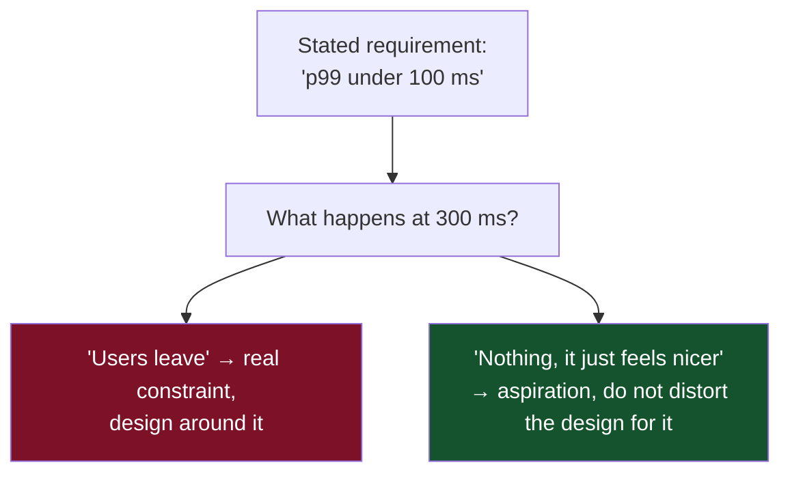

# 01 — The Method

*The procedure, requirement elicitation, and capacity math done longhand.*

[← back to the handbook](../README.md)

---

## 1. Why a procedure at all

System design looks like a creative act and is mostly not one. The variance between
a good design and a bad one is rarely imagination — it is whether the designer
established the constraints before choosing the components.

The procedure exists to stop three specific failures:

1. **Solving the wrong problem.** Half of all design disagreements dissolve once
   somebody writes down what the system must actually do.
2. **Choosing components before knowing the load.** A design for 300 QPS and a
   design for 300,000 QPS share almost nothing. Naming Kafka before computing the
   volume is guessing.
3. **Discovering the hard part at the end.** Every system has one component the
   scale genuinely breaks. Finding it early is the difference between a design and
   a diagram.

---

## 2. Step 1 — Requirements

### 2.1 Eliciting functional requirements

Ask for the **user journeys**, not the features. "A user posts a photo" is a
journey; "photo upload" is a feature that hides the thumbnailing, the moderation,
the feed insertion and the notification fan-out.

For each journey, extract:

| Question | Produces |
|---|---|
| Who initiates it? | The client type — mobile, browser, server-to-server |
| How often? | The QPS input |
| What does it read? | The read model |
| What does it write? | The write model and its durability needs |
| What must be true afterwards? | The consistency requirement |
| What may happen later? | The async boundary |

That last pair is the important one. "The post must exist" is synchronous. "Their
followers must be notified" is not. Drawing that line is most of the architecture.

### 2.2 Scoping ruthlessly

State what you are **not** building. A design that quietly includes search,
analytics, admin tooling, billing and moderation is a design that will be shallow
everywhere. Pick three or four journeys, name the rest as deferred, and go deep.

### 2.3 The non-functional interrogation

Every non-functional requirement should come with the question *"and what happens
if we miss it?"* The answer separates the real constraints from the aspirational
ones.



A requirement nobody can attach a consequence to is a preference. Preferences are
fine — they just must not buy complexity.

---

## 3. Step 2 — The API

Defining the API before the architecture is a forcing function: it makes you name
the operations, their inputs, their outputs, and — critically — **which ones are
synchronous**.

```
POST   /v1/posts                    → 201 {id, created_at}      sync
GET    /v1/posts/{id}               → 200 {post}                sync, cacheable
GET    /v1/feed?after=<cursor>      → 200 {items[], next}       sync, cacheable 10s
POST   /v1/posts/{id}/like          → 204                       sync, idempotent
POST   /v1/media/upload-url         → 200 {url, key}            sync
POST   /v1/media/{key}/complete     → 202 {status_url}          ASYNC boundary
```

The moment `202` appears, you have committed to a queue, a worker, a status
mechanism, and a UX for the pending state. That is an architectural decision made
visible by writing six lines of API.

---

## 4. Step 3 — Capacity estimation, longhand

### 4.1 Units — get these automatic

| | Value | Power |
|---|---|---|
| Thousand | 1,000 | 10³ |
| Million | 1,000,000 | 10⁶ |
| Billion | 1,000,000,000 | 10⁹ |
| Trillion | 10¹² | 10¹² |

| Bytes | | Rough |
|---|---|---|
| KB | 10³ | a paragraph |
| MB | 10⁶ | a photo, a minute of MP3 |
| GB | 10⁹ | a movie, a mid-sized database |
| TB | 10¹² | a large database, a disk |
| PB | 10¹⁵ | a large company's data lake |

**Time anchors:**

```
seconds per day    = 86,400        ≈ 10^5
seconds per month  = 2,592,000     ≈ 2.5 x 10^6
seconds per year   = 31,536,000    ≈ 3 x 10^7
```

> **The single most useful shortcut:** 1 event per user per day for 1 million users
> ≈ **12 QPS**. Everything else scales from there. 100 M users doing 1 thing a day
> ≈ 1,200 QPS. 100 M users doing 100 things a day ≈ 120,000 QPS.

### 4.2 The five computations

**QPS**

```
avg_qps  = daily_events / 86,400
peak_qps = avg_qps x peak_factor
```

Peak factors by workload shape:

| Workload | Peak-to-average |
|---|---|
| Global consumer app (traffic follows the sun) | 2–3× |
| Regional / single-timezone consumer app | 4–8× |
| Business hours B2B | 5–10× |
| Event-driven (ticket sales, tax deadline, flash sale) | 50–1000× |

**Storage**

```
bytes_per_day  = writes_per_day x bytes_per_record
raw_per_year   = bytes_per_day x 365
stored_per_year = raw_per_year x replication_factor x (1 + index_overhead)
```

Use `index_overhead ≈ 0.3` for a typical relational table with two or three
secondary indexes. Add compression savings (2–5× for text, ~1× for already-compressed
media) only if you know the engine compresses.

**Bandwidth**

```
ingress_bps = write_qps x avg_request_bytes x 8
egress_bps  = read_qps  x avg_response_bytes x 8
```

Compute egress separately — it is the one with a per-GB price in every cloud.

**Memory / cache**

```
hot_set_bytes = items_in_working_set x bytes_per_item
cache_nodes   = hot_set_bytes / usable_bytes_per_node
```

Under a Zipfian distribution, caching the top 20% of keys typically yields an 80–90%
hit ratio. Verify against real access logs when you have them; assume it only for
estimation.

**Machines**

```
app_nodes = peak_qps / per_node_qps x (1 + headroom)
```

Use `headroom ≈ 0.3–0.5`. A fleet running at 90% has no capacity to absorb a node
failure — losing one node at 90% utilisation pushes the survivors over 100%, which
is how a single instance failure becomes an outage.

### 4.3 Worked example — a photo sharing service

```
GIVEN
  Users                    500 M registered, 200 M DAU
  Uploads                  0.2 photos/user/day
  Views                    120 photo views/user/day
  Photo original           3 MB
  Derivatives              thumb 20 KB, medium 200 KB, large 800 KB → 1.02 MB
  Metadata row             ~500 B
  Retention                forever
  Replication              3x for metadata, 2x (erasure-coded) for media

WRITES
  uploads/day  = 200M x 0.2                    = 40 M/day
  avg write QPS = 40M / 86,400                 ≈ 463 /s
  peak (x3)                                    ≈ 1,400 /s
  → comfortably handled by a modest fleet; the DB is not the problem

READS
  views/day    = 200M x 120                    = 24 B/day
  avg read QPS = 24B / 86,400                  ≈ 278,000 /s
  peak (x3)                                    ≈ 834,000 /s
  read:write ratio                             ≈ 600:1
  → overwhelmingly read-dominated. CDN + cache is the entire game.

STORAGE — media
  per day  = 40M x (3 MB + 1.02 MB)            ≈ 161 TB/day
  per year                                     ≈ 58.7 PB/year
  x2 durability                                ≈ 117 PB/year
  → object storage with lifecycle tiering. Originals to cold storage after 90 days;
    derivatives stay hot. This one decision is worth tens of millions per year.

STORAGE — metadata
  per day  = 40M x 500 B                       = 20 GB/day
  per year = 7.3 TB  x3 replicas x1.3 indexes  ≈ 28 TB/year
  → fits a sharded relational cluster easily. Metadata is NOT the scaling problem.
    Note the ratio: media is ~4,000x the metadata volume.

BANDWIDTH
  Assume the medium derivative (200 KB) serves most views.
  egress = 834,000 /s x 200 KB                 ≈ 167 GB/s ≈ 1.33 Tbps
  → this MUST be served from a CDN. At origin-egress list prices this is
    a nine-figure annual bill; at 95% CDN offload it becomes tractable.

CACHE
  Assume 80% of views target photos from the last 7 days.
  recent photos = 40M x 7                      = 280 M photos
  medium derivatives = 280M x 200 KB           = 56 TB
  → too large for RAM; this is a CDN job, not a Redis job.
  Metadata cache: 280M x 500 B                 = 140 GB → fits in a Redis cluster.

CONCLUSIONS BEFORE ANY COMPONENT WAS NAMED
  1. This is a content delivery problem wearing a database costume.
  2. Media never touches the application servers — pre-signed URLs both ways.
  3. Metadata is small and boring; a sharded relational store is fine.
  4. The CDN hit ratio is the single most important number in the system's economics.
  5. Storage tiering of originals is the largest cost lever available.
```

Notice how little of this depended on knowing any particular technology. The shape
of the system fell out of five multiplications.

---

## 5. Step 4 — High-level design

Draw **five to nine boxes**. More than nine and nobody can hold it in their head;
fewer than five and you have not decomposed anything.

The default skeleton, in order:

1. Client → 2. Edge (CDN/LB) → 3. API layer → 4. Service(s) → 5. Cache →
6. Primary store → 7. Async pipeline → 8. Derived stores

Then annotate every arrow with **what flows and how often**. An unlabelled arrow
hides the entire load model.

---

## 6. Step 5 — Data model

Write the **access patterns first**, then design the schema to serve them. This is
mandatory for NoSQL and merely excellent practice for relational.

```
AP1  get post by id                            → point lookup
AP2  get a user's posts, newest first, paged   → range scan on (user_id, created_at DESC)
AP3  get a user's feed, newest first, paged    → precomputed list, or fan-out on read
AP4  count likes on a post                     → counter, eventually consistent
AP5  has THIS user liked THIS post             → point lookup on (post_id, user_id)
AP6  search posts by text                      → inverted index (derived store)
```

AP3 is the one that decides the architecture. AP4 tells you a counter table with
contention is coming. AP6 tells you there is a second store to keep in sync.

---

## 7. Step 6 — Find the hard part

Every system has exactly one component where the numbers stop being comfortable.
Name it explicitly and spend your remaining time there.

| System | The hard part |
|---|---|
| Photo sharing | CDN economics and the media pipeline |
| Social feed | Fan-out for high-follower accounts |
| Chat | Connection state and ordering across devices |
| Payments | Exactly-once effects and reconciliation |
| Ride hailing | Geospatial matching at update volume |
| Search | Index freshness vs query latency |
| Analytics | Cardinality and query cost |

If you cannot name the hard part, you have not estimated properly.

---

## 8. Step 7 — Bottlenecks and failure

Walk the diagram and, for each box, ask three questions:

1. **What happens when this is slow?** (Not down — *slow*. Grey failure is worse.)
2. **What happens when this is down?** Does the system degrade or stop?
3. **What is its scaling limit, and what do we do at 10×?**

Then look specifically for:

- **Single points of failure** — any box without redundancy.
- **Serialised resources** — a global lock, a single sequence, one primary database.
- **Unbounded growth** — a queue, a cache, a table without retention.
- **Correlated failure** — components that share a rack, a config push, or a
  dependency, and therefore fail together despite looking redundant.

---

## 9. Step 8 — State the trade-offs

Close by naming what you gave up. This is the part that distinguishes a design from
a wish.

A good trade-off statement has three parts: **the choice, the cost, and the
condition that flips it.**

> "I chose eventual consistency for the feed. The cost is that a user may briefly
> not see a follow they just made reflected in their timeline. I would flip to
> read-your-writes via leader routing if we saw support tickets about it, and to
> full strong consistency only if the feed became transactional — for example if we
> started charging for promoted posts by impression."

---

## 10. The one-page checklist

```
□ Functional requirements listed, scope explicitly narrowed
□ Non-functional targets stated WITH consequences
□ API sketched; the sync/async boundary is visible
□ QPS computed — average and peak, with the peak factor justified
□ Storage computed — per day, per year, with replication and indexes
□ Bandwidth computed — ingress and egress separately
□ Read:write ratio stated
□ Access patterns written before the schema
□ High-level diagram: 5-9 boxes, every arrow labelled
□ The hard part named
□ Bottlenecks identified: SPOFs, serialised resources, unbounded growth
□ Failure behaviour described for each component: slow, down, and at 10x
□ Trade-offs stated as choice + cost + flip condition
□ Deferred scope listed explicitly
```

---

[← back to the handbook](../README.md) · [next: Scalability and load balancing →](02-scalability-and-load-balancing.md)
