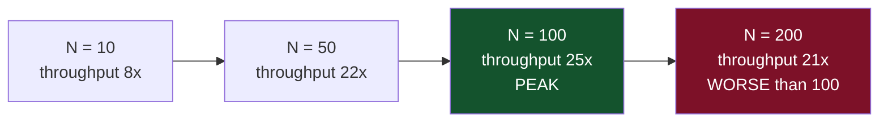
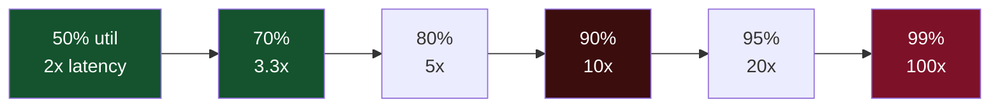
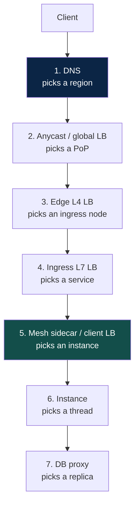
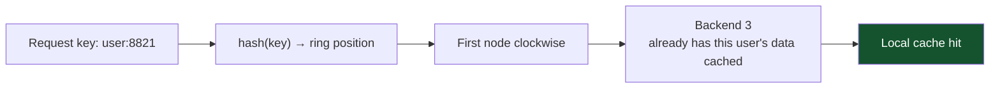
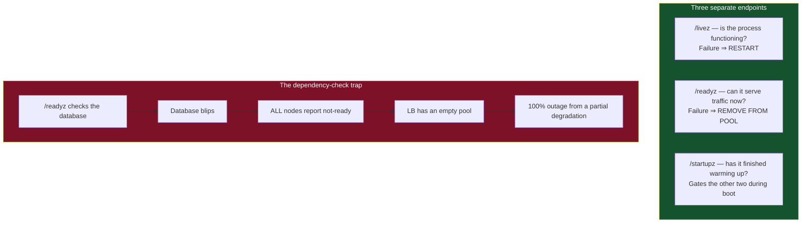
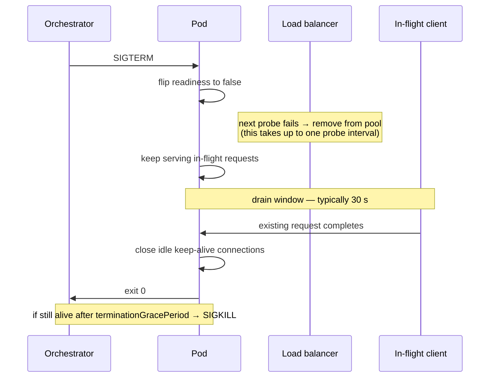
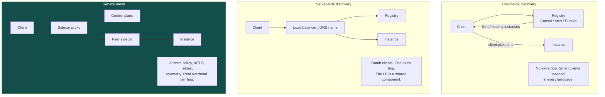
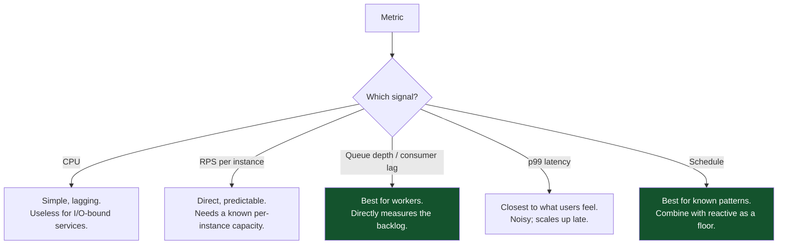

# 02 — Scalability and Load Balancing

*Why adding machines stops working, and how traffic actually finds a server.*

[← back to the handbook](../README.md)

---

## 1. The laws that bound scaling

### 1.1 Amdahl's Law — the serial fraction caps you

If a fraction `s` of the work is inherently serial, the maximum speed-up from `N`
workers is:

```
speedup(N) = 1 / (s + (1 - s) / N)
```

As `N → ∞`, `speedup → 1/s`. A workload that is 5% serial can never exceed a 20×
speed-up, no matter how many machines you buy.

| Serial fraction | Ceiling |
|---|---|
| 1% | 100× |
| 5% | 20× |
| 10% | 10× |
| 25% | 4× |

In a distributed system the "serial fraction" is anything every request must pass
through: a shared primary database, a single ID generator, a global lock, a
coordination service, one leader.

### 1.2 The Universal Scalability Law — it gets worse

Amdahl is optimistic because it ignores the cost of workers *talking to each
other*. The USL adds a coherency term:

```
C(N) = N / (1 + σ(N − 1) + κN(N − 1))

  σ (sigma) = contention   — waiting for a shared resource
  κ (kappa) = coherency    — keeping nodes consistent with each other
```



The κ term is quadratic, so **beyond some N, adding nodes reduces throughput**.
Anyone who has watched a database cluster get slower after adding a replica, or a
consensus group degrade as it grew, has seen κ dominate.

### 1.3 What to do about it

| Symptom | Cause | Fix |
|---|---|---|
| Throughput plateaus | σ — contention on a shared resource | Find the shared resource. Shard it, replicate it, or remove it from the hot path |
| Throughput **declines** with more nodes | κ — coordination cost | Reduce cross-node communication: partition so nodes are independent, batch coordination, use gossip instead of all-to-all |
| Latency rises but throughput is flat | Queueing | You are at saturation — add capacity or shed load |

The universal remedy is **independence**. Nodes that never need to agree scale
linearly. Every design decision that lets two nodes act without consulting each
other is a scaling decision.

### 1.4 Little's Law — the one you will use most

```
L = λ × W

  L = average number of requests in the system
  λ = arrival rate (requests/sec)
  W = average time in the system (sec)
```

Rearranged, it answers real questions:

- **How many threads do I need?** `threads = qps × latency`. 1,000 QPS at 50 ms
  needs 50 concurrent workers. At 500 ms it needs 500.
- **How deep will my queue get?** If arrivals exceed service rate by 100/s, depth
  grows by 100 every second. Forever.
- **What happens if latency triples?** Concurrency requirement triples. This is
  exactly how a slow dependency exhausts a connection pool.

### 1.5 Queueing theory, in one graph

Response time does not degrade linearly with utilisation — it degrades
*hyperbolically*, and the knee is much earlier than intuition suggests.

```
For an M/M/1 queue:  W = service_time / (1 − utilisation)

  50% utilisation → 2.0x service time
  70%             → 3.3x
  80%             → 5.0x
  90%             → 10x
  95%             → 20x
  99%             → 100x
```



**This is why you target 60–70% utilisation, not 95%.** The idle 30% is not waste;
it is the latency budget. It is also the capacity that absorbs a node failure
without cascading.

---

## 2. Load balancing in depth

### 2.1 Where balancing happens



Seven layers of load balancing in a single request is normal in a mature system.
Each has a different failure mode and a different rebalancing latency: DNS takes
minutes, anycast takes seconds, an L7 balancer takes milliseconds.

### 2.2 Algorithm behaviour under stress

The published comparisons of LB algorithms use uniform request costs. Real traffic
is not uniform, and that is where the differences appear.

| Scenario | Round robin | Least connections | Least response time | P2C |
|---|---|---|---|---|
| Uniform requests, uniform nodes | Optimal | Optimal | Optimal | Near-optimal |
| One node is 2× slower | Overloads it | Adapts well | Adapts well | Adapts well |
| One node **fails fast** (instant 500s) | Sends 1/N | **Sends everything** — no connections held | Adapts (errors counted) | Adapts if health-aware |
| Highly variable request cost | Poor | Good | Good | Good |
| 1,000-node fleet | Fine | Needs global state | Needs global state | **Fine — no global state** |

> **The "least connections attracts failure" trap is real.** A node returning
> instant errors has zero active connections, so a least-connections balancer
> routes *more* traffic to it. This is called a **black hole**, and it converts one
> broken node into a fleet-wide error rate. The defence is **outlier detection**:
> eject nodes whose *error rate* deviates from the fleet, independently of the
> health check.

### 2.3 Consistent hashing for affinity

When backends hold per-key state — a local cache, a WebSocket session, a
stream-processing partition — you want the same key to reach the same backend.



The trade-off is **load imbalance**: consistent hashing distributes *keys* evenly,
not *load*, and one hot key can saturate its owner. **Bounded-load consistent
hashing** fixes this: if the target node is above a load threshold (say 1.25× the
mean), spill to the next node on the ring. You keep most of the affinity and cap
the damage.

### 2.4 Health checking done properly



Rules that prevent the trap:

- **Minimum healthy percentage.** Never eject below a floor (commonly 50%). If more
  than half the fleet reports unhealthy, the check is more likely wrong than the
  fleet. Envoy calls this *panic mode* and it sends traffic to everyone.
- **Separate shallow from deep.** Shallow checks gate routing; deep checks emit
  metrics and page a human.
- **Passive health checking.** Use real traffic outcomes — consecutive 5xx, consecutive
  timeouts — rather than only synthetic probes. Real traffic tests the real path.
- **Slow start.** A newly healthy node with cold caches and an unoptimised JIT will
  fall over if it receives its full share instantly. Ramp over 30–60 seconds.

### 2.5 Connection draining



The classic bug: the pod exits immediately on SIGTERM while the balancer still has
it in the pool, producing a burst of connection-refused errors on every deploy.
Two fixes, both needed — fail readiness **before** you stop accepting, and add a
small `preStop` sleep so the balancer's probe interval elapses before the process
begins shutting down.

---

## 3. Service discovery



**Registration** is either self-registration (the instance announces itself and
heartbeats) or third-party registration (the orchestrator registers it on the
instance's behalf — what Kubernetes does). Third-party is more reliable because a
crashed instance cannot fail to deregister itself.

The subtlety that bites people: **deregistration is not instant**. Between a crash
and its removal from the registry there is a window — typically one or two
heartbeat intervals — during which clients will still be handed a dead address.
Client-side retry with a different instance is what covers that gap. Discovery
alone is not sufficient; discovery plus retry is.

---

## 4. Autoscaling



The realities that make autoscaling harder than it looks:

- **Scaling is not instant.** Instance boot, image pull, JIT warm-up and cache
  priming can take minutes. A 60-second traffic spike is over before autoscaling
  responds. **Buffer capacity handles spikes; autoscaling handles trends.**
- **Scale up fast, scale down slow.** Aggressive scale-down causes thrashing, and
  the cost of one extra instance for ten minutes is trivial next to an outage.
- **Predictive beats reactive** where the pattern is known. Pre-scale before the
  daily peak, before the marketing email goes out, before the match starts.
- **The database usually cannot follow.** Scaling the stateless tier 5× while the
  database stays fixed just moves the queue. Autoscaling without a matching data
  tier plan is a way to overload your database faster.
- **Watch for scale-to-zero cold starts.** Excellent for cost, hostile to p99.

---

## 5. A practical scaling checklist

```
□ Identify every serialised resource on the request path
□ Compute Little's Law: threads = qps x latency, for each pool
□ Target 60-70% utilisation, not 90%
□ Confirm the LB algorithm handles a fast-failing node (outlier detection on)
□ Health checks: shallow gates routing, deep only alerts
□ Minimum-healthy-percentage floor configured
□ Slow start enabled for new instances
□ Graceful drain: readiness flipped before shutdown, preStop delay present
□ Retry on a DIFFERENT instance, with a retry budget
□ Autoscale on the signal that matches the workload, not on CPU by default
□ Confirm the data tier can absorb the scaled app tier
```

---

[← previous: The method](01-the-method.md) · [back to the handbook](../README.md) · [next: Caching and CDN →](03-caching-and-cdn.md)
