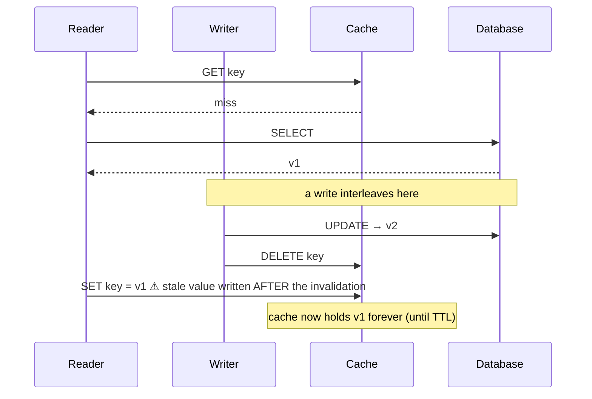
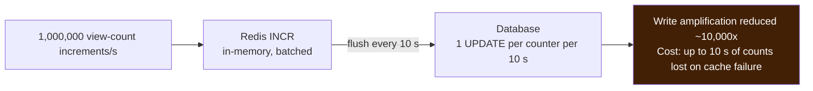
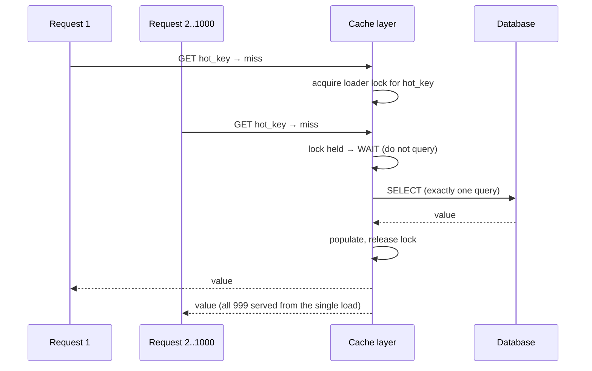
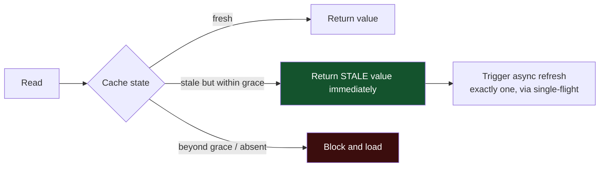
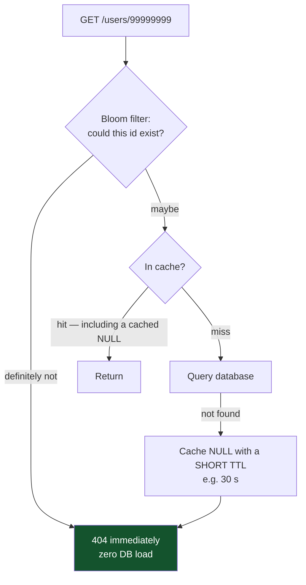
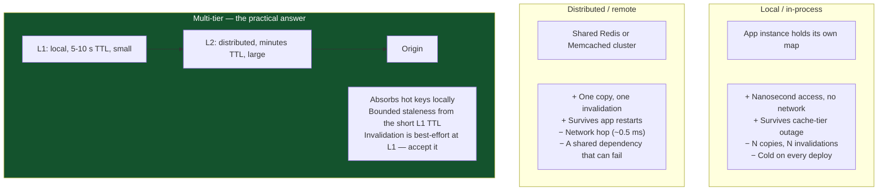
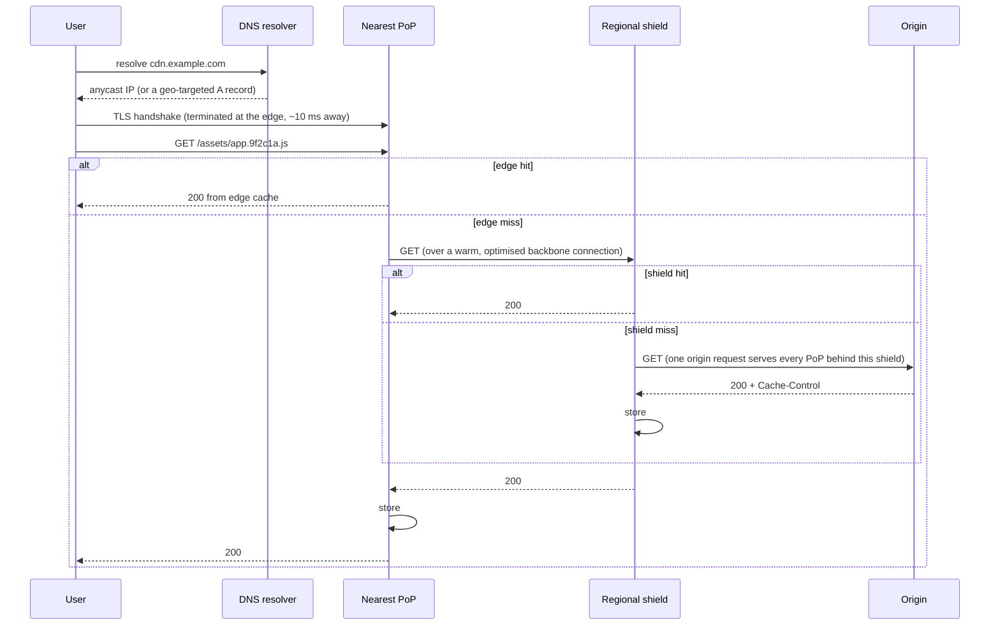
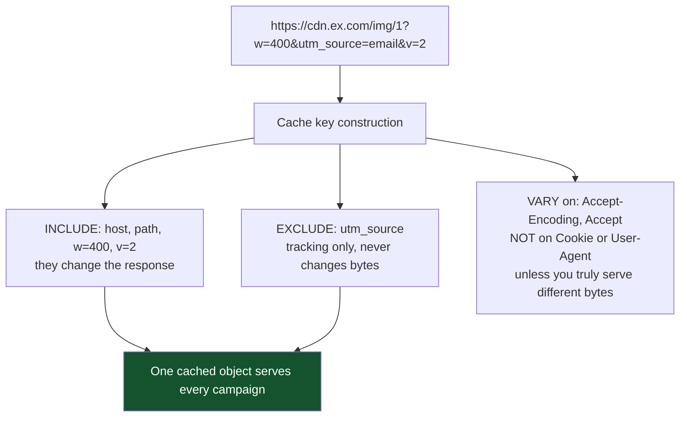
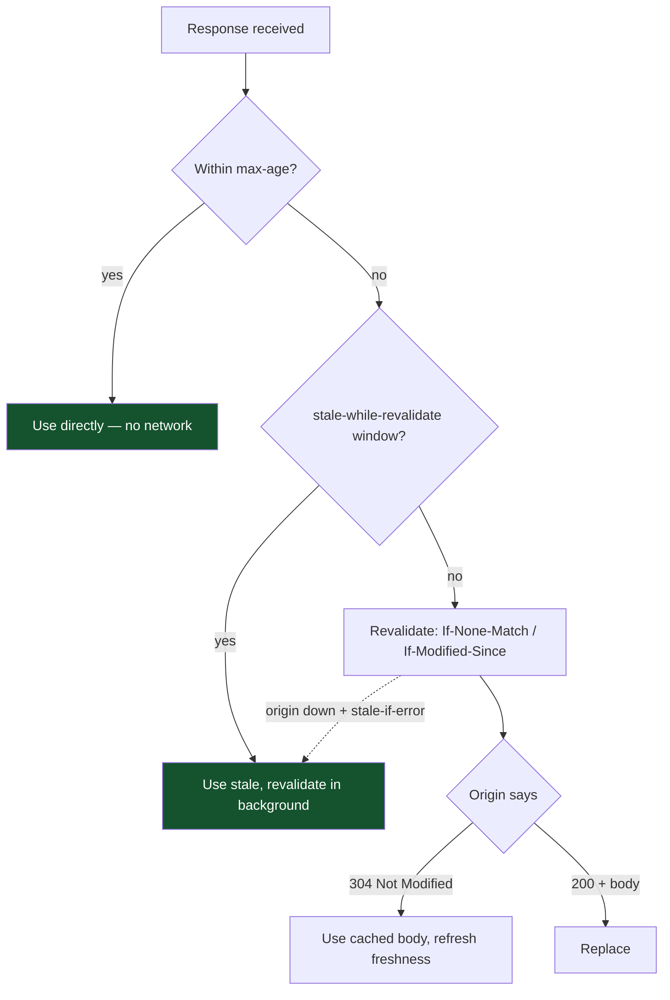

# 03 — Caching and CDN

*Cache patterns, eviction, invalidation, stampede protection, and how a CDN actually works.*

[← back to the handbook](../README.md)

---

## 1. The two questions a cache must answer

Before adding any cache, answer both:

1. **What is the source of truth, and can the cache be rebuilt from it?**
   If the answer is no, it is not a cache — it is a database with no durability.
2. **How wrong may this data be, and for how long?**
   If the answer is "never wrong", you do not want a cache; you want a faster
   database or a different data model.

Everything below is machinery in service of those two answers.

---

## 2. Cache hit ratio — the number that matters

```
effective_latency = hit_ratio × cache_latency + (1 − hit_ratio) × origin_latency
```

With a 1 ms cache and a 50 ms origin:

| Hit ratio | Effective latency | Origin QPS at 10,000 total QPS |
|---|---|---|
| 0% | 50.0 ms | 10,000 |
| 50% | 25.5 ms | 5,000 |
| 80% | 10.8 ms | 2,000 |
| 90% | 5.9 ms | 1,000 |
| **95%** | **3.5 ms** | **500** |
| 99% | 1.5 ms | 100 |

Two observations that change how you prioritise work:

- **Latency improvements flatten early.** Going 80% → 95% saves 7 ms. Not dramatic.
- **Origin load improvements never flatten.** 80% → 95% *quarters* your origin
  traffic. 95% → 99% quarters it again.

So the case for pushing hit ratio higher is almost always about **capacity and
cost**, not about user-visible latency. Frame it that way when arguing for it.

---

## 3. Patterns in full

### 3.1 Cache-aside, with the race made explicit



This is the well-known cache-aside anomaly. Mitigations, in increasing order of
cost:

| Mitigation | How | Cost |
|---|---|---|
| **TTL** | Bound the damage in time | Simple; wrong for up to the TTL |
| **Delayed double delete** | Writer deletes, waits ~1 s, deletes again | Simple; heuristic, not a proof |
| **Versioned writes** | Store `(version, value)`; only overwrite if the version is newer | Correct; needs a version source |
| **Single-flight + read-through** | One loader per key, cache owns the read | Correct-ish; the loader still races with writes |
| **CDC-driven invalidation** | Invalidate from the database's change log, strictly ordered after commit | Correct and ordered; more infrastructure |

For most systems, **TTL plus delete-on-write** is the right amount of engineering.
For money, permissions and inventory, use versioned writes or do not cache.

### 3.2 Write-back, and when it is legitimate

Write-back caching (write to cache, flush to the store asynchronously) is usually
described as dangerous, and it is — but it is also the correct answer for a
specific shape of problem: **very high write volume where each individual write is
low-value and the aggregate is what matters.**



Nobody is harmed if a view counter loses ten seconds of increments during a Redis
failover. Everybody is harmed if the database has to absorb a million writes per
second. State the loss window explicitly and get agreement on it — that is what
makes it engineering rather than negligence.

---

## 4. Stampede protection in detail

### 4.1 Single-flight (request coalescing)



In-process this is a `sync.Once`-style map or Guava/Caffeine's `LoadingCache`. Across
processes it needs a short-lived distributed lock — and note that a *failed* lock
acquisition should **wait briefly then re-read the cache**, not fall through to the
database, or you have rebuilt the stampede.

### 4.2 Probabilistic early expiration

Rather than everyone missing at once when the TTL expires, each reader
independently decides to refresh *early*, with probability rising as expiry
approaches. From the XFetch paper:

```
should_refresh = now − delta × beta × ln(rand()) ≥ expiry

  delta = how long the last recompute took
  beta  = tuning factor (1.0 default; >1 refreshes earlier)
```

The effect: an expensive-to-compute key gets refreshed earlier and by fewer
readers, and the key effectively never expires under load. No locks, no
coordination.

### 4.3 Stale-while-revalidate

The simplest and often the best: **serve the stale value immediately, refresh in
the background.**



Nobody ever waits for a recompute, the origin sees one request per key per TTL, and
a brief origin outage is invisible because stale data keeps flowing. This pattern
is available for free at the HTTP layer via `stale-while-revalidate` and
`stale-if-error`, and it is dramatically under-used.

### 4.4 The negative-caching / penetration defence



Short TTLs on negative entries matter: a resource that does not exist now may exist
in a second, and caching "absent" for an hour turns a successful signup into a
support ticket.

---

## 5. Cache topologies



The multi-tier subtlety: **you cannot reliably invalidate a local cache** across a
fleet without a pub/sub fan-out, and even then delivery is not guaranteed. The
standard resolution is to keep L1 TTLs very short (seconds), so the worst-case
staleness is bounded and small, and reserve L1 for data where seconds of staleness
is provably fine.

---

## 6. CDN internals

### 6.1 The request path



Three separate wins are happening here, and people usually only count the first:

1. **Distance** — TLS handshake and TCP round trips terminate ~10 ms away instead
   of ~150 ms away. For a connection-heavy page this dominates.
2. **Connection reuse** — the PoP holds warm, tuned connections to the shield and
   origin. Even a full miss avoids handshake cost.
3. **Request collapsing** — concurrent misses for the same object at one PoP become
   a single upstream fetch.

### 6.2 Getting the cache key right



Two failure modes, both common:

- **Over-keying** — including `utm_*`, session cookies, or the full `User-Agent`
  creates a near-unique key per request and collapses the hit ratio to ~0 while you
  pay full CDN prices.
- **Under-keying** — ignoring a parameter that *does* change the response serves
  the wrong content to everyone, which is a correctness bug with a global blast
  radius.

`Vary: User-Agent` deserves specific warning: there are millions of distinct
user-agent strings, so it effectively disables caching. If you must serve different
bytes per device class, normalise to a small set of buckets at the edge and vary on
that.

### 6.3 Caching *dynamic* responses

The largest untapped CDN win in most systems is not images — it is API responses.

| Response | Cacheable? | How |
|---|---|---|
| Public product listing | Yes | `s-maxage=60, stale-while-revalidate=600` |
| Search results for a common query | Yes | Same, keyed on the normalised query |
| Homepage feed (not personalised) | Yes | Short `s-maxage`, purge on publish |
| Personalised feed | Partially | Cache the *shared* fragments; compose per user at the edge or client |
| User profile (own) | No | `private, no-store` |
| Anything with a bearer token | No, unless you key on it | Almost always a mistake to try |

A 10-second `s-maxage` on a high-traffic public endpoint removes ~99% of origin
requests at that endpoint while making the data at most 10 seconds stale. Very few
products care about 10 seconds; almost every product cares about the bill.

### 6.4 Purge strategies

| Mechanism | Latency | Granularity | Notes |
|---|---|---|---|
| TTL expiry | Up to the TTL | Per object | Free, always the backstop |
| URL purge | Seconds | One object | Fine for occasional corrections |
| **Surrogate-key / tag purge** | Seconds | Arbitrary groups | Tag responses (`Surrogate-Key: product-42 category-9`) and purge by tag. The right answer for content systems |
| Wildcard / prefix purge | Seconds to minutes | A path tree | Coarse; can cause a miss storm |
| Purge all | Minutes | Everything | **Emergency only** — you have just guaranteed a full origin stampede |

Content-hashed URLs remain the best strategy where they apply, because they turn
invalidation into deployment: the new build references new URLs, the old URLs stay
valid for in-flight clients, and nothing is ever purged.

---

## 7. HTTP caching reference



Sensible defaults by asset class:

| Asset | Header |
|---|---|
| Hashed JS/CSS/fonts | `Cache-Control: public, max-age=31536000, immutable` |
| Unhashed HTML entry point | `Cache-Control: no-cache` (store, but always revalidate) |
| User avatars | `Cache-Control: public, max-age=86400` + versioned URL on change |
| Public API list endpoint | `Cache-Control: public, s-maxage=60, stale-while-revalidate=600` |
| Authenticated API response | `Cache-Control: private, no-store` |
| Anything with a Set-Cookie | Never in a shared cache |

---

## 8. Operating a cache tier

- **Alert on hit ratio, not just on the cache being up.** A cache at 20% hit ratio
  is an outage in slow motion — the origin is now taking 80% of the traffic it was
  built to be protected from.
- **Plan for the cold-start thundering herd.** After a cache cluster restart, the
  origin sees 100% of traffic. Options: warm the cache before admitting traffic,
  ramp traffic gradually, or keep a persistent replica that survives restart.
- **Cap memory and choose the eviction policy explicitly.** An unbounded cache
  becomes an OOM. `maxmemory` plus `allkeys-lru` is a deliberate choice; the default
  might not be.
- **Never let the cache become the source of truth.** Ask regularly: "if this
  cluster vanished right now, could we rebuild it from the database?" If the answer
  is no, fix that before anything else.
- **Watch key size distribution.** One 500 MB value in Redis will block the event
  loop during serialisation and cause p99 spikes that look like a network problem.
- **Set client-side timeouts on cache calls.** A cache that has become slow must
  degrade to a miss, not to a hang. `timeout 50ms → treat as miss → query origin` is
  the correct behaviour, and it must be tested.

---

[← previous: Scalability and load balancing](02-scalability-and-load-balancing.md) · [back to the handbook](../README.md) · [next: Data and consistency →](04-data-and-consistency.md)
