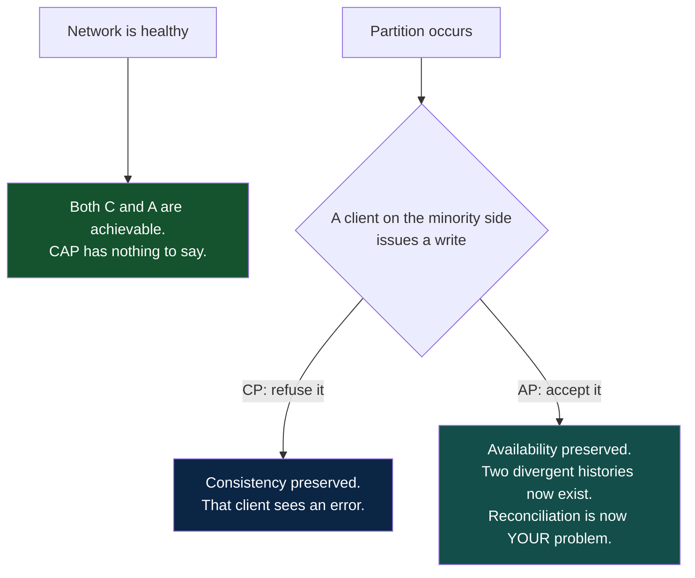
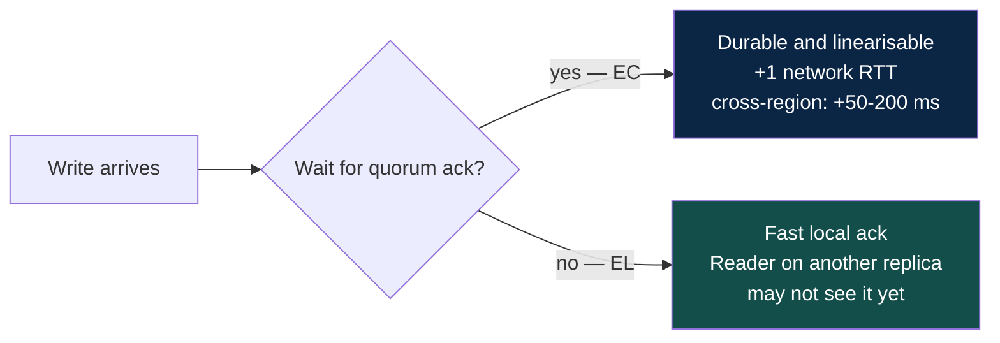
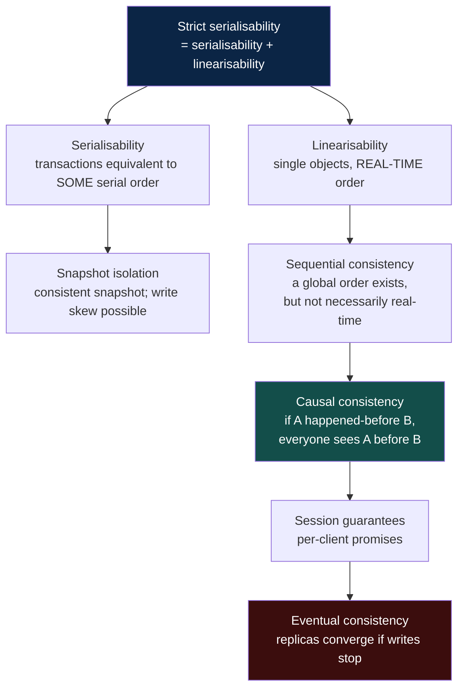
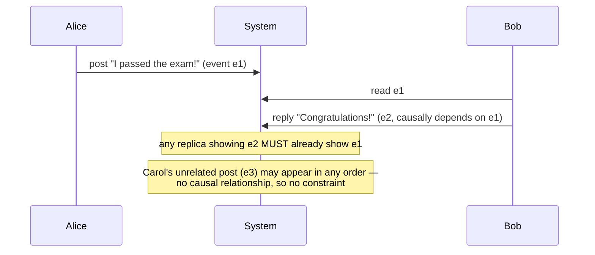
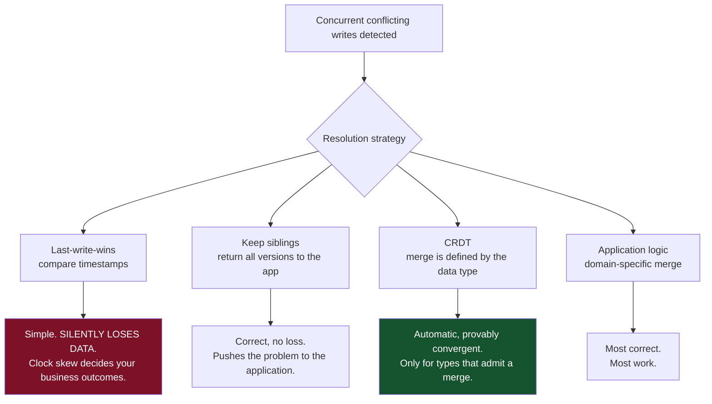
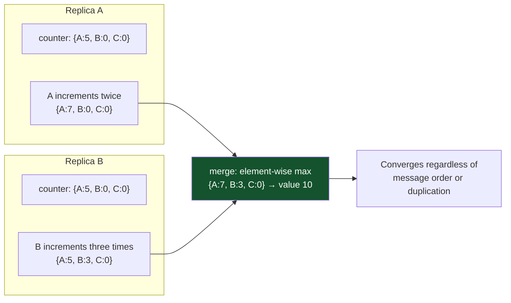
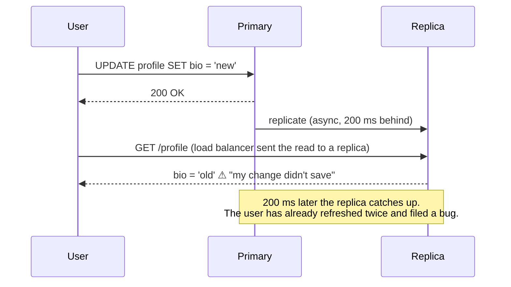
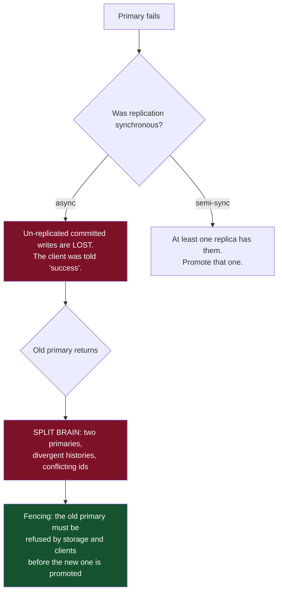
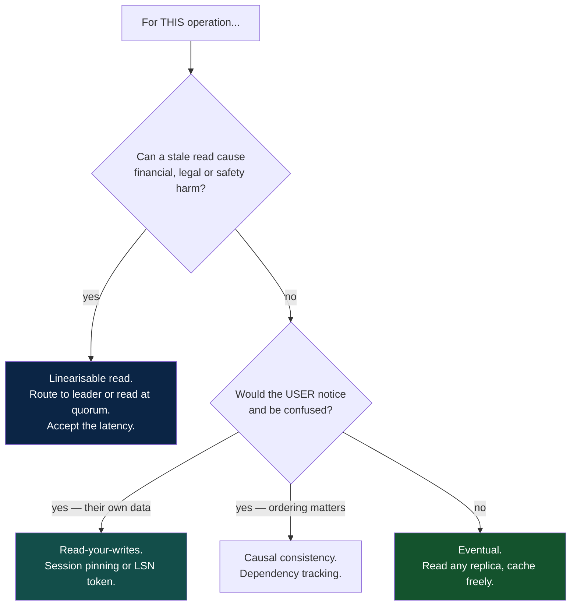

# 04 — Data and Consistency

*CAP properly stated, PACELC, the consistency hierarchy, session guarantees, and CRDTs.*

[← back to the handbook](../README.md)

---

## 1. CAP, stated precisely

The popular version — "pick two of three" — is wrong in a way that causes real
design errors. The precise statement:

> **In an asynchronous network where messages may be lost, it is impossible for a
> read/write register to be simultaneously available and linearisable.**

Three corrections follow:

1. **Partition tolerance is not a choice.** Networks drop packets. A system that is
   not partition-tolerant is a system that is broken during a partition, which is
   not an architecture.
2. **The choice only applies during a partition.** A healthy CP system is available.
   A healthy AP system is consistent-ish. CAP says nothing about normal operation.
3. **"Consistency" in CAP means linearisability specifically** — not the C in ACID,
   which is about integrity constraints. They are unrelated concepts that share a
   letter.



### 1.1 The proof, in three lines

Two nodes N1 and N2, both holding `x = 0`, partitioned from each other.

- A client writes `x = 1` to N1. N1 cannot tell N2.
- A client reads `x` from N2.
- N2 must either return `0` (**not linearisable** — it missed a completed write) or
  refuse to answer (**not available**). There is no third option.

---

## 2. PACELC — the formulation to actually use

> **if (P)artition then (A)vailability or (C)onsistency, (E)lse (L)atency or (C)onsistency**

The `else` branch is the one that governs daily life. Even with a perfect network,
making a read linearisable means confirming with a quorum, and confirming with a
quorum costs a round trip. **Most consistency decisions are latency decisions.**



| System | P → | E → | Practical reading |
|---|---|---|---|
| Spanner | C | C | Always consistent; TrueTime commit-wait costs latency |
| CockroachDB | C | C | Same family; consensus per range |
| DynamoDB (eventual reads) | A | L | Fast, cheap, may be stale |
| DynamoDB (strong reads) | C | C | Opt-in per call, ~2× read cost |
| Cassandra | A | L or C | Tunable per query via consistency level |
| MongoDB | C | C or L | `writeConcern` / `readConcern` per operation |
| Riak | A | L | Availability-first by design |
| MySQL / Postgres, single primary | C | L | Primary consistent, async replicas lag |

The important skill is not memorising this table. It is recognising that **most
modern stores let you choose per operation**, and that a design which picks one
global setting is leaving both performance and correctness on the table.

---

## 3. The consistency hierarchy



### 3.1 Distinguishing the two that get confused

**Linearisability** is about *single objects* and *real time*. If write W completes
at 10:00:00.000 and read R starts at 10:00:00.001, R must see W. It is a
recency guarantee.

**Serialisability** is about *multiple objects in transactions*. It requires the
result to be equivalent to *some* serial order — not necessarily the real-time
order. A serialisable system may execute your transaction "as if" it ran before one
that actually finished earlier.

**Strict serialisability** is both, and it is what people usually mean when they say
"strongly consistent". Spanner provides it. Most single-node databases running
`SERIALIZABLE` provide it too, since one node makes real-time order trivial.

### 3.2 Causal consistency — the sweet spot

Causal consistency is the strongest model achievable **without giving up
availability during a partition**. It preserves the orderings people actually
notice:



The implementation uses **vector clocks** or **dependency tracking**: each write
carries the set of writes it observed, and a replica delays applying a write until
its dependencies are present. The cost is metadata that grows with the number of
writers, which is why practical systems compress it (dotted version vectors,
per-datacentre counters, or hybrid logical clocks).

### 3.3 Session guarantees — the cheap wins

These are what users perceive, and they are far cheaper than global consistency
because they only constrain **one client's own view**.

| Guarantee | Formal meaning | Implementation |
|---|---|---|
| **Read-your-writes** | A client sees its own prior writes | Route to the leader for N seconds after a write; or carry the write's LSN and require the replica to be caught up |
| **Monotonic reads** | Successive reads never go backwards in time | Pin the session to one replica; or track the highest LSN seen and never read from a replica behind it |
| **Monotonic writes** | A client's writes apply in issue order | Same-session ordering token; or serialise per session |
| **Writes-follow-reads** | A write that follows a read is ordered after what was read | Attach the read's version to the write |

The **version-token** technique deserves highlighting because it generalises: the
client keeps the highest version it has observed (an LSN, a hybrid logical
timestamp, a vector) and sends it with every request. Any replica can serve the
request as long as it has caught up to that token; otherwise it waits briefly or
forwards to one that has. You get per-client consistency with full replica
parallelism.

---

## 4. Conflict resolution

When two replicas accept conflicting writes, something must reconcile them.



**Last-write-wins is more dangerous than it looks.** With clock skew between nodes,
"last" is not "latest" — a write made at 10:00:05 on a node whose clock is 3
seconds slow will lose to a write made at 10:00:03 on a fast node. The user who
wrote second sees their change vanish, silently, with no error anywhere. Only use
LWW where losing a concurrent update is genuinely acceptable (a cache, a
last-seen-at timestamp, a presence indicator).

### 4.1 CRDTs

A **conflict-free replicated data type** has a merge function that is commutative,
associative and idempotent. That means replicas converge regardless of the order or
number of times updates arrive — no coordination, no conflicts, ever.

| Type | Operation | Merge rule |
|---|---|---|
| **G-Counter** | increment only | Per-replica counters; merge takes the max of each, sum for the value |
| **PN-Counter** | increment and decrement | Two G-Counters (P and N); value = sum(P) − sum(N) |
| **G-Set** | add only | Union |
| **2P-Set** | add, remove once | Two G-Sets (added, removed) |
| **LWW-Element-Set** | add, remove | Timestamped membership; latest wins per element |
| **OR-Set** | add, remove, re-add | Unique tag per add; remove targets specific tags |
| **RGA / Logoot / YATA** | ordered sequence | Position identifiers between neighbours — the basis of collaborative text editing |



The limitation is real: **CRDTs give you convergence, not correctness.** A CRDT set
will happily converge to a state where a seat is booked twice. Anything requiring a
global invariant — non-negative inventory, unique usernames, account balances that
must not go below zero — needs coordination. CRDTs remove the need to coordinate;
they do not remove the need to be right.

---

## 5. Replication mechanics

### 5.1 What actually gets shipped

| Method | Ships | Pros | Cons |
|---|---|---|---|
| **Statement-based** | The SQL text | Compact | Non-deterministic functions (`NOW()`, `RAND()`), triggers and auto-increment diverge |
| **Write-ahead log shipping** | Physical page changes | Exact, cheap | Replicas must run the identical storage engine version |
| **Logical / row-based** | Row before/after images | Version-independent, enables CDC and heterogeneous targets | Larger volume |
| **Trigger-based** | Application-level captures | Fully flexible | Slow, invasive, fragile |

Logical replication is the one to know, because it is what makes **change data
capture** possible — streaming a database's changes into Kafka, a search index, a
warehouse, or a cache invalidator, in commit order, with no polling.

### 5.2 Replication lag and its symptoms



Fixes, cheapest first:

1. **Read your own writes from the primary** for a short window after any write —
   set a cookie or session flag with a timestamp.
2. **Carry the LSN.** The write returns its log position; the read requires a
   replica at or beyond it.
3. **Monitor and cap lag.** Eject replicas beyond a lag threshold from the read
   pool.
4. **Semi-synchronous replication** so at least one replica is always current.

### 5.3 Failover hazards



The nastiest concrete instance: an async replica is promoted, starts issuing
auto-increment ids from where *it* left off, and reuses ids the old primary had
already handed out — so ids that were unique become duplicates pointing at
different rows in the application, the cache, and every downstream system. This is
a genuine, documented production failure class, and it is the reason external ids
should not be a bare database sequence.

---

## 6. Quorum arithmetic

```
N = replicas
W = nodes that must acknowledge a write
R = nodes that must respond to a read

R + W > N  ⇒  read and write sets intersect ⇒ at least one node in every read
             has the latest write
W > N/2    ⇒  writes cannot conflict with each other (no two disjoint write quorums)
```

| Config | Behaviour |
|---|---|
| N=3, W=3, R=1 | Fast reads. Any node down blocks writes |
| N=3, W=1, R=3 | Fast writes. Any node down blocks reads |
| **N=3, W=2, R=2** | Tolerates one failure for both. **The standard** |
| N=5, W=3, R=3 | Tolerates two failures |
| N=3, W=1, R=1 | No overlap — eventual only, maximum availability |

**Sloppy quorums** (Dynamo-style) relax this: if the natural replicas are
unreachable, write to *any* N available nodes and hand the data back later via
**hinted handoff**. This buys availability during a partition and gives up the
`R + W > N` guarantee while the hints are outstanding. It is the right trade for a
shopping cart and the wrong one for a bank balance.

---

## 7. A decision procedure



Applied to one product, this produces a table like:

| Operation | Model | Why |
|---|---|---|
| Account balance at withdrawal | Linearisable | Money |
| Permission check | Linearisable, fail closed | Security |
| Placing an order | Linearisable on inventory | Cannot oversell |
| Own profile after editing | Read-your-writes | Otherwise "it didn't save" |
| Reply appearing under its parent | Causal | Otherwise nonsense |
| Follower count | Eventual | Nobody is harmed by a 10 s lag |
| Recommendations | Eventual, cached for hours | Freshness is nearly irrelevant |

**One system, six different answers.** That is the correct outcome — a single global
consistency setting means you are either paying too much or being wrong somewhere.

---

[← previous: Caching and CDN](03-caching-and-cdn.md) · [back to the handbook](../README.md) · [next: Messaging and async →](05-messaging-and-async.md)
