# 05 — Messaging and Async

*Queues, logs, delivery semantics, the outbox, ordering, and backpressure.*

[← back to the handbook](../README.md)

---

## 1. Choosing the messaging primitive

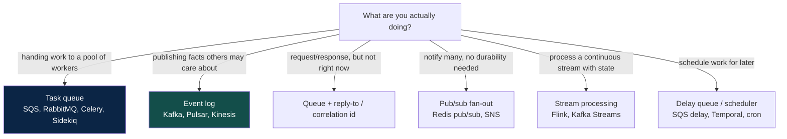

The distinction that matters most: **a command has exactly one intended handler; an
event has zero or more interested observers.**

```
Command:  ChargeCard          → "do this"      → a queue, one consumer, may be rejected
Event:    OrderPlaced         → "this happened" → a log, N consumers, cannot be rejected
```

Getting this backwards produces the two classic architectural smells: a "queue" that
five services all read (and each processes a fraction of the messages, silently
dropping the rest) and an "event" that the publisher expects a specific consumer to
act on, creating hidden coupling that no diagram shows.

---

## 2. Log mechanics in depth

### 2.1 Anatomy

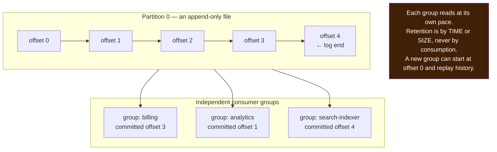

Retention decoupled from consumption is the whole point. It means:

- A bug in a consumer is recoverable — fix it, reset the offset, reprocess.
- A new service can be added later and backfill from history.
- A projection (search index, cache, materialised view) can be rebuilt from scratch.

### 2.2 Partitioning and its consequences

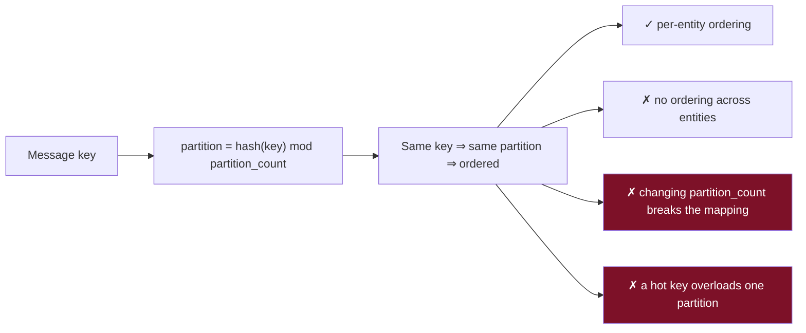

| Decision | Guidance |
|---|---|
| **Partition count** | Set it for future parallelism — increasing later breaks key affinity. A common heuristic: `max(target_throughput / per_partition_throughput, target_consumers)`, then round up generously |
| **Key choice** | The entity whose ordering must be preserved: `order_id`, `user_id`, `account_id`. **Never** a random value if ordering matters, **never** a low-cardinality value like `country` |
| **Null key** | Round-robin distribution, no ordering. Correct for genuinely independent events |
| **Hot key** | Sub-key it (`user_id:bucket`) and accept partial ordering, or handle it out of band |

### 2.3 Consumer group rebalancing

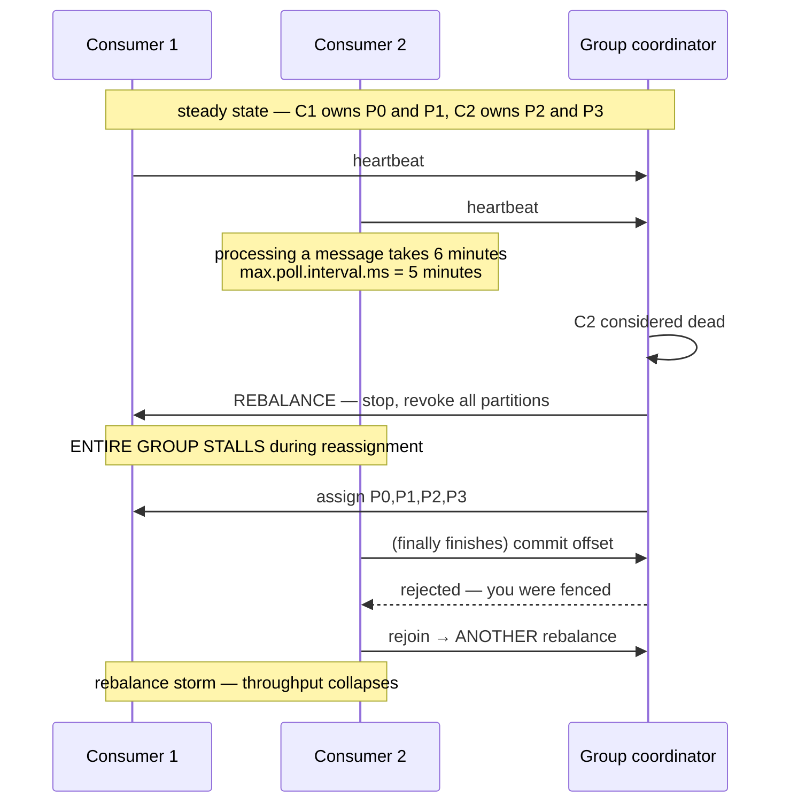

This is one of the most common production incidents with log-based consumers, and
it presents as "the broker is broken" when it is an application problem. The fixes:

- **Keep per-message processing well under the poll interval.** If work is slow,
  hand it to a thread pool and keep polling — but then you own the offset-commit
  correctness yourself.
- **Raise `max.poll.interval.ms` and lower `max.poll.records`** so a batch cannot
  exceed the interval.
- **Use cooperative/incremental rebalancing** so only the moved partitions pause
  rather than the whole group.
- **Use static group membership** so a rolling restart does not trigger a full
  reshuffle.

---

## 3. Delivery semantics, precisely

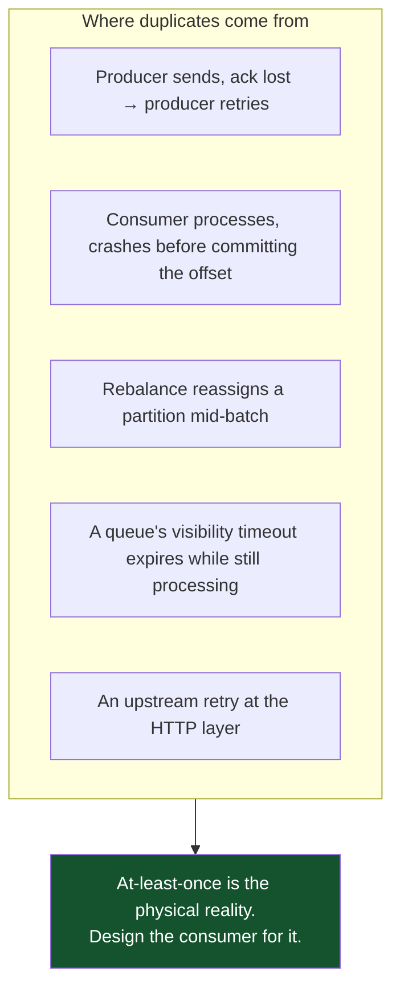

### 3.1 The consumer's commit choice

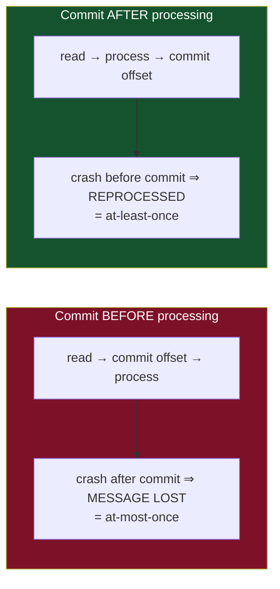

Always commit after. Then make processing idempotent. There is no third option that
does not involve a transaction spanning the broker and your database — which is
exactly what the outbox/inbox pattern approximates without the distributed
transaction.

### 3.2 The inbox pattern

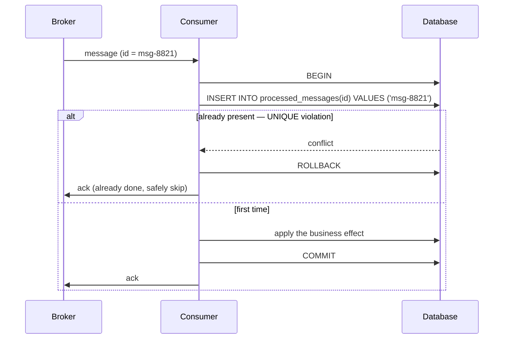

The effect and the dedup record commit atomically, so the duplicate is impossible
to double-apply regardless of when the crash happens. Keep `processed_messages`
partitioned by time and drop old partitions — it is the cheapest way to prevent
unbounded growth.

---

## 4. Ordering

Ordering is the requirement people forget to state and then discover the hard way.

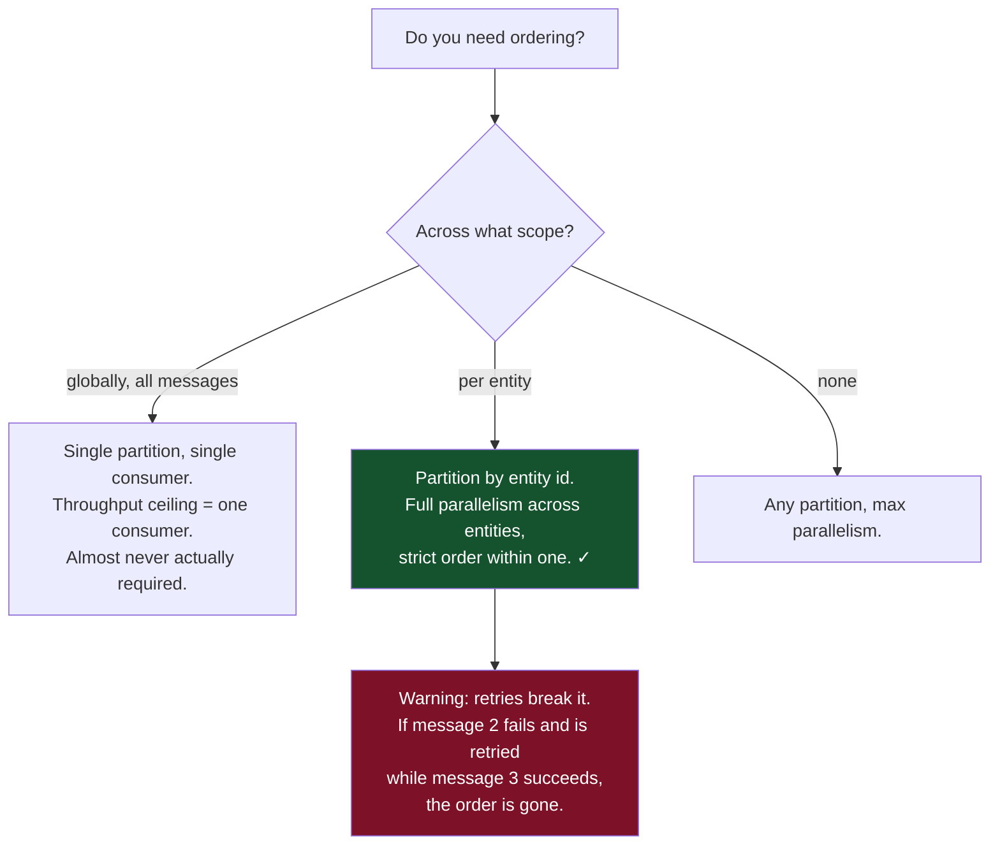

The retry/ordering conflict is subtle and important. If you need strict per-entity
ordering **and** retries, you must either:

- **Block the partition** on failure — stop consuming until the message succeeds or
  is parked. Correct, but one poison message halts every entity in that partition.
- **Park the entity, not the partition** — move the failing entity's messages to a
  side queue and continue with others. More work, much better behaviour.
- **Make handlers order-insensitive** — use version numbers and ignore stale
  updates (`if incoming.version <= current.version: skip`). Often the best answer.

---

## 5. The outbox pattern, in production form

```sql
CREATE TABLE outbox (
    id             BIGSERIAL PRIMARY KEY,
    aggregate_type TEXT        NOT NULL,   -- 'order'
    aggregate_id   TEXT        NOT NULL,   -- '8821'
    event_type     TEXT        NOT NULL,   -- 'OrderPlaced'
    payload        JSONB       NOT NULL,
    created_at     TIMESTAMPTZ NOT NULL DEFAULT now(),
    published_at   TIMESTAMPTZ            -- NULL until relayed
);

CREATE INDEX outbox_unpublished ON outbox (id) WHERE published_at IS NULL;
```

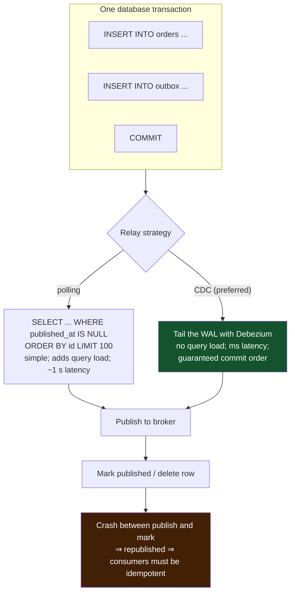

Details that separate a working outbox from a demo one:

- **Order by `id`, and process serially per aggregate.** Publishing out of commit
  order defeats the purpose.
- **Delete or archive published rows.** An outbox table that grows forever will
  eventually make the partial index useless and the vacuum expensive.
- **The partial index is not optional.** Without `WHERE published_at IS NULL`, the
  relay's query scans an ever-growing table.
- **Include an idempotency key in the payload** — usually the outbox `id` — so
  consumers have a natural dedup key.
- **Monitor relay lag.** `now() - min(created_at) WHERE published_at IS NULL` is the
  single most important metric; if it grows, events are silently not happening.

---

## 6. Dead letter queues

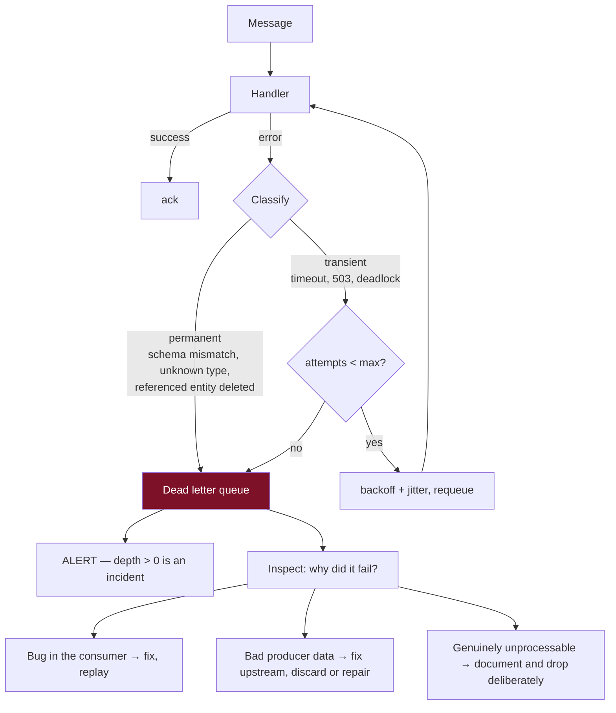

The operational rules people skip:

- **Store the failure reason and the full original message**, not just the payload.
  A DLQ entry without the exception and the headers is nearly useless.
- **Build the replay tool before you need it.** During an incident is the wrong time
  to write one, and an untested replay path can double-apply effects.
- **Cap DLQ retention and alert on age**, not only on count. A message that has sat
  in the DLQ for two weeks is a decision nobody made.

---

## 7. Backpressure and flow control

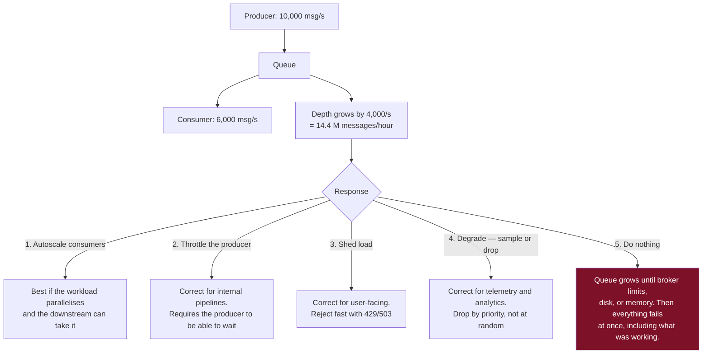

**Every buffer must be bounded.** An unbounded queue does not absorb overload — it
converts a visible, immediate, partial failure into an invisible, delayed, total
one. When the bound is hit, the system must have a defined behaviour: block, shed,
or drop. "Undefined" means OOM.

### 7.1 Consumer lag is the health metric

Measure lag in **two units**, because they answer different questions:

| Unit | Answers |
|---|---|
| Messages behind | How much work is outstanding |
| **Seconds behind** (age of the oldest unprocessed message) | **How stale is the data downstream** — this is the one users feel |

Alert on seconds-behind with a burn-rate style rule: a lag that is growing is an
incident even if the absolute number is still small, because the trend determines
whether it recovers.

---

## 8. Scheduled and delayed work

| Need | Mechanism | Notes |
|---|---|---|
| Retry in 30 s | Delay queue / visibility timeout | Native in SQS, RabbitMQ (via TTL + DLX) |
| Send a reminder in 3 days | Scheduler table + poller, or a durable workflow engine | Broker delay limits are usually ~15 minutes |
| Nightly batch | Cron / workflow orchestrator | Needs idempotency — reruns happen |
| Long multi-step process with waits | **Durable workflow engine** (Temporal, Step Functions) | Persists execution state; survives restarts; handles timers, retries and compensation natively |

For anything with more than two steps, human approval, or waits measured in days, a
durable workflow engine is dramatically less work than hand-rolling a state machine
across queues and a database — and it makes the process *inspectable*, which is
what you will want at 3 am.

---

## 9. Checklist

```
□ Command vs event distinguished; queue vs log chosen accordingly
□ Partition key chosen from the ordering requirement, not by default
□ Partition count set with future parallelism in mind
□ Consumer commits AFTER processing
□ Consumers are idempotent (dedup key + inbox table, or naturally idempotent effects)
□ Outbox used for any "write to DB and publish an event" flow
□ Outbox relay lag monitored and alerted
□ Retry classification: transient vs permanent
□ Backoff has jitter; total attempts capped
□ DLQ exists, is alerted on, and has a TESTED replay path
□ Every buffer is bounded, with defined behaviour at the bound
□ Consumer lag measured in seconds, not just messages
□ The UX for "work is pending" is designed, not an afterthought
```

---

[← previous: Data and consistency](04-data-and-consistency.md) · [back to the handbook](../README.md) · [next: Microservices and APIs →](06-microservices-and-apis.md)
