# 06 — Microservices and APIs

*Decomposition, domain boundaries, protocols, versioning, and the shape of a good API.*

[← back to the handbook](../README.md)

---

## 1. The honest case for and against

Microservices solve **organisational** problems primarily and technical problems
secondarily. If your team is eight people deploying twice a week, microservices
will cost you more than they return.

| Genuine reason to split | Not a reason to split |
|---|---|
| Two teams block each other on every deploy | The codebase "feels big" |
| One component needs 50× the instances of the rest | It would be more "modern" |
| One component needs a different language or runtime | A blog post recommended it |
| A component must be isolated for compliance (PCI, HIPAA) | The directory structure is messy |
| A component's failure must not affect the rest | We might need to scale someday |
| Radically different change velocity | It will look good in the architecture diagram |

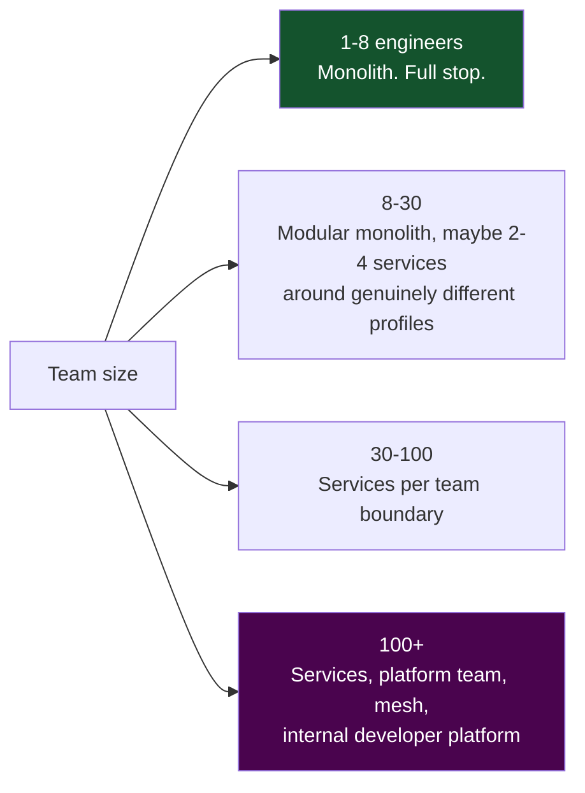

---

## 2. Finding boundaries with domain-driven design

### 2.1 Bounded contexts

The same word means different things in different parts of a business, and **each
distinct meaning is a boundary**.

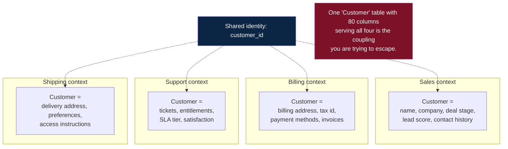

Each context owns its own model. They share only an **identifier**, and they learn
about each other through **events**, not through joins.

### 2.2 The aggregate rule

An **aggregate** is a cluster of objects treated as one unit for consistency — an
Order with its OrderLines, an Account with its Entries. Two rules follow:

1. **One transaction, one aggregate.** If a use case must atomically modify two
   aggregates, either they are actually one aggregate, or the consistency between
   them must become eventual (a saga).
2. **Reference other aggregates by id, never by object.** This is what makes them
   separable later.

Aggregates are the natural granularity of a service. A service that owns whole
aggregates has local transactions; a service that owns half an aggregate has a
distributed transaction problem forever.

### 2.3 Testing a proposed boundary

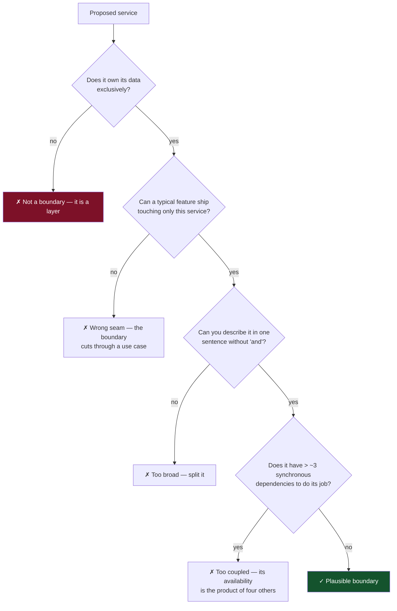

---

## 3. Inter-service data

The hardest part of microservices is not the network. It is that **service B needs
data that service A owns.**

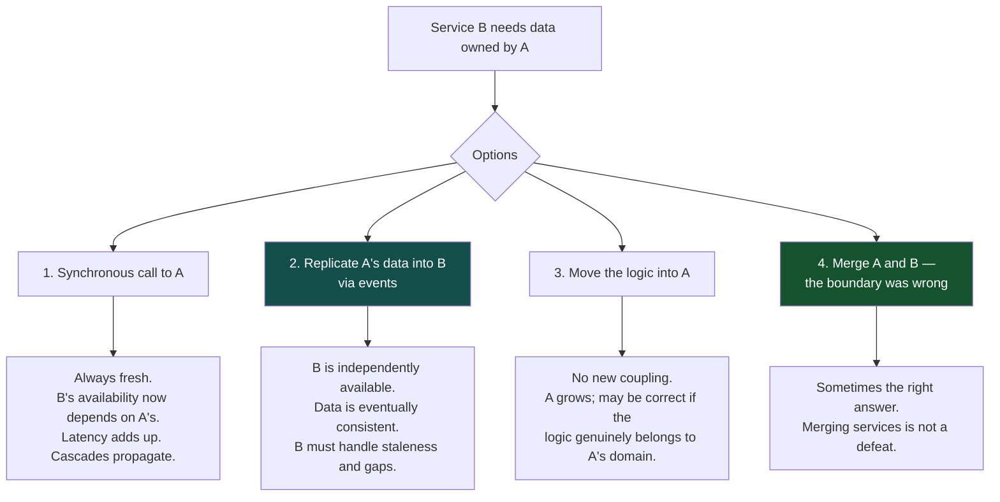

**Data replication via events** is the pattern that makes microservices actually
work. Service B subscribes to `CustomerUpdated` and keeps a local read-only
projection of the fields it needs. B can then serve requests when A is completely
down. The costs are real and must be accepted explicitly: the projection is stale
by the event lag, B must handle events arriving out of order (use version numbers),
and B must be able to rebuild the projection from a replay.

### 3.1 The forbidden pattern

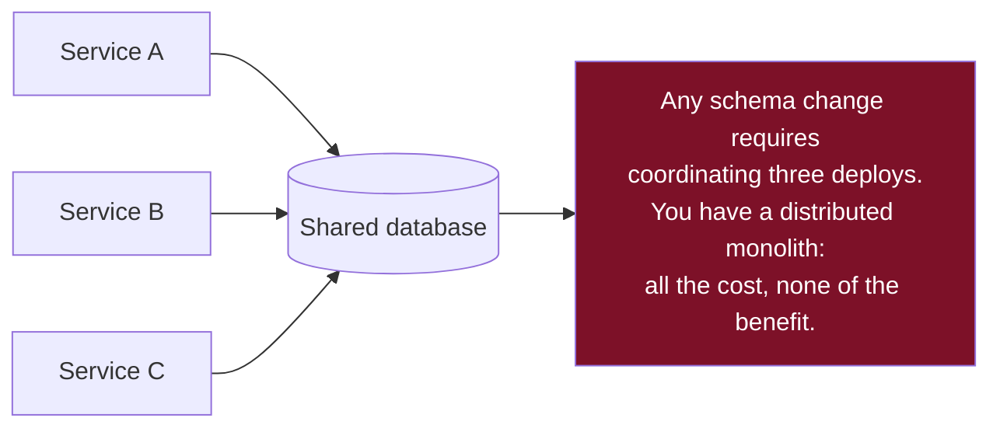

There is exactly one legitimate variant: **one writer, many readers with a
read-only replica and a stable, versioned view**. Even then, the view is a
published API contract and must be treated with the same discipline as an HTTP
endpoint.

---

## 4. Protocol selection in practice

### 4.1 gRPC vs REST for internal traffic

| | REST/JSON | gRPC/Protobuf |
|---|---|---|
| Payload size | Baseline | 30–60% smaller |
| Serialisation cost | High (text parsing) | Low (binary) |
| Schema | Optional (OpenAPI, often stale) | Mandatory, compiled |
| Client generation | Add-on | Built in, all languages |
| Streaming | SSE or WebSocket | Native, bidirectional |
| Load balancing | Per-request (easy) | Per-connection — **needs L7 or client-side LB** |
| Debuggability | curl | grpcurl, less convenient |
| Browser support | Native | Needs grpc-web + proxy |

The gRPC gotcha worth stating: **HTTP/2 multiplexes many requests over one
long-lived connection**, so a naive L4 balancer pins all of a client's traffic to
one backend and your load distribution collapses. You need either an L7-aware proxy
(Envoy) or client-side load balancing with periodic connection recycling.

### 4.2 GraphQL — where it wins and where it hurts

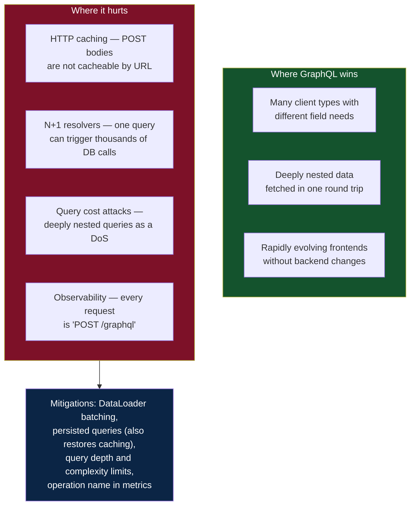

**Persisted queries** solve two problems at once: the client sends a hash instead of
a query string (so it is a cacheable GET), and the server only accepts queries from
a known allowlist (so query-cost attacks become impossible). If you run GraphQL in
production and are not using persisted queries, that is the highest-value change
available.

---

## 5. API design details that matter

### 5.1 Pagination — why keyset wins

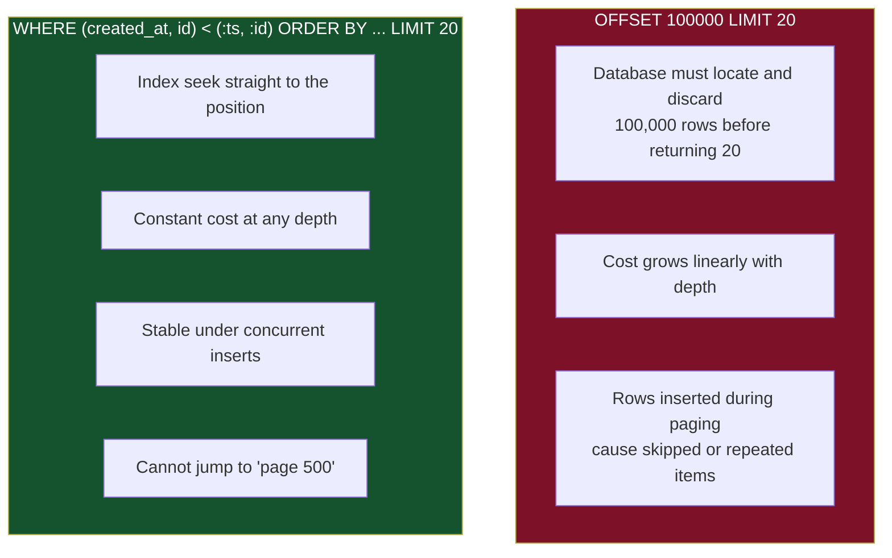

Encode the cursor as an opaque base64 blob so clients cannot construct one and you
can change its internals later. Always include the sort key **plus a tiebreaker**
(usually the primary key) — sorting on a non-unique column alone produces
duplicates and gaps at page boundaries.

### 5.2 Partial responses and expansion

```
GET /orders/42?fields=id,total,status          → sparse fieldset
GET /orders/42?expand=customer,items.product   → controlled embedding
```

This gives most of GraphQL's over-fetching benefit with none of its infrastructure.
Cap the expansion depth and the field count, or you have built the same DoS surface.

### 5.3 Long-running operations

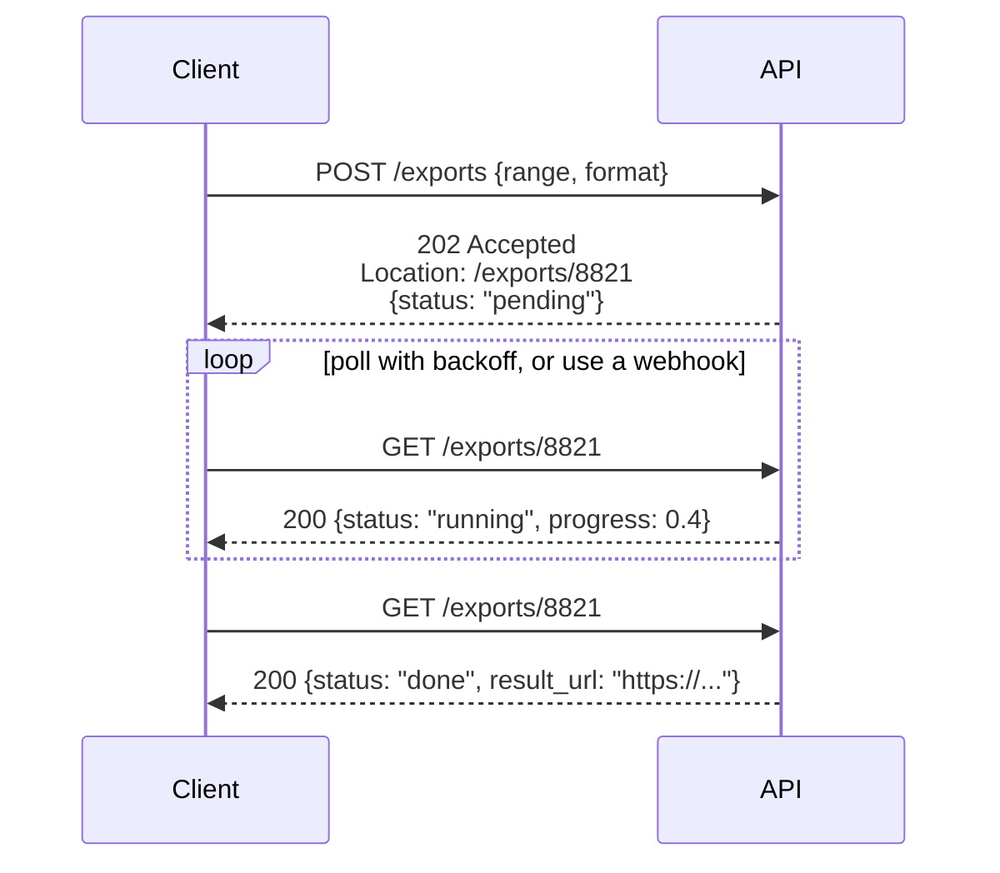

Return a **resource that represents the operation**, not a job id in an ad-hoc
shape. The operation resource can then carry progress, errors, timing, and a result
link, and it is cancellable via `DELETE`.

### 5.4 Versioning without pain

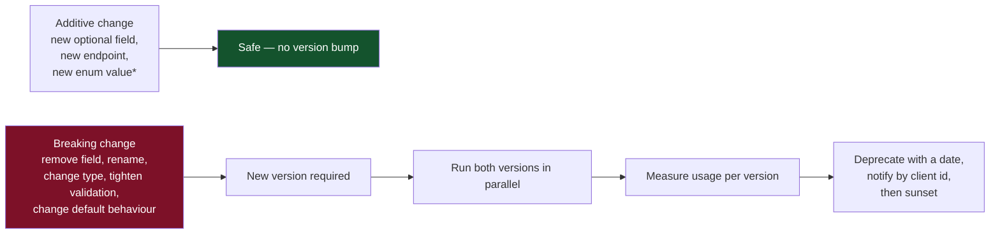

\* New enum values are only safe if clients were told to tolerate unknown values.
Say so in the contract on day one; retrofitting it is not possible.

**Never version for the sake of it.** Every live version is a maintenance burden
multiplied by every downstream service. Two versions is normal; five means you have
no deprecation process.

---

## 6. The gateway and the BFF

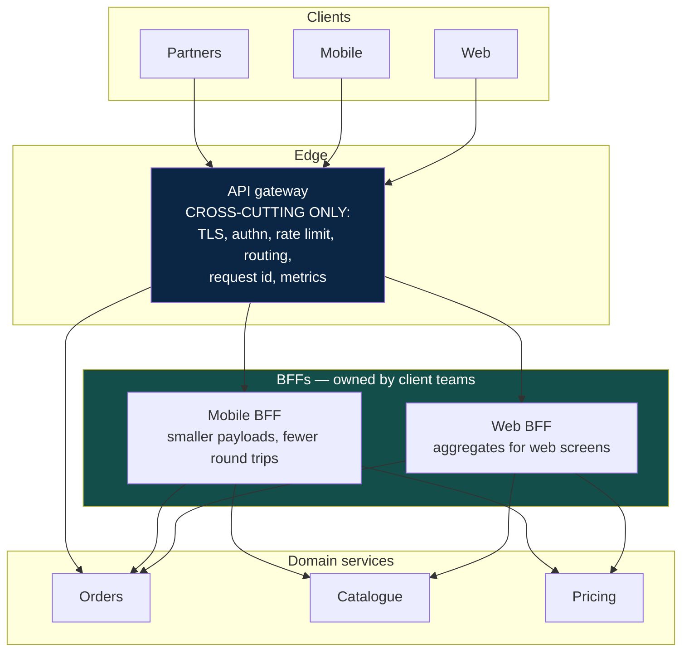

The division of responsibility is the point:

- **Gateway** — owned by the platform team, contains **no business logic**, changes
  rarely.
- **BFF** — owned by the client team, contains presentation-shaped aggregation,
  changes with the UI, and can be deployed without coordinating with anyone.

Without the BFF, aggregation logic accumulates in the gateway, and the gateway
becomes a shared bottleneck that every team must queue behind — the exact
organisational problem microservices were meant to remove.

---

## 7. Service mesh — when it earns its cost

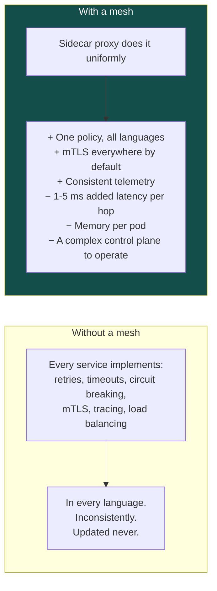

A mesh pays for itself somewhere around **20–30 services or 3+ languages**. Below
that, a shared client library gives you most of the benefit for a fraction of the
operational cost. Above it, the library approach fails because you cannot get every
team to upgrade.

---

## 8. Checklist

```
□ Split justified by a named organisational or technical need, not by aesthetics
□ Each service owns its data exclusively — no shared tables
□ Boundaries follow bounded contexts and aggregates, not technical layers
□ Cross-service data need answered deliberately: call, replicate, or move the logic
□ Synchronous dependency depth kept shallow; availability product computed
□ Protocol chosen per use case; gRPC LB is L7 or client-side
□ Pagination is cursor-based with a tiebreaker
□ Errors use a stable machine-readable shape with a request id
□ Idempotency keys accepted on all unsafe, retryable operations
□ Versioning policy written down; additive changes preferred; deprecation has dates
□ Gateway holds no business logic; aggregation lives in a BFF
□ Every service can start when its dependencies are down (degraded, not crashed)
```

---

[← previous: Messaging and async](05-messaging-and-async.md) · [back to the handbook](../README.md) · [next: Distributed transactions and consensus →](07-distributed-transactions-and-consensus.md)
