# 07 — Distributed Transactions and Consensus

*2PC, sagas, Raft in detail, quorums, leases, clocks, and the impossibility results.*

[← back to the handbook](../README.md)

---

## 1. Why this is hard

A single-node transaction is atomic because one component decides. Across nodes,
the decision itself must be agreed upon, and **agreement over an unreliable network
is the fundamental problem of distributed systems.**

Two impossibility results bound what is achievable:

**FLP (1985)** — in a fully asynchronous system where even one process may fail by
crashing, no deterministic algorithm guarantees consensus in bounded time. The
proof rests on the inability to distinguish a crashed process from a slow one.

**The Two Generals Problem** — no finite exchange of messages over a lossy channel
can produce common knowledge of an agreement. Every message needs an
acknowledgement, which needs an acknowledgement, forever.

Practical systems escape both by weakening the requirement: they use timeouts (a
**failure detector**, which may be wrong) and randomisation, trading *guaranteed*
termination for termination *with probability 1*. That is sufficient in practice
and is why Raft and Paxos work despite FLP.

---

## 2. Two-phase commit

### 2.1 The protocol

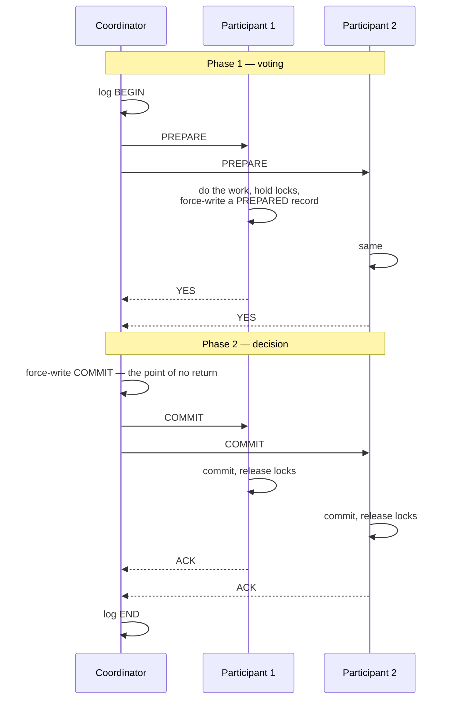

Once a participant votes YES it has **surrendered its autonomy**: it must be able to
commit if told to, so it holds locks and cannot unilaterally abort. That single
property is the source of every 2PC problem.

### 2.2 The failure matrix

| Failure point | Consequence |
|---|---|
| Participant fails **before** voting | Coordinator times out → global ABORT. Clean |
| Participant fails **after** voting YES | On recovery it must ask the coordinator for the outcome. It may block indefinitely |
| **Coordinator fails before writing the decision** | Participants time out → they may abort. Recoverable |
| **Coordinator fails after writing COMMIT but before sending it** | Participants are stuck in PREPARED, holding locks, unable to decide. **This is the blocking case** |
| Network partition during phase 2 | Same as above for the isolated participants |

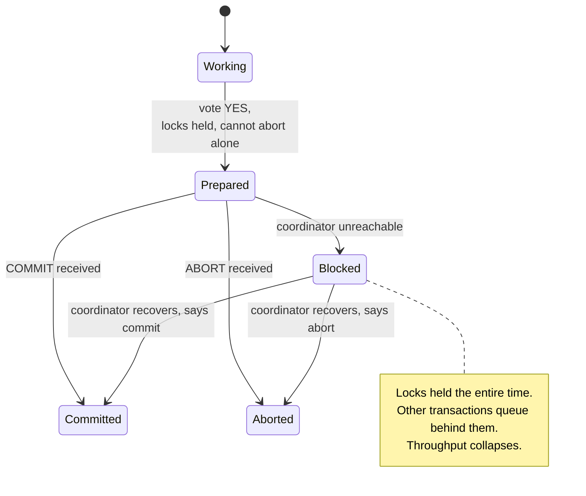

**Three-phase commit** adds a pre-commit phase to make the protocol non-blocking —
but only under the assumption of a synchronous network with bounded message delay
and a perfect failure detector. Those assumptions do not hold on real networks, so
3PC is essentially unused in practice. The modern answer to 2PC's blocking problem
is to make the *coordinator itself* fault-tolerant via consensus — which is exactly
what Spanner and CockroachDB do: 2PC across shards, with each shard's state
replicated by Paxos/Raft, so no single coordinator failure can block anything.

---

## 3. Sagas in production

### 3.1 Orchestrated saga with a state machine

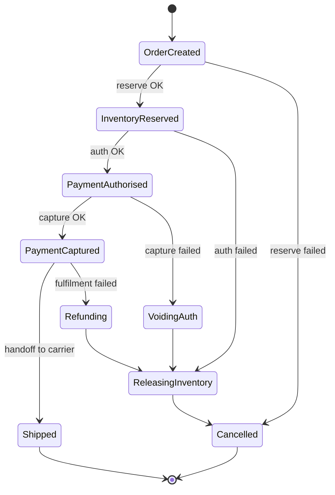

The saga's state must be **persisted after every transition**, not held in memory.
The orchestrator is then stateless and any instance can pick up any saga after a
crash by reading its current state and re-driving the next step. This is precisely
what a durable workflow engine gives you for free.

### 3.2 The isolation problem

Sagas have **no isolation**. Intermediate states are visible to everyone.

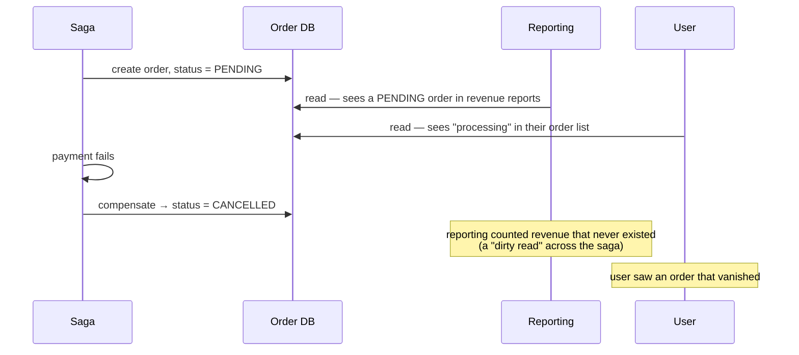

Countermeasures, from the saga literature:

| Countermeasure | What it does |
|---|---|
| **Semantic lock** | A status flag (`PENDING`) that tells everyone else this entity is mid-flight. Readers decide how to treat it |
| **Commutative updates** | Design operations so order does not matter (increment/decrement rather than set) |
| **Pessimistic view** | Reorder steps so the risky, visible-effect step happens as late as possible |
| **Re-read value** | Verify the data has not changed before acting on it — optimistic concurrency inside the saga |
| **By value** | Route low-value requests through a saga and high-value ones through a real distributed transaction |

The practical minimum is the **semantic lock plus a UI that reflects it**: show
"processing" rather than "confirmed", and exclude `PENDING` from financial reports.

### 3.3 What makes compensations hard

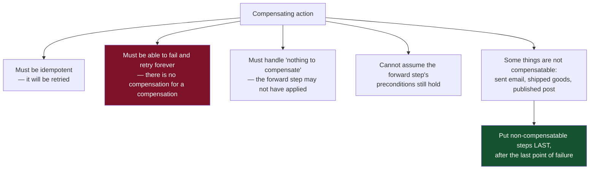

The "compensation cannot fail" property is what makes sagas operationally demanding:
a compensation that permanently fails leaves the system in an inconsistent state
that only a human can resolve. Every saga therefore needs a **manual intervention
queue** and someone who watches it.

---

## 4. Raft in detail

### 4.1 The three sub-problems

Raft decomposes consensus into leader election, log replication, and safety.

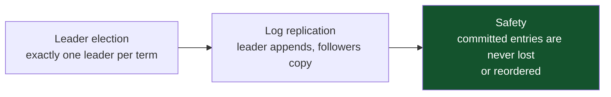

### 4.2 Terms and elections

**Terms** are a logical clock: a monotonically increasing integer, at most one
leader per term. Every message carries a term, and any node seeing a higher term
immediately reverts to follower. This single rule makes stale leaders harmless.

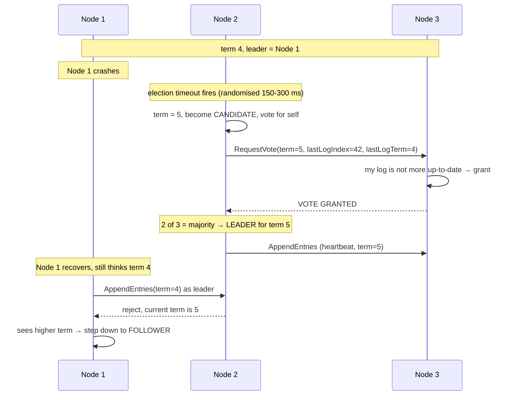

Two rules do the heavy lifting:

- **Randomised election timeouts** (typically 150–300 ms) make simultaneous
  candidacies rare, so split votes resolve within a round or two without any extra
  protocol.
- **The election restriction**: a voter refuses a candidate whose log is less
  up-to-date than its own (compare last log term, then last log index). This
  guarantees that any elected leader already contains every committed entry — which
  is what makes committed entries durable across leader changes.

### 4.3 Log replication and the commit rule

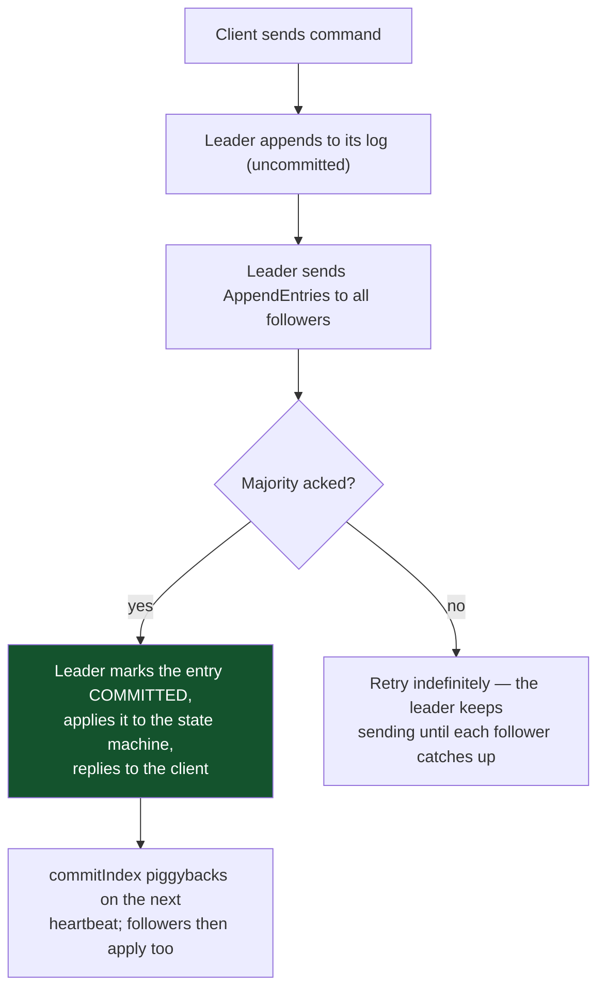

The **log matching property** is what keeps everything consistent: each
`AppendEntries` includes the index and term of the *preceding* entry. A follower
rejects the request if it does not have a matching entry there, and the leader then
walks backwards until it finds the point of agreement and overwrites the follower's
divergent suffix. By induction, identical index+term implies identical history.

One subtle safety rule: **a leader may only commit entries from its own term
directly.** Entries from previous terms are committed indirectly, by being followed
by a committed current-term entry. Without this, a specific interleaving of leader
failures can un-commit an already-committed entry.

### 4.4 Cost and placement

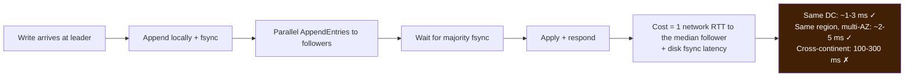

Placement guidance:

- **3 or 5 nodes.** 3 tolerates 1 failure, 5 tolerates 2. Even numbers add cost
  without adding fault tolerance.
- **Spread across availability zones, not regions**, unless you specifically need to
  survive a region loss and can afford the write latency.
- **Keep it off the data hot path.** Use consensus for cluster membership,
  configuration, leader election and locks. For data, use it per-shard (as
  CockroachDB and TiKV do) so the coordination cost is bounded to one shard's
  replicas rather than the whole cluster.

### 4.5 Raft vs Paxos vs the rest

| Protocol | Notes |
|---|---|
| **Paxos** | The original. Single-decree Paxos agrees on one value; Multi-Paxos chains it. Notoriously difficult to specify completely — most "Paxos" implementations are subtly different |
| **Raft** | Same guarantees, designed for understandability: strong leader, terms, log matching. Dominates new systems |
| **Zab** | ZooKeeper's protocol. Similar to Raft, with primary-order guarantees suited to its API |
| **Viewstamped Replication** | Predates Paxos in publication of the practical form; very close to Raft in structure |
| **EPaxos / Flexible Paxos** | Leaderless or relaxed-quorum variants; lower latency in the common case, considerably more complex |

---

## 5. Leases and fencing

A **lease** is a lock with an expiry — it grants exclusive access for a bounded
time, so a crashed holder cannot block forever.

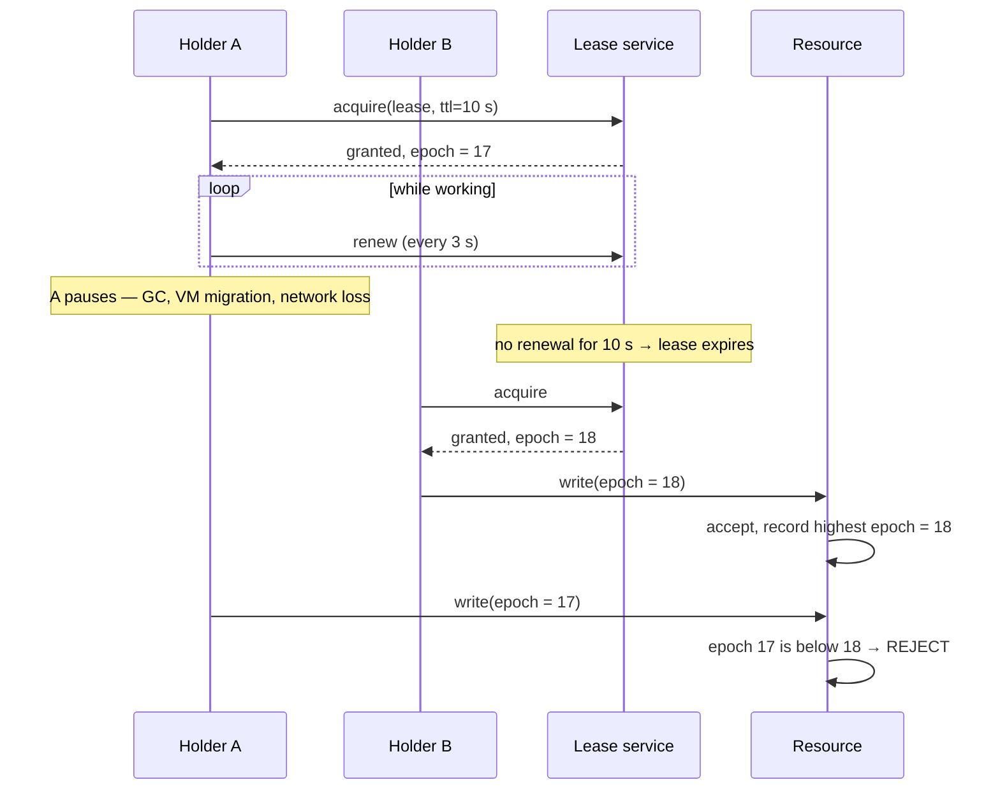

The critical insight, from Martin Kleppmann's analysis of distributed locking: **the
lease service alone cannot provide mutual exclusion**, because a process can be
paused arbitrarily long between checking the lease and using it. Safety must come
from the **resource** rejecting stale epochs. If your resource cannot do that (a
plain file, a third-party API with no versioning), then the lock is advisory and
your operation must tolerate concurrent execution.

**Clock skew makes leases subtler still.** The holder and the service must agree
that time has passed. The standard defence is that the holder treats its lease as
expiring *earlier* than the service does — a safety margin larger than the maximum
plausible clock drift plus one round trip.

---

## 6. Time in distributed systems

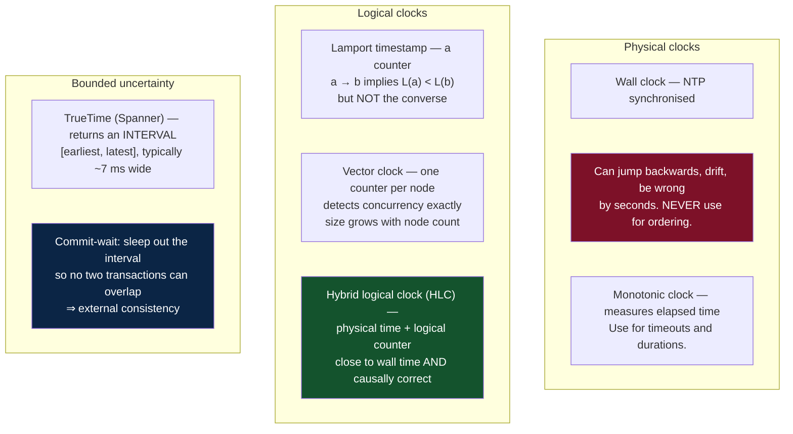

The practical rules:

- **Never order events across machines by wall-clock timestamp.** NTP skew of tens
  of milliseconds is routine; seconds happen. Last-write-wins on wall clocks loses
  data silently.
- **Use monotonic clocks for durations.** A wall-clock-based timeout can become
  negative or enormous after an NTP correction.
- **Hybrid logical clocks are the pragmatic default** for systems that want
  timestamps that are both meaningful to humans and causally consistent. CockroachDB
  and MongoDB both use them.
- **TrueTime's insight is honesty about uncertainty.** Rather than pretending the
  clock is exact, expose the error bound and wait it out. The cost is a few
  milliseconds per commit; the benefit is globally consistent snapshots without
  coordination.

---

## 7. Choosing an approach

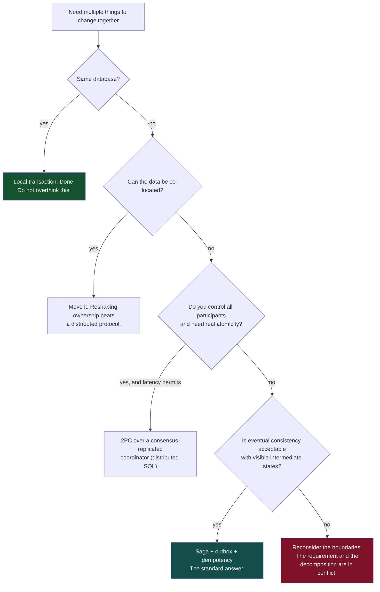

That last branch is not a cop-out. If a business invariant genuinely requires
atomicity across two services, the invariant is telling you those two things belong
to one aggregate. Merging them is usually cheaper and more correct than building a
protocol to simulate what a single transaction would have given you for free.

---

[← previous: Microservices and APIs](06-microservices-and-apis.md) · [back to the handbook](../README.md) · [next: Resilience and failure →](08-resilience-and-failure.md)
