# 08 — Resilience and Failure

*Timeouts, retries, breakers, bulkheads, shedding, and the failure modes that surprise people.*

[← back to the handbook](../README.md)

---

## 1. The premise

> **Everything fails, all the time.** The question is never whether a component will
> fail, but whether its failure is contained.

Resilience engineering is the discipline of ensuring that the failure of any one
component produces **degradation proportional to that component's importance** —
and nothing more. The alternative, which is the default without deliberate design,
is that any failure anywhere produces total failure everywhere.

---

## 2. Timeouts

### 2.1 Choosing the value

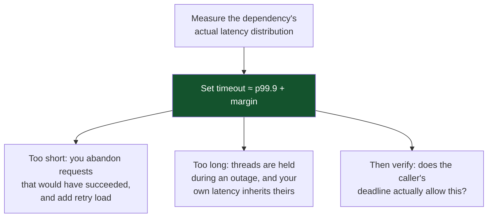

The frequent mistake is a single global timeout. A 30-second default applied to a
call whose p99 is 40 ms means that during a dependency failure, each request holds
a thread for 30 seconds. At 1,000 QPS with a 200-thread pool, the pool is exhausted
in 0.2 seconds and the service is completely down — because of a dependency that
was merely slow.

### 2.2 Deadline propagation

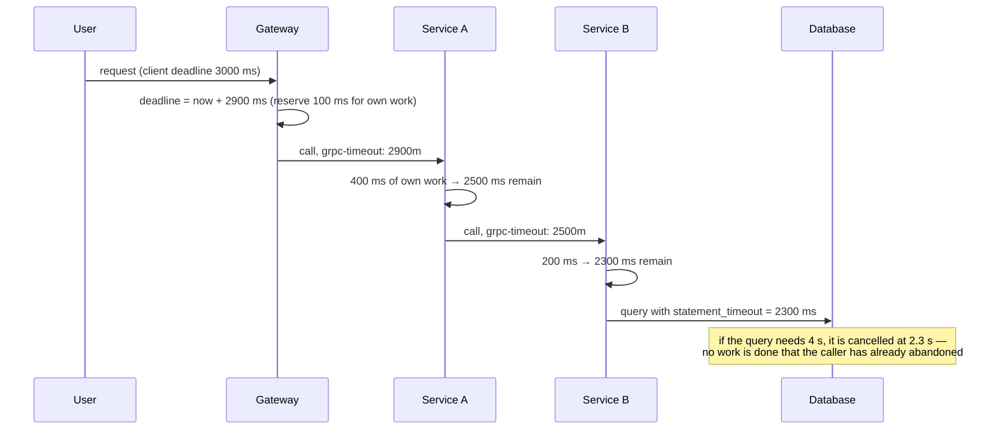

Deadline propagation is the difference between a service that wastes capacity on
dead requests and one that does not. Without it, a timed-out user request continues
consuming database CPU for another 30 seconds — during an overload, exactly when
you can least afford it.

gRPC propagates deadlines natively. For HTTP, pass a header (`X-Request-Deadline`
or the standard `Deadline`) and honour it.

---

## 3. Retries done correctly

### 3.1 The backoff formula

```
# Full jitter — the recommended default
delay = random(0, min(cap, base * 2^attempt))

# Decorrelated jitter — better throughput under contention
delay = min(cap, random(base, previous_delay * 3))
```


### 3.2 Retry budgets — the thing that actually stops storms

Backoff spreads retries in time but does not bound their **total volume**. A retry
budget does:

```
allowed_retries = max(min_retries_per_sec, retry_ratio × successful_requests_per_sec)

typical: retry_ratio = 0.1  (retries may add at most 10% to the load)
```

When the budget is exhausted, retries are **abandoned immediately** — the request
fails fast rather than adding load. This is what breaks the feedback loop: as the
dependency's success rate falls, the retry budget falls with it, so a service in
trouble receives *less* extra traffic, not more.


### 3.3 Where to retry

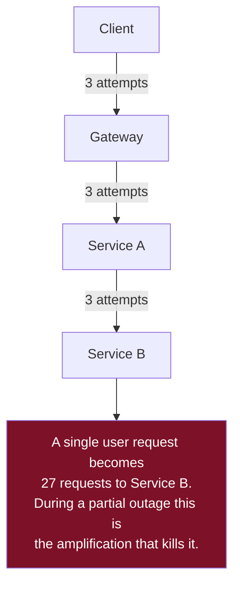

**Retry at exactly one layer.** The usual correct choice is the layer closest to the
failure that still has enough context to know the operation is idempotent — often
the immediate caller. Everything above it should fail fast and let the user decide.

---

## 4. Circuit breakers in practice

### 4.1 Configuration that works

| Parameter | Sensible starting point | Notes |
|---|---|---|
| Failure threshold | 50% over a rolling window | Percentage, not a count — a count is meaningless at varying traffic |
| Minimum request volume | 20 requests in the window | Prevents tripping on 1 failure out of 2 during low traffic |
| Rolling window | 10 seconds | Long enough to be stable, short enough to react |
| Open duration | 30 seconds | Then probe |
| Half-open probes | 1–5 concurrent | Too many and you re-overload the recovering service |
| Success threshold to close | 5 consecutive successes | Avoid closing on a single lucky request |

### 4.2 What counts as a failure

This matters more than the thresholds. **A 404 is not a failure of the dependency**
— it is a correct answer. Counting business-level errors as circuit failures means
a burst of legitimate "not found" responses will trip the breaker and take down a
healthy dependency.

| Count as failure | Do not count |
|---|---|
| Connection refused / reset | 400, 401, 403, 404, 422 |
| Timeout | 409 conflict |
| 500, 502, 503, 504 | Any application-level "no" |
| TLS handshake failure | Validation errors |
| 429 (debatable — usually count as a *separate* signal that triggers throttling, not the breaker) | |

### 4.3 Fallbacks

An open circuit still has to return something. Design the fallback deliberately:

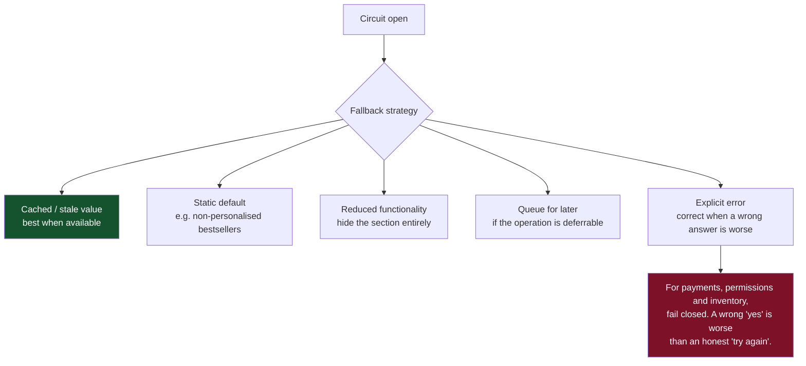

---

## 5. Isolation

### 5.1 Bulkhead sizing

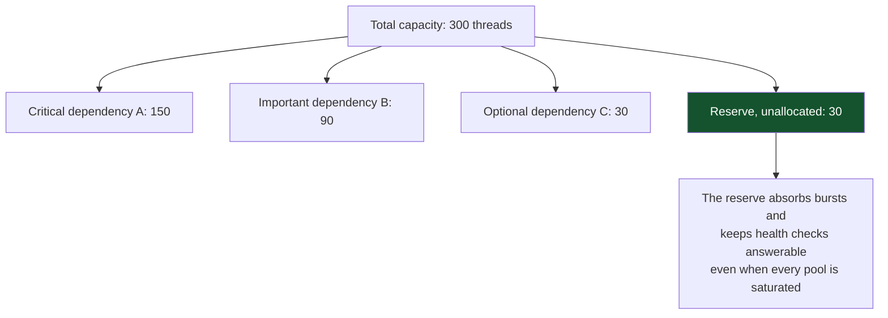

Size each pool from `Little's Law`: `threads = expected_qps × p99_latency`. Then
verify that the sum plus reserve does not exceed what the machine can actually run
— 1,000 threads on 4 cores is not isolation, it is context-switch thrashing.

### 5.2 Cells and shuffle sharding

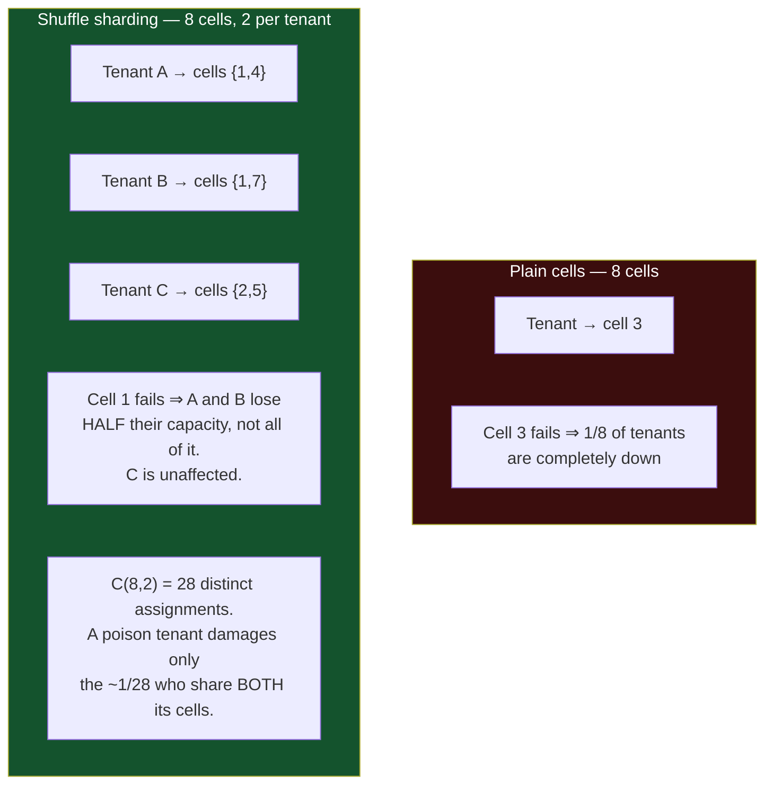

The combinatorics are the point: with `C(n,k)` possible assignments, the probability
that another tenant shares *all* of a given tenant's cells falls off dramatically.
Eight cells with two per tenant already isolates any single bad actor from ~96% of
customers. This is how AWS limits the blast radius of a poison request in shared
services.

---

## 6. Load shedding

### 6.1 Shedding beats queueing

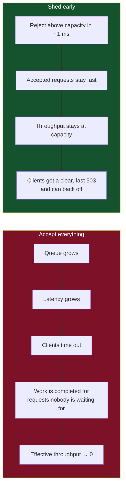

**Congestive collapse** is the formal name for the left-hand path: a system doing
maximum work and delivering zero value, because every completed request has already
been abandoned by its caller. Shedding is the only exit.

### 6.2 Deciding what to shed

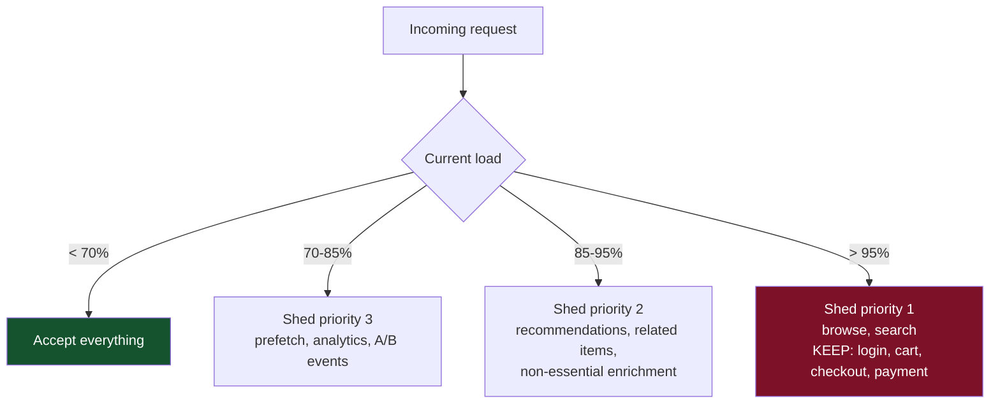

Implementing this requires that requests **carry a priority**, assigned at the edge
from the endpoint and the user's context. Retries should be shed *before* first
attempts, and requests whose deadline has already passed should be dropped without
being processed at all — checking the deadline at dequeue time is one of the
cheapest, highest-value pieces of overload protection available.

### 6.3 Adaptive concurrency limits

Rather than a fixed limit, infer capacity continuously from observed latency — the
same idea as TCP congestion control:

```
if latency is rising → reduce the concurrency limit
if latency is stable and the limit is saturated → increase it
```

This adapts automatically to changing instance sizes, dependency performance, and
request mix, and removes the perpetually-stale "max connections" constant that
nobody has revisited since the service was written.

---

## 7. The failure modes that surprise people

### 7.1 Grey failure

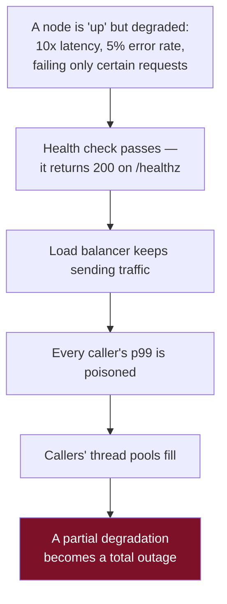

Grey failure is harder than crash failure precisely because every automatic
mechanism designed for crashes fails to notice it. The defences:

- **Outlier detection on real traffic** — eject a node whose error rate or latency
  deviates significantly from its peers, independently of health checks.
- **Client-side hedging** — for read-only idempotent requests, send a second request
  to a different backend if the first has not answered by p95, and take whichever
  returns first. This caps tail latency at roughly p95 for a few percent extra load.
- **Deep health checks that alert**, even where they must not evict.

### 7.2 Metastable failure

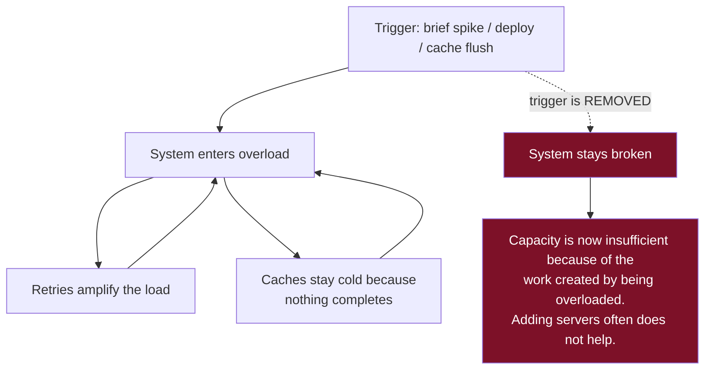

Recognising metastability matters because the instinctive response — add capacity —
frequently fails. The exit is to **remove load**: shed aggressively, drain queues,
disable retries, warm caches, then readmit traffic gradually. Some systems need a
full restart with traffic held off, which is unpalatable but faster than the
alternative.

### 7.3 Correlated failure

Redundancy assumes independence. Real systems violate it constantly:

| Assumed independent | Actually shares |
|---|---|
| Three replicas | The same rack, PDU, or top-of-rack switch |
| Three availability zones | The same region's control plane |
| A whole fleet | One config push, one bad deploy, one expired certificate |
| Multiple services | One DNS provider, one identity provider, one CDN |
| Primary and backup | The same buggy software version |
| N instances | The same leap-second bug, the same certificate expiry date |

**Certificate expiry** deserves a special mention: it is perfectly correlated across
every instance using that certificate, it is scheduled in advance, and it is one of
the most common causes of large multi-service outages. Monitor expiry as a
first-class metric with a 30-day alert.

---

## 8. Testing for failure

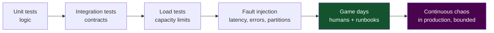

Start where the value is highest per unit of effort:

1. **Inject latency, not just errors.** Most systems handle a dependency returning
   500 correctly and handle it taking 30 seconds catastrophically.
2. **Kill an instance during a deploy.** This is where draining bugs live.
3. **Fill a disk. Exhaust a connection pool. Expire a certificate in staging.**
   These are the boring failures that cause real outages.
4. **Run a game day with the runbook you actually have.** The gap between the
   runbook and reality is the thing you are testing.
5. **Only then automate continuous chaos**, and only with a defined blast radius and
   an automatic stop condition.

---

## 9. Checklist

```
□ Every network call has an explicit timeout derived from measured p99
□ Deadlines propagate across hops; work stops when the caller has given up
□ Retries: idempotent operations only, transient failures only
□ Backoff has full jitter; attempts are capped
□ A retry budget exists and is enforced (retries ≤ ~10% of traffic)
□ Retry happens at exactly one layer
□ Circuit breakers use failure PERCENTAGE with a minimum volume
□ Business errors (4xx) do not trip breakers
□ Every breaker has a defined fallback, and fail-closed where correctness demands
□ Bulkheads isolate dependency pools; sizes derived from Little's Law
□ Load shedding exists, is priority-aware, and rejects in ~1 ms
□ Requests past their deadline are dropped at dequeue, not processed
□ Outlier detection is enabled for grey failure
□ Certificate expiry is monitored with 30-day lead time
□ Failure injection includes LATENCY, not only errors
□ Game days run on a schedule, against the real runbook
```

---

[← previous: Distributed transactions and consensus](07-distributed-transactions-and-consensus.md) · [back to the handbook](../README.md) · [next: Observability and operations →](09-observability-and-operations.md)
