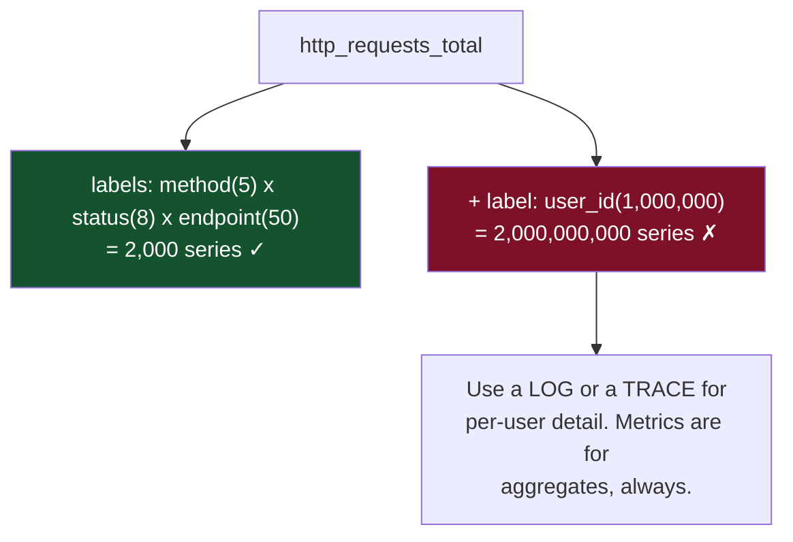
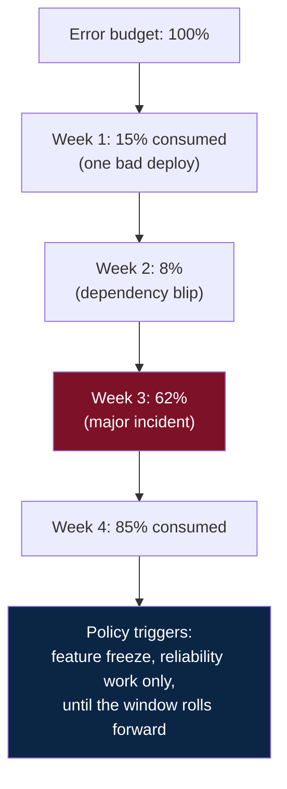
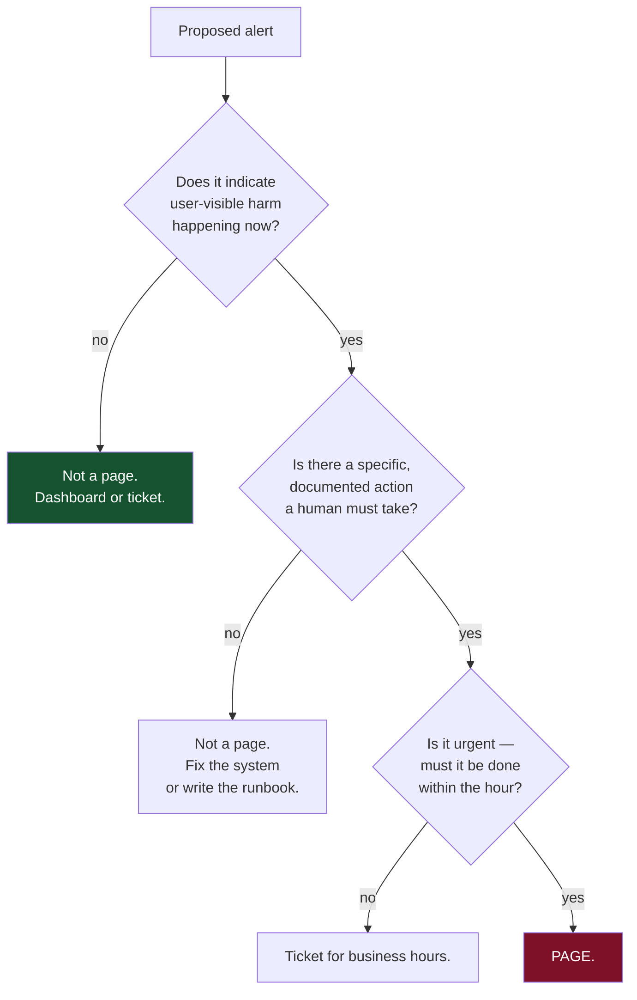
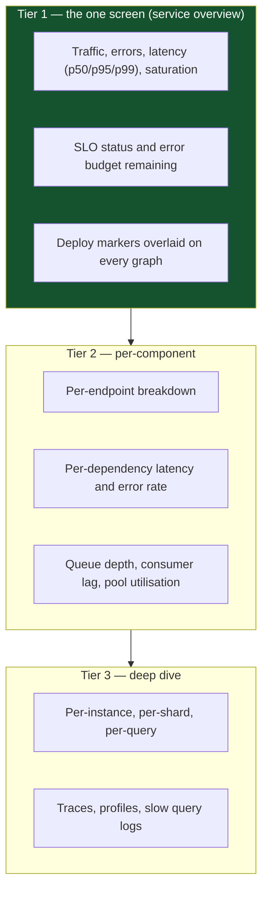
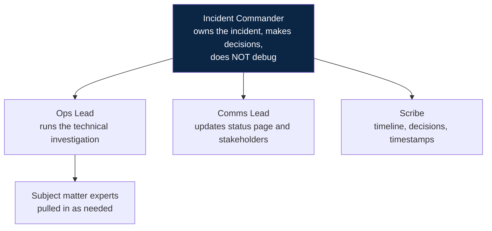
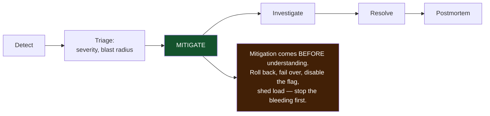
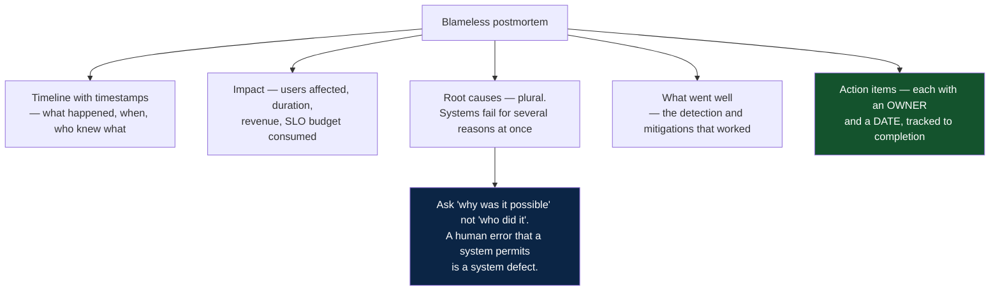

# 09 — Observability and Operations

*Metrics, logs, traces, SLOs, alerting, on-call and incident response.*

[← back to the handbook](../README.md)

---

## 1. Instrumentation strategy

### 1.1 What each signal costs

| Signal | Cost driver | Typical cost shape |
|---|---|---|
| **Metrics** | Cardinality — the number of distinct label combinations | Cheap per data point, catastrophic if cardinality explodes |
| **Logs** | Volume × retention | Linear and large; usually the biggest observability bill |
| **Traces** | Volume × sampling rate | Moderate with sampling, enormous without |
| **Profiles** | Sampling frequency | Small — usually the best value per byte |

**Cardinality is the number that ruins metric budgets.** A counter labelled with
`user_id` on a service with a million users creates a million time series. The rule:
labels must be **bounded and low-cardinality** — status code, endpoint, region,
instance class. Never user id, request id, session id, URL with parameters, or an
error message string.



### 1.2 Structured logs

```json
{
  "ts": "2026-08-20T14:22:31.482Z",
  "level": "error",
  "msg": "payment authorisation failed",
  "service": "payments",
  "version": "2026.8.19-a3f2c1",
  "trace_id": "4bf92f3577b34da6a3ce929d0e0e4736",
  "span_id": "00f067aa0ba902b7",
  "request_id": "01J8Z9X3QK7",
  "user_id": "u_8821",
  "order_id": "o_41902",
  "provider": "stripe",
  "provider_error": "card_declined",
  "duration_ms": 842,
  "attempt": 2
}
```

Rules that make logs usable rather than merely voluminous:

- **One event per line, machine-parseable.** Multi-line stack traces should be a
  field, not separate lines.
- **`trace_id` in every line.** This is what connects logs to traces and turns a
  support ticket into a single query.
- **Log the identifiers, not the prose.** `order_id: o_41902` is queryable;
  "failed to process order 41902" is not.
- **Never log secrets, tokens, card numbers, or full request bodies.** Redact at the
  logging library, not at each call site — call sites are missed.
- **Sample high-volume success logs, keep all errors.** A 1% sample of successes
  plus 100% of errors typically cuts volume by 90% and loses nothing.

---

## 2. SLOs in practice

### 2.1 Writing a good SLI

An SLI must be measurable from the **user's perspective**, which usually means at
the load balancer or client, not inside the service.

```
Bad:   "CPU utilisation below 80%"           — a cause, not an experience
Bad:   "average latency under 200 ms"        — hides the tail
Bad:   "the service is up"                   — up and useless is still useless

Good:  "the proportion of HTTP GET /feed requests, measured at the edge,
        that return 2xx within 300 ms"
```

The standard shape is a ratio:

```
SLI = good_events / valid_events
```

Defining `valid` matters: exclude requests the user malformed (4xx caused by the
client), but **include** everything that is your fault. Excluding too much produces
an SLO that stays green during an outage.

### 2.2 Error budget mathematics

```
SLO = 99.9% over 28 days
budget = 0.1% × 28 days = 40.3 minutes of "bad"

If measured by requests at 10,000 QPS:
  total requests in 28 days = 10,000 × 2,419,200 s = 24.19 B
  allowed bad requests      = 24.19 M
```



The policy is what gives the number teeth. Agree it in advance, in writing, with
product: *"at 75% consumed we review; at 100% we freeze non-reliability changes
until the trailing window recovers."* Without a pre-agreed policy, the budget is
just a dashboard.

### 2.3 Burn-rate alerting

Alerting on "the SLI dipped below target" produces constant noise. Alerting on
**how fast the budget is being consumed** produces actionable pages.

```
burn_rate = observed_error_rate / budgeted_error_rate

burn_rate = 1  → you will exactly exhaust the budget at the end of the window
burn_rate = 14.4 → you will exhaust a 28-day budget in ~2 days
```

| Burn rate | Budget consumed | Window | Action |
|---|---|---|---|
| 14.4× | 2% in 1 hour | 1 h and 5 m | **Page immediately** |
| 6× | 5% in 6 hours | 6 h and 30 m | **Page** |
| 3× | 10% in 1 day | 1 d and 2 h | Ticket |
| 1× | 10% in 3 days | 3 d and 6 h | Ticket |

The **two-window** requirement (a long window and a short one, both breaching) is
what suppresses false positives from momentary spikes while still catching fast
burns quickly.

---

## 3. Alerting philosophy



**Alert on symptoms, not causes.** "Checkout success rate dropped to 82%" is one
actionable page. "CPU high on node 7", "connection pool at 90%", "GC pause
increased", "replica lag rising" are twelve pages that all describe the same
incident, arrive in a random order, and bury the one that matters.

The measurable health check for an alerting system:

| Metric | Target |
|---|---|
| Pages per on-call shift | < 2 |
| Pages that were actionable | > 90% |
| Pages that auto-resolved before a human looked | ~0 |
| Incidents detected by a customer before an alert | ~0 |

If pages per shift exceeds five, the team stops reading them and you have lost
detection entirely — a noisy alerting system is *worse* than none, because it
provides false confidence.

---

## 4. Dashboards that work



Two details that make dashboards genuinely useful during an incident:

- **Deploy markers.** The first question in every incident is "what changed?" A
  vertical line at each deploy answers it in one second.
- **The top dashboard fits on one screen.** If an on-call engineer has to scroll or
  choose between twelve dashboards at 3 am, the dashboard has failed.

---

## 5. Incident response

### 5.1 Roles



The single most important rule: **the Incident Commander does not debug.** The
moment the coordinator's head is inside a stack trace, nobody is tracking the
timeline, deciding whether to roll back, or telling customers anything. In a small
team one person may hold several roles, but IC and Ops Lead should be separate as
soon as more than two people are involved.

### 5.2 The response sequence



Mitigation-before-diagnosis is counterintuitive to engineers and correct.
Understanding a novel failure can take hours; rolling back takes two minutes.
Roll back first, understand afterwards, from a system that is no longer on fire.

**Severity levels** should be defined by user impact and drive the response, not by
how interesting the bug is:

| Sev | Definition | Response |
|---|---|---|
| **SEV1** | Complete outage or data loss for many users | Page everyone, all-hands, status page immediately |
| **SEV2** | Major feature broken, or severe degradation | Page the on-call, IC assigned, status page |
| **SEV3** | Minor feature degraded, workaround exists | Business hours, ticket |

### 5.3 Postmortems



The two failure modes of postmortems: **blame** (people stop reporting incidents
honestly, and you lose your data source) and **no follow-through** (action items
without owners and dates are decorative — track them like any other work, and
review the open ones monthly).

Useful questions that go beyond the immediate cause:

- Why did detection take as long as it did?
- Why did mitigation take as long as it did?
- What made this hard to diagnose? Was information missing?
- Where else does this class of problem exist right now?
- What would have made this a non-event?

---

## 6. On-call sustainability

| Practice | Why |
|---|---|
| **Rotation of 6+ people** | A 1-in-3 rotation burns people out and they leave |
| **Follow-the-sun where possible** | Nobody should be routinely woken |
| **Compensate on-call** | It is work; treating it as free guarantees resentment |
| **Time to fix alert noise is protected work** | Otherwise it is never done and quality decays monotonically |
| **Every alert has a linked runbook** | A page without a runbook is a puzzle, at 3 am, for the least-prepared person |
| **The on-call does not carry sprint commitments** | They will not finish them, and they will feel bad about it |
| **Handover is written, not verbal** | State what is ongoing, what is degraded, what to watch |

---

## 7. Checklist

```
□ The four golden signals instrumented for every service
□ Metric label cardinality bounded — no user/request/session ids
□ Logs structured, with trace_id on every line, secrets redacted centrally
□ Traces propagate across async boundaries; tail-based sampling keeps slow/errors
□ At least one SLO per user-facing journey, measured at the edge
□ Error budget policy agreed IN WRITING with product
□ Alerting is on burn rate with two windows, not on threshold crossings
□ Every page is actionable and has a runbook link
□ Pages per shift < 2; noise treated as a defect
□ Deploy markers on every dashboard
□ Tier-1 dashboard fits one screen
□ Incident roles defined; IC does not debug
□ Mitigation precedes diagnosis; rollback is one command and is practised
□ Postmortems are blameless, with owned and dated action items that are tracked
```

---

[← previous: Resilience and failure](08-resilience-and-failure.md) · [back to the handbook](../README.md) · [next: Security →](10-security.md)
