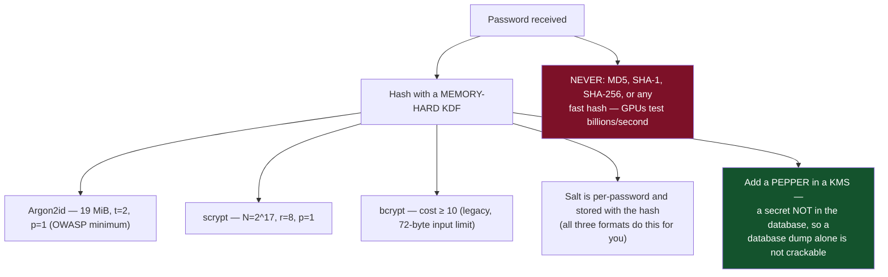
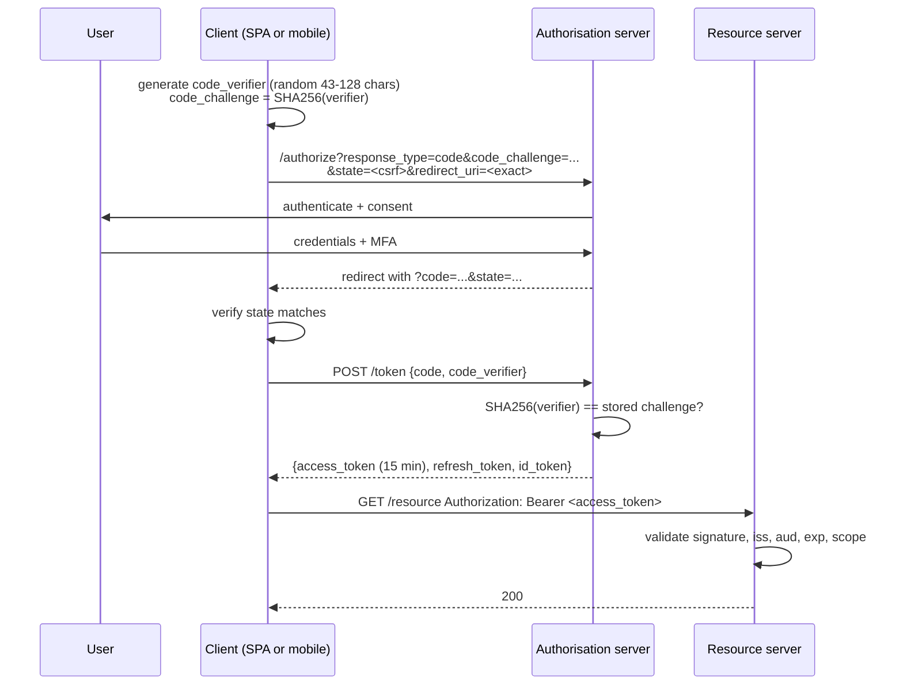
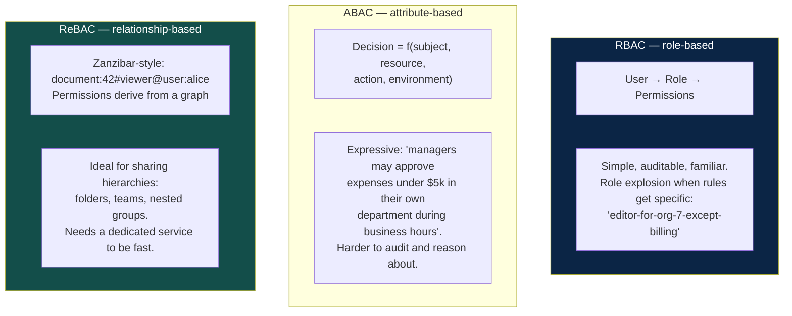
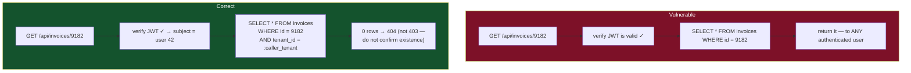
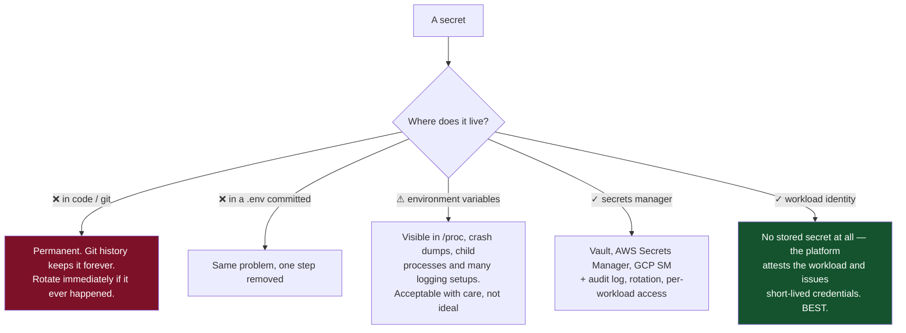
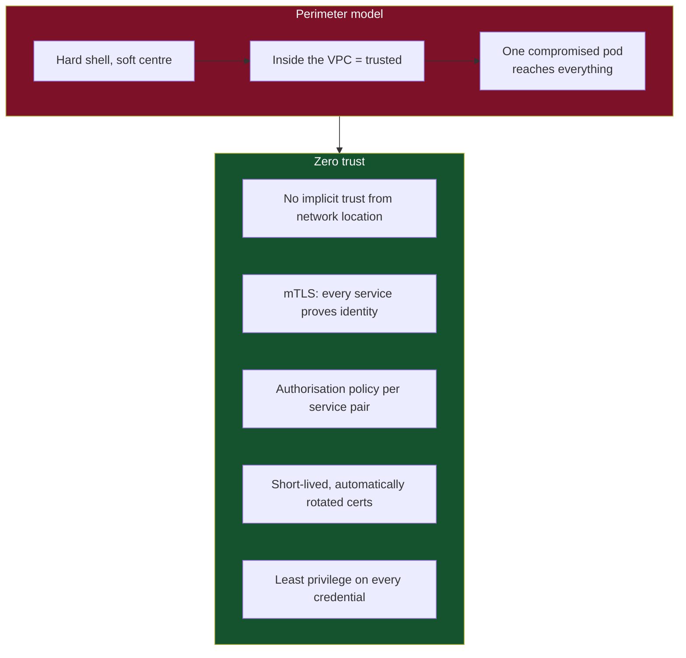
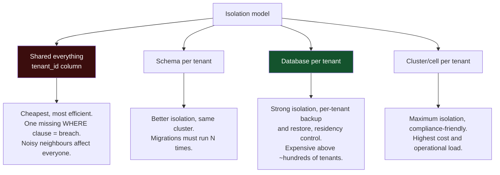
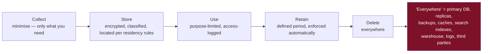

# 10 — Security

*Identity, authorisation, secrets, zero trust, the OWASP classes, and multi-tenancy.*

[← back to the handbook](../README.md)

---

## 1. The threat model comes first

Security work without a threat model is guesswork. Answer four questions:

| Question | Example |
|---|---|
| **What are we protecting?** | User PII, payment data, proprietary content, availability itself |
| **From whom?** | Opportunistic scanners, credential stuffers, competitors, insiders, nation states |
| **What can they reach?** | Public API, an authenticated tenant boundary, the internal network, the database |
| **What is the cost if they succeed?** | Regulatory fine, customer loss, fraud, life safety |

The answers determine how much of what follows is proportionate. A hobby project
and a payments platform should not have the same controls, and pretending otherwise
produces security theatre that nobody maintains.

---

## 2. Authentication

### 2.1 Passwords, if you must



Other password essentials:

- **Check against known-breached password lists** (k-anonymity APIs let you do this
  without sending the password). This blocks credential stuffing more effectively
  than any complexity rule.
- **Drop composition rules.** "One uppercase, one symbol" produces `Password1!` and
  measurably weakens security. Enforce length (12+) and a breach check instead.
- **Rate limit and lock out carefully.** Per-account lockout enables a denial of
  service against a known user; prefer progressive delays plus per-IP and
  per-account limits, with CAPTCHA or step-up as escalation.
- **Constant-time comparison** everywhere a secret is compared.

### 2.2 OAuth 2.0 / OIDC, correctly



The non-negotiables:

| Control | Why |
|---|---|
| **PKCE, always** — including for confidential clients | Prevents authorisation-code interception |
| **`state` parameter, verified** | CSRF protection on the callback |
| **Exact redirect URI matching** | Open redirects lead directly to token theft |
| **Never use the implicit flow** | Tokens in the URL fragment leak via history, referrers and logs. Deprecated |
| **Validate `aud` on the resource server** | Otherwise a token minted for another service is accepted by yours |
| **Rotate refresh tokens on use, detect reuse** | Reuse of a rotated refresh token means it was stolen — revoke the whole family |

### 2.3 Session and token storage in browsers

| Storage | XSS risk | CSRF risk | Verdict |
|---|---|---|---|
| `localStorage` | **Readable by any script** | None | Avoid for tokens |
| `sessionStorage` | Readable by any script | None | Same problem |
| Cookie, `HttpOnly` + `Secure` + `SameSite=Lax`/`Strict` | Not readable by script | Mitigated by SameSite + a CSRF token | **Preferred** |
| In-memory (JS variable) | Lost on refresh; still XSS-reachable while live | None | Good for access tokens with a refresh flow |

The honest summary: **if you have an XSS vulnerability, you have lost regardless of
storage.** But `HttpOnly` cookies remove the easiest exfiltration path and are
strictly better than `localStorage`. Combine `HttpOnly` cookies for the refresh
token with an in-memory access token for the best available posture.

---

## 3. Authorisation

### 3.1 The models



Most systems should start with **RBAC plus resource ownership** (`role` for what
kind of action, `owner_id`/`tenant_id` for which specific objects) and only adopt
ABAC or ReBAC when the rules genuinely need them.

### 3.2 Broken object-level authorisation — the number one API risk



The structural defences, in order of reliability:

1. **Scope every query by the caller's tenant/owner** — put it in the `WHERE`
   clause, not in an `if` statement after fetching. The database enforces it.
2. **Row-level security in the database**, so even a forgotten predicate is safe.
3. **A repository layer that cannot construct an unscoped query.** Make the unsafe
   thing impossible to express rather than merely discouraged.
4. **Automated tests that attempt cross-tenant access** on every endpoint. This is
   the only defence that catches regressions.

---

## 4. Secrets



**Workload identity is the endgame.** If a service can prove what it is to the
platform (IAM roles for service accounts, SPIFFE identities, cloud instance
metadata) and receive a short-lived credential, there is no long-lived secret to
leak, rotate, or find in a repository.

Rotation guidance: rotate **automatically** on a schedule, and rotate
**immediately** on any suspicion. A rotation procedure that has never been executed
does not work — practise it. And support **two valid credentials at once** during
rotation, or every rotation is an outage.

---

## 5. The OWASP classes that matter most

| Risk | Concrete failure | Defence |
|---|---|---|
| **Broken access control** | Cross-tenant data via an id in the URL | Scope every query; RLS; cross-tenant tests |
| **Injection** | `"SELECT * FROM u WHERE n='" + name + "'"` | Parameterised queries; never build SQL/shell/LDAP by concatenation |
| **Cryptographic failures** | Fast password hashes, plaintext PII, TLS 1.0 | Argon2id, TLS 1.3, field-level encryption via KMS |
| **Insecure design** | No rate limit on password reset; no re-auth for changing email | Threat model the flow, not just the endpoint |
| **Security misconfiguration** | Public S3 bucket, debug mode on, default credentials | Infrastructure as code, scanned; secure defaults |
| **Vulnerable components** | An unpatched library with a known RCE | SBOM, automated dependency scanning, an actual patch SLA |
| **Auth failures** | No MFA, no breach check, session fixation | Rotate session id on login; MFA; breached-password checks |
| **Integrity failures** | Unsigned CI artefacts; unpinned build dependencies | Signed builds, provenance, pinned and verified dependencies |
| **Logging failures** | No record of who accessed what | Immutable audit log of security-relevant events |
| **SSRF** | User-supplied URL fetched by the server, reaching the metadata endpoint | Allowlist destinations; block link-local (169.254.169.254) and RFC1918; resolve then validate the IP |

**SSRF deserves a specific note** because cloud metadata endpoints turn it into full
credential theft. Validating the URL string is insufficient — DNS can resolve a
benign hostname to an internal IP, and a redirect can move an allowed URL to a
forbidden one. Resolve the hostname, check the resulting IP against a denylist,
then connect to **that IP** directly, and re-validate on every redirect.

---

## 6. Zero trust and the internal network



The practical entry point is **mTLS via a service mesh**, which gives you
cryptographic service identity, encryption in transit, and per-pair authorisation
policy without changing application code. Add network policies so that pods can
only reach the services they actually need — most breaches escalate through lateral
movement that a default-deny policy would have stopped.

---

## 7. Multi-tenancy



For the shared model — which most SaaS uses — **row-level security is the control
that actually holds**, because it moves enforcement from every developer's memory
into the database:

```sql
ALTER TABLE invoices ENABLE ROW LEVEL SECURITY;

CREATE POLICY tenant_isolation ON invoices
  USING (tenant_id = current_setting('app.tenant_id')::uuid);

-- the application sets this per connection/transaction:
SET LOCAL app.tenant_id = '...';
```

Get the connection-pooling interaction right: with a transaction-scoped pool,
`SET LOCAL` inside the transaction is correct; a session-level `SET` can leak a
tenant context to the next borrower of that connection, which is precisely the
breach you were preventing.

Also isolate **beyond the database**: per-tenant rate limits and quotas (so one
tenant cannot starve the rest), per-tenant cache key prefixes, and per-tenant
encryption keys where regulation requires crypto-shredding on deletion.

---

## 8. Privacy and data lifecycle



Deletion is the requirement that retrofits worst. Two designs make it tractable:

- **Key every piece of personal data by `user_id`** so a deletion job can find all
  of it. Data that is only reachable by a join through three tables will be missed.
- **Crypto-shredding.** Encrypt each user's data with a per-user key held in a KMS.
  Deleting the key renders every copy — including immutable backups you cannot
  edit — permanently unreadable. This is the only practical answer to "delete this
  user from a backup taken last March".

---

## 9. Checklist

```
□ Threat model written: assets, adversaries, entry points, impact
□ Passwords hashed with Argon2id/scrypt/bcrypt + KMS pepper; breach-list checked
□ MFA available, enforced for privileged accounts
□ OAuth: PKCE, state verified, exact redirect URIs, no implicit flow
□ Tokens short-lived; refresh tokens rotate with reuse detection
□ Every request authorises against the SPECIFIC object, server-side
□ Queries scoped by tenant in the WHERE clause; RLS enabled as a backstop
□ Automated cross-tenant access tests on every endpoint
□ Secrets in a manager or workload identity — never in git, ideally not in env
□ Rotation automated AND practised; two credentials valid during rotation
□ Parameterised queries everywhere
□ SSRF defence resolves the hostname and validates the IP, on every redirect
□ mTLS between services; default-deny network policies
□ TLS 1.2+ only, HSTS, secure cookie flags
□ Dependency scanning with a patch SLA
□ Immutable audit log of security-relevant events
□ Deletion pipeline reaches backups, caches, indexes and third parties
□ Incident response plan includes breach notification obligations and timelines
```

---

[← previous: Observability and operations](09-observability-and-operations.md) · [back to the handbook](../README.md) · [next: Case studies →](11-case-studies.md)
