# 11 — Case Studies

*Ten systems designed end to end. Each follows the same method: requirements →
estimation → API → data model → architecture → the hard part → trade-offs.*

[← back to the handbook](../README.md)

---

## Contents

1. [URL shortener](#1-url-shortener)
2. [News feed](#2-news-feed)
3. [Chat and messaging](#3-chat-and-messaging)
4. [Distributed rate limiter](#4-distributed-rate-limiter)
5. [Notification service](#5-notification-service)
6. [Video streaming](#6-video-streaming)
7. [Ride hailing](#7-ride-hailing)
8. [Payment system](#8-payment-system)
9. [Web crawler](#9-web-crawler)
10. [Collaborative editor](#10-collaborative-editor)

---

## 1. URL shortener

### Requirements

**Functional:** shorten a long URL to a short one; redirect; optional custom alias;
optional expiry; click analytics.
**Non-functional:** redirects must be fast (p99 < 50 ms) and highly available
(99.99%); shortened links are effectively permanent; the mapping is immutable once
created.

### Estimation

```
Writes      100 M new URLs/month  → 100M / 2.6M s ≈ 40 /s  (peak x5 ≈ 200 /s)
Reads       100:1 ratio           → 4,000 /s      (peak    ≈ 20,000 /s)
Storage     500 B/record x 100M x 12 months x 5 yrs ≈ 3 TB
Hot set     20% of links get 80% of traffic; a week of links ≈ 23 M x 500 B ≈ 12 GB
            → the entire hot set fits in memory. This is a cache problem.
```

### API

```
POST /v1/urls          {long_url, custom_alias?, expires_at?} → 201 {short_url}
GET  /{code}                                                  → 301/302 redirect
GET  /v1/urls/{code}/stats                                    → 200 {clicks, referrers, ...}
```

### The short code

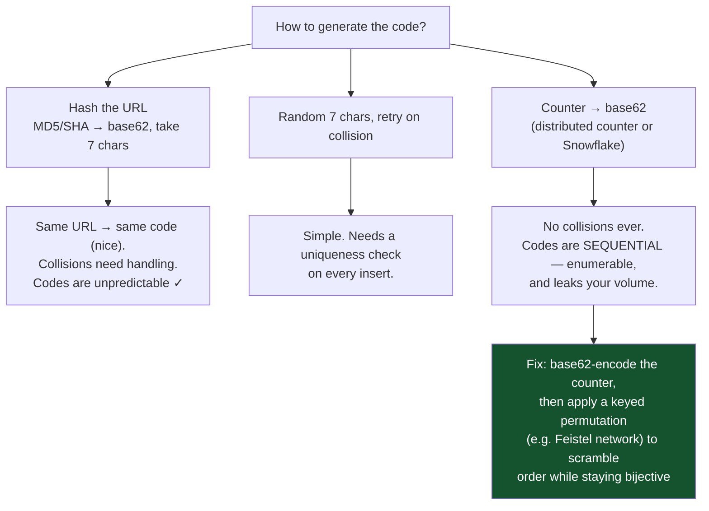
```mermaid
flowchart TD
    Q["How to generate the code?"] --> A["Hash the URL<br/>MD5/SHA → base62, take 7 chars"]
    Q --> B["Random 7 chars, retry on collision"]
    Q --> C["Counter → base62<br/>(distributed counter or Snowflake)"]
    A --> AN["Same URL → same code (nice).<br/>Collisions need handling.<br/>Codes are unpredictable ✓"]
    B --> BN["Simple. Needs a uniqueness check<br/>on every insert."]
    C --> CN["No collisions ever.<br/>Codes are SEQUENTIAL — enumerable,<br/>and leaks your volume."]
    CN --> D["Fix: base62-encode the counter,<br/>then apply a keyed permutation<br/>(e.g. Feistel network) to scramble<br/>order while staying bijective"]
    style D fill:#14532d,color:#fff
```

`62^7 ≈ 3.5 × 10^12` — seven characters is ample for any realistic scale.

### Architecture

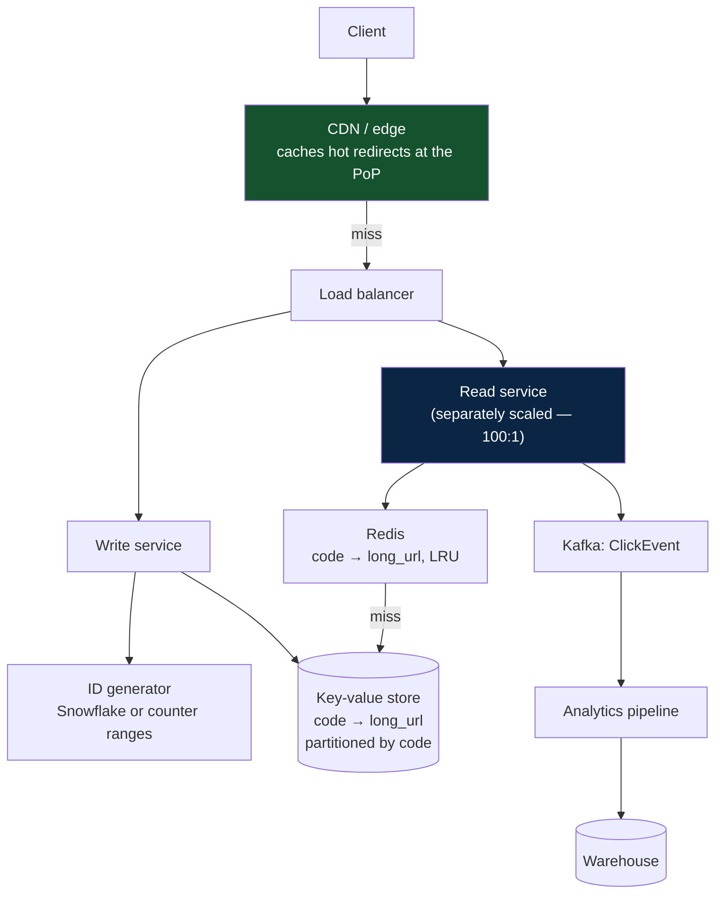
```mermaid
flowchart TD
    U["Client"] --> CDN["CDN / edge<br/>caches hot redirects at the PoP"]
    CDN -->|"miss"| LB["Load balancer"]
    LB --> W["Write service"]
    LB --> R["Read service<br/>(separately scaled — 100:1)"]
    W --> IDG["ID generator<br/>Snowflake or counter ranges"]
    W --> DB[("Key-value store<br/>code → long_url<br/>partitioned by code")]
    R --> C["Redis<br/>code → long_url, LRU"]
    C -->|"miss"| DB
    R --> K["Kafka: ClickEvent"]
    K --> A["Analytics pipeline"] --> WH[("Warehouse")]
    style CDN fill:#14532d,color:#fff
    style R fill:#0b2545,color:#fff
```

### The hard part — making the redirect free

Redirect is the only latency-critical path, and it is a pure point lookup. Three
layers make it near-free:

1. **A 301 with a long cache lifetime** means the browser never asks again. But then
   you lose all analytics and can never change or expire the link. **302 keeps
   control and costs a request** — most shorteners choose 302 for exactly this
   reason.
2. **CDN caching of 302s** with a short `s-maxage` recovers most of the benefit while
   retaining control.
3. **Analytics must be asynchronous.** Fire the click event to a queue and return the
   redirect immediately; never write to a database on the redirect path.

### Trade-offs

| Choice | Cost | Flips when |
|---|---|---|
| 302 over 301 | Every click hits your infrastructure | If analytics stopped mattering, 301 removes ~all traffic |
| Async analytics | Click counts lag by seconds and may lose a few on failure | If clicks were billable, they would need an outbox and exact counting |
| KV store over relational | No ad-hoc queries over the mapping | If link management features grew substantially |

---

## 2. News feed

### Requirements

**Functional:** post; follow; view a reverse-chronological or ranked feed of posts
from followees.
**Non-functional:** feed load p99 < 200 ms; feed may be up to a few seconds stale;
a user must see their **own** post immediately; 100 M DAU.

### Estimation

```
Posts       2/user/day x 100M      = 200M/day   → 2,300 /s   (peak ≈ 7,000 /s)
Feed views  20/user/day x 100M     = 2B/day     → 23,000 /s  (peak ≈ 70,000 /s)
Avg following                      = 200
Fan-out writes at 2,300 posts/s x 200 followers ≈ 460,000 writes/s
   ← this is the number that decides the architecture
Celebrity with 50 M followers posting once ⇒ 50 M writes from ONE action
```

### The central decision

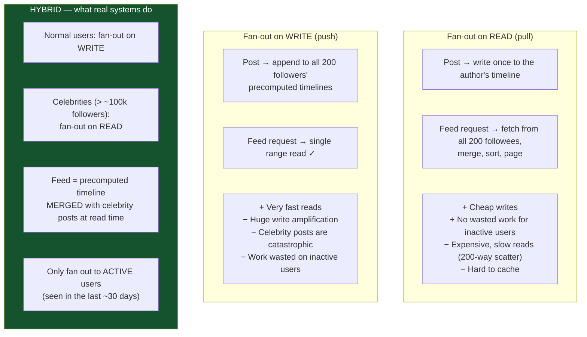
```mermaid
flowchart TD
    subgraph pull["Fan-out on READ (pull)"]
        P1["Post → write once to the author's timeline"]
        P2["Feed request → fetch from all 200 followees,<br/>merge, sort, page"]
        P3["+ Cheap writes<br/>+ No wasted work for inactive users<br/>− Expensive, slow reads (200-way scatter)<br/>− Hard to cache"]
    end
    subgraph push["Fan-out on WRITE (push)"]
        Q1["Post → append to all 200 followers'<br/>precomputed timelines"]
        Q2["Feed request → single range read ✓"]
        Q3["+ Very fast reads<br/>− Huge write amplification<br/>− Celebrity posts are catastrophic<br/>− Work wasted on inactive users"]
    end
    subgraph hybrid["HYBRID — what real systems do"]
        H1["Normal users: fan-out on WRITE"]
        H2["Celebrities (&gt; ~100k followers):<br/>fan-out on READ"]
        H3["Feed = precomputed timeline<br/>MERGED with celebrity posts at read time"]
        H4["Only fan out to ACTIVE users<br/>(seen in the last ~30 days)"]
    end
    style hybrid fill:#14532d,color:#fff
```

### Architecture

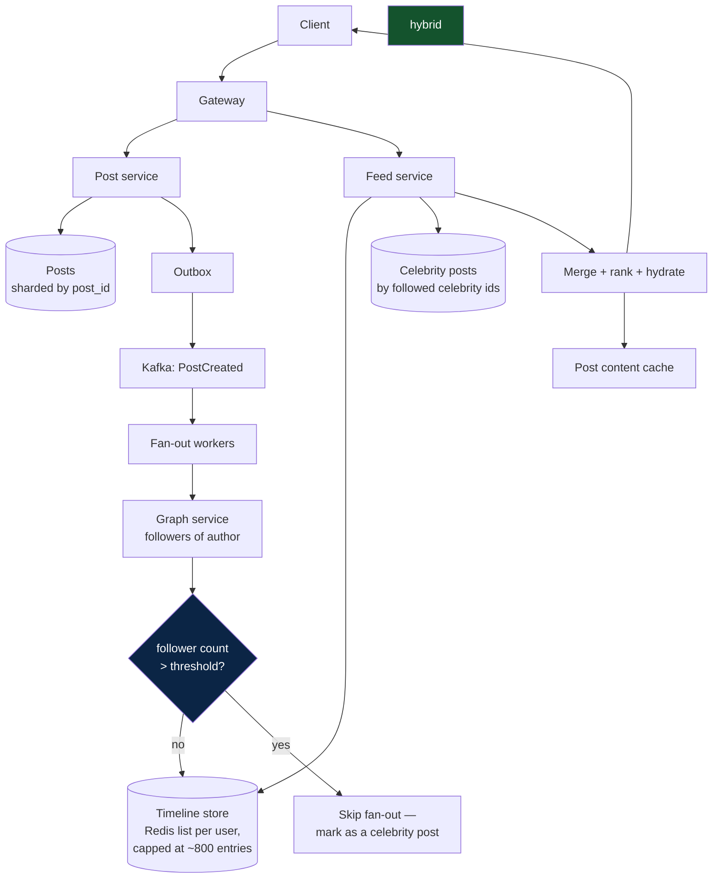
```mermaid
flowchart TD
    U["Client"] --> GW["Gateway"]
    GW --> PS["Post service"] --> PDB[("Posts<br/>sharded by post_id")]
    PS --> OB["Outbox"] --> K["Kafka: PostCreated"]

    K --> FO["Fan-out workers"]
    FO --> GS["Graph service<br/>followers of author"]
    GS --> CHK{"follower count<br/>&gt; threshold?"}
    CHK -->|"no"| TL[("Timeline store<br/>Redis list per user,<br/>capped at ~800 entries")]
    CHK -->|"yes"| SKIP["Skip fan-out —<br/>mark as a celebrity post"]

    GW --> FS["Feed service"]
    FS --> TL
    FS --> CEL[("Celebrity posts<br/>by followed celebrity ids")]
    FS --> M["Merge + rank + hydrate"]
    M --> PC["Post content cache"]
    M --> U
    style CHK fill:#0b2545,color:#fff
    style hybrid fill:#14532d,color:#fff
```

### Details that matter

- **Store ids in the timeline, not content.** A timeline entry is
  `(post_id, author_id, timestamp, score)` — about 32 bytes. Hydrating content from a
  cache at read time means an edited or deleted post is corrected everywhere for
  free. Denormalising content into 200 timelines makes deletion a nightmare.
- **Cap the timeline.** Nobody scrolls past ~800 posts. Beyond the cap, fall back to
  fan-out on read.
- **Fan-out only to active users.** If 60% of users have not opened the app in 30
  days, you have just cut the write amplification by 60%.
- **Read-your-writes** is non-negotiable: insert the author's own post into their
  own timeline synchronously before returning 201.

### Trade-offs

| Choice | Cost | Flips when |
|---|---|---|
| Hybrid fan-out | Two code paths, a merge step at read time | Pure pull if writes ever exceeded read capacity; pure push if no user ever exceeded ~10k followers |
| Eventual consistency for others' posts | A post may take seconds to appear | Never worth strong consistency here |
| Redis timelines | Memory cost, must be rebuildable from the posts store | If cost dominated, tier cold timelines to disk |

---

## 3. Chat and messaging

### Requirements

**Functional:** 1:1 and group messages; delivery and read receipts; presence; offline
delivery; multi-device sync; media attachments; message history.
**Non-functional:** delivery p99 < 500 ms; messages must never be lost; strict
per-conversation ordering; 50 M concurrent connections.

### Estimation

```
Concurrent connections   50 M
Per node (tuned)         ~500 k WebSockets  → ~100 gateway nodes
Messages                 40/user/day x 200M DAU = 8B/day → 92,000 /s (peak ≈ 300,000 /s)
Message size             ~500 B → 4 TB/day → 1.5 PB/year (before media)
Fan-out                  group of 100 ⇒ one send becomes 100 deliveries
```

### Architecture

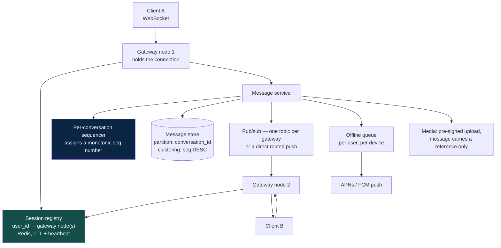
```mermaid
flowchart TD
    C1["Client A<br/>WebSocket"] --> GW1["Gateway node 1<br/>holds the connection"]
    C2["Client B"] --> GW2["Gateway node 2"]

    GW1 --> S["Session registry<br/>user_id → gateway node(s)<br/>Redis, TTL + heartbeat"]
    GW2 --> S

    GW1 --> MS["Message service"]
    MS --> SEQ["Per-conversation sequencer<br/>assigns a monotonic seq number"]
    MS --> MDB[("Message store<br/>partition: conversation_id<br/>clustering: seq DESC")]
    MS --> PS["Pub/sub — one topic per gateway<br/>or a direct routed push"]
    PS --> GW2 --> C2

    MS --> OFF["Offline queue<br/>per user, per device"]
    OFF --> PUSH["APNs / FCM push"]

    MS --> MEDIA["Media: pre-signed upload,<br/>message carries a reference only"]
    style SEQ fill:#0b2545,color:#fff
    style S fill:#134e4a,color:#fff
```

### The hard part — ordering and multi-device sync

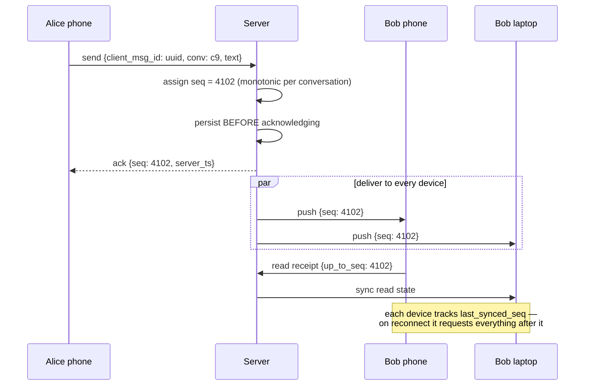
```mermaid
sequenceDiagram
    participant A as Alice phone
    participant S as Server
    participant B1 as Bob phone
    participant B2 as Bob laptop

    A->>S: send {client_msg_id: uuid, conv: c9, text}
    S->>S: assign seq = 4102 (monotonic per conversation)
    S->>S: persist BEFORE acknowledging
    S-->>A: ack {seq: 4102, server_ts}
    par deliver to every device
        S->>B1: push {seq: 4102}
        S->>B2: push {seq: 4102}
    end
    B1->>S: read receipt {up_to_seq: 4102}
    S->>B2: sync read state
    Note over B1,B2: each device tracks last_synced_seq —<br/>on reconnect it requests everything after it
```

The mechanisms that make this correct:

- **A per-conversation sequence number** is the ordering authority. Client
  timestamps are unusable (clock skew, deliberate manipulation), and a global
  sequence is an unnecessary bottleneck.
- **`client_msg_id` provides idempotency.** A client that retries after a lost ack
  must not create a duplicate message.
- **Persist before acknowledging.** An ack the message did not survive is a lie, and
  chat users notice missing messages immediately.
- **`last_synced_seq` per device** turns reconnection into a simple range query,
  which also handles a device that has been offline for a week.
- **Read state is per user, not per device** — a watermark (`read_up_to`) rather
  than a per-message flag, which is O(1) to store and update.

### Group messaging

| Group size | Approach |
|---|---|
| Small (< 500) | Fan out on write to each member's inbox |
| Large (500–100k) | Shared conversation log; members read from it with their own cursor |
| Broadcast (millions) | Treat as a feed, not a chat — fan-out on read, no receipts |

### Trade-offs

| Choice | Cost | Flips when |
|---|---|---|
| WebSocket over long polling | Connection state, sticky routing, reconnect logic | Long polling if concurrency were small and simplicity dominated |
| Per-conversation sequencer | A hot conversation is a single-writer bottleneck | Fine — conversations are naturally partitioned |
| Store all history | Petabytes | Tier old messages to cold storage; most access is recent |

---

## 4. Distributed rate limiter

### Requirements

Enforce per-key limits (per API key, user, IP, endpoint) across a fleet of hundreds
of nodes; accurate to within a few percent; adds < 1 ms to a request; must not take
the system down when it fails.

### The core problem

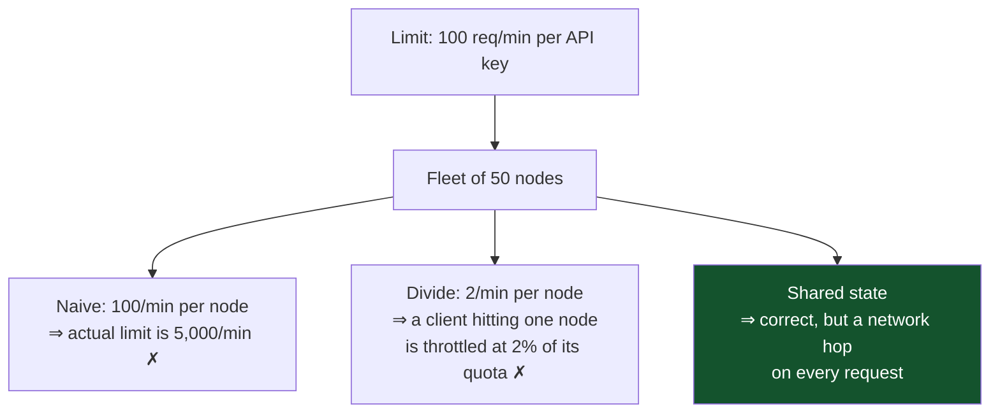
```mermaid
flowchart TD
    P["Limit: 100 req/min per API key"] --> N["Fleet of 50 nodes"]
    N --> B1["Naive: 100/min per node<br/>⇒ actual limit is 5,000/min ✗"]
    N --> B2["Divide: 2/min per node<br/>⇒ a client hitting one node<br/>is throttled at 2% of its quota ✗"]
    N --> B3["Shared state<br/>⇒ correct, but a network hop<br/>on every request"]
    style B3 fill:#14532d,color:#fff
```

### Design — sliding window counter in Redis

```lua
-- Atomic: called with KEYS[1] = key, ARGV = {now_ms, window_ms, limit}
local now    = tonumber(ARGV[1])
local window = tonumber(ARGV[2])
local limit  = tonumber(ARGV[3])

local current_bucket  = math.floor(now / window)
local previous_bucket = current_bucket - 1

local cur  = tonumber(redis.call('GET', KEYS[1] .. ':' .. current_bucket)  or 0)
local prev = tonumber(redis.call('GET', KEYS[1] .. ':' .. previous_bucket) or 0)

-- weight the previous window by how much of it still overlaps
local elapsed = (now % window) / window
local estimate = prev * (1 - elapsed) + cur

if estimate >= limit then
  return {0, limit, 0, (current_bucket + 1) * window - now}   -- denied
end

redis.call('INCR',   KEYS[1] .. ':' .. current_bucket)
redis.call('EXPIRE', KEYS[1] .. ':' .. current_bucket, math.ceil(window / 1000) * 2)
return {1, limit, limit - estimate - 1, 0}                     -- allowed
```

Two fixed counters and one interpolation give near-sliding-window accuracy in O(1)
memory — versus a sorted set of timestamps, which is exact but O(requests) in
memory and much slower for high-volume keys.

### Reducing the Redis round trip

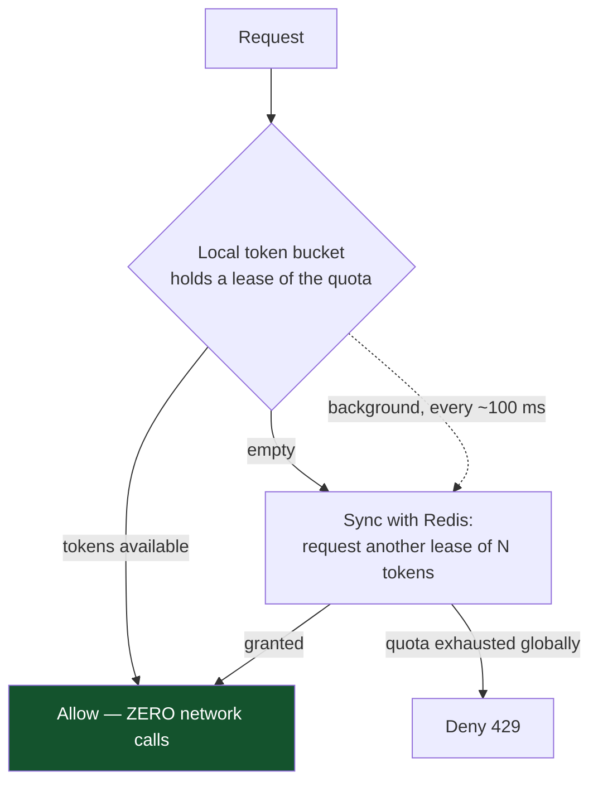
```mermaid
flowchart TD
    R["Request"] --> L{"Local token bucket<br/>holds a lease of the quota"}
    L -->|"tokens available"| A["Allow — ZERO network calls"]
    L -->|"empty"| S["Sync with Redis:<br/>request another lease of N tokens"]
    S -->|"granted"| A
    S -->|"quota exhausted globally"| D["Deny 429"]
    L -.->|"background, every ~100 ms"| S
    style A fill:#14532d,color:#fff
```

Each node leases a slice of the global budget and spends it locally. The accuracy
cost is bounded by the lease size; the latency saving is nearly total. This is how
high-throughput gateways get global limits without a Redis call per request.

### Failure behaviour

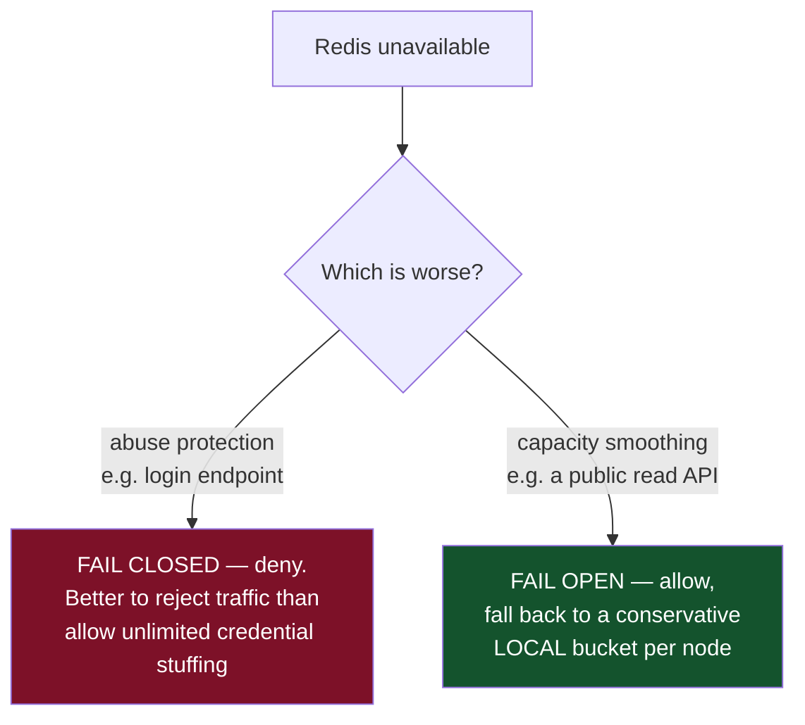
```mermaid
flowchart TD
    F["Redis unavailable"] --> D{"Which is worse?"}
    D -->|"abuse protection<br/>e.g. login endpoint"| C["FAIL CLOSED — deny.<br/>Better to reject traffic than<br/>allow unlimited credential stuffing"]
    D -->|"capacity smoothing<br/>e.g. a public read API"| O["FAIL OPEN — allow,<br/>fall back to a conservative<br/>LOCAL bucket per node"]
    style C fill:#7d1128,color:#fff
    style O fill:#14532d,color:#fff
```

Fail-open with a local fallback bucket is the answer for most endpoints: you keep
serving, and you still have a per-node cap that prevents unbounded damage.

### Trade-offs

| Choice | Cost | Flips when |
|---|---|---|
| Sliding window counter | Slight approximation at boundaries | Sorted-set log if exactness were legally required and volume were low |
| Local leases | Accuracy bounded by lease size | Central-only if limits were billing-critical |
| Fail open | An outage could let a burst through | Fail closed for auth and anything abuse-related |

---

## 5. Notification service

### Requirements

Send notifications across push, email, SMS and in-app; respect per-user preferences
and quiet hours; deduplicate; never send the same notification twice; handle
provider outages; support both transactional (immediate) and digest (batched).

### Architecture

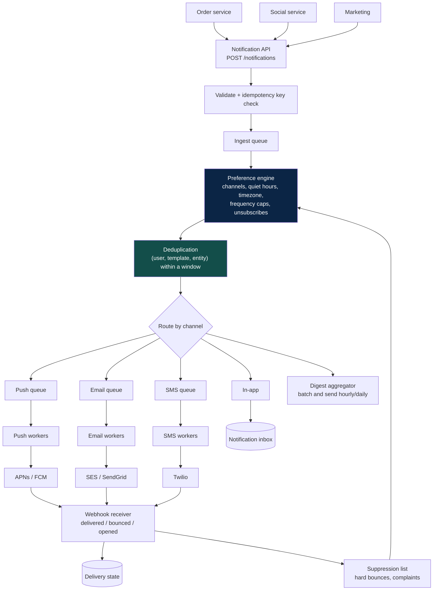
```mermaid
flowchart TD
    P1["Order service"] --> API["Notification API<br/>POST /notifications"]
    P2["Social service"] --> API
    P3["Marketing"] --> API

    API --> V["Validate + idempotency key check"]
    V --> Q["Ingest queue"]
    Q --> PREF["Preference engine<br/>channels, quiet hours, timezone,<br/>frequency caps, unsubscribes"]
    PREF --> DEDUP["Deduplication<br/>(user, template, entity) within a window"]
    DEDUP --> ROUTE{"Route by channel"}

    ROUTE --> PUSHQ["Push queue"] --> PW["Push workers"] --> APNS["APNs / FCM"]
    ROUTE --> MAILQ["Email queue"] --> MW["Email workers"] --> ESP["SES / SendGrid"]
    ROUTE --> SMSQ["SMS queue"] --> SW["SMS workers"] --> TW["Twilio"]
    ROUTE --> INAPPQ["In-app"] --> IDB[("Notification inbox")]

    APNS & ESP & TW --> WH["Webhook receiver<br/>delivered / bounced / opened"]
    WH --> ST[("Delivery state")]
    WH --> SUP["Suppression list<br/>hard bounces, complaints"]
    SUP --> PREF

    ROUTE --> DIG["Digest aggregator<br/>batch and send hourly/daily"]
    style PREF fill:#0b2545,color:#fff
    style DEDUP fill:#134e4a,color:#fff
```

### The hard parts

**Deduplication across retries and producers.** The same event can arrive twice
(at-least-once delivery) and two producers can independently decide to notify about
the same thing. The dedup key is `(user_id, template_id, entity_id, time_bucket)`
stored with a unique constraint and a TTL. Note this is different from — and
required *in addition to* — the API-level idempotency key, which only covers a
single producer's retries.

**Provider failure.** Every provider will have an outage. Each channel needs a
primary and a secondary with automatic failover, a circuit breaker, and per-provider
rate limits (providers throttle you, and exceeding it gets you blocked). Delivery
state must be tracked per attempt so a failover does not resend what already
succeeded.

**Preference evaluation is a hot path.** Quiet hours require the user's timezone;
frequency caps require a rolling count; unsubscribes are legally binding and must
never be bypassed by a bug. Cache preferences aggressively, but invalidate on change
immediately — sending to someone who has unsubscribed is a regulatory problem in
most jurisdictions.

**Fan-out spikes.** "New season available" to 50 M users creates a burst that will
destroy your providers' rate limits and your own database. Schedule it as a
throttled campaign with a target rate, spread over hours, prioritised below
transactional traffic.

### Trade-offs

| Choice | Cost | Flips when |
|---|---|---|
| Separate queue per channel | More infrastructure | Enables per-channel scaling and isolation — one slow provider cannot block push |
| At-least-once + dedup | Dedup state to maintain | Exactly-once is unavailable; this is the only correct construction |
| Digest for low-priority | Added latency for those notifications | Immediate for transactional, always |

---

## 6. Video streaming

### Requirements

Upload; transcode to multiple resolutions and bitrates; adaptive playback; global
delivery; resumable viewing; live streaming as a stretch goal.

### Estimation

```
Uploads       500 hours/minute → 8.3 hours/s of source video
Source        ~5 GB/hour → 42 GB/s ingest
Transcoded    ~6 renditions ≈ 1.5x source → ~63 GB/s of output written
Views         1 B hours/day watched
Bitrate       average 3 Mbps → 1B hrs x 3600 s x 3 Mbit / 86400 s ≈ 125 Tbps peak-ish
              → CDN is not optional; it IS the system
Storage       growing by petabytes weekly → tiering is mandatory
```

### Upload and transcode pipeline

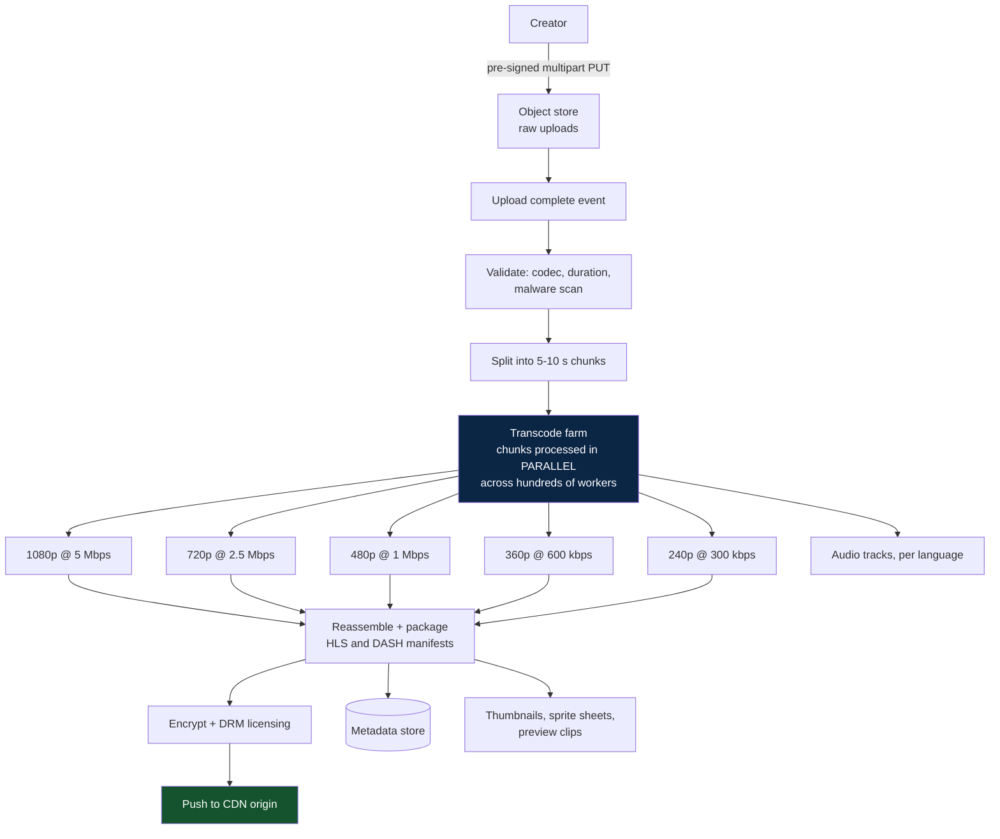
```mermaid
flowchart TD
    U["Creator"] -->|"pre-signed multipart PUT"| S3["Object store<br/>raw uploads"]
    S3 --> EV["Upload complete event"]
    EV --> VAL["Validate: codec, duration,<br/>malware scan"]
    VAL --> SEG["Split into 5-10 s chunks"]
    SEG --> FARM["Transcode farm<br/>chunks processed in PARALLEL<br/>across hundreds of workers"]

    FARM --> R1["1080p @ 5 Mbps"]
    FARM --> R2["720p @ 2.5 Mbps"]
    FARM --> R3["480p @ 1 Mbps"]
    FARM --> R4["360p @ 600 kbps"]
    FARM --> R5["240p @ 300 kbps"]
    FARM --> AUD["Audio tracks, per language"]

    R1 & R2 & R3 & R4 & R5 --> ASM["Reassemble + package<br/>HLS and DASH manifests"]
    ASM --> DRM["Encrypt + DRM licensing"]
    DRM --> CDN["Push to CDN origin"]
    ASM --> META[("Metadata store")]
    ASM --> THUMB["Thumbnails, sprite sheets,<br/>preview clips"]
    style FARM fill:#0b2545,color:#fff
    style CDN fill:#14532d,color:#fff
```

**Chunked parallel transcoding is the key idea.** A two-hour film transcoded
serially takes many hours; split into 5-second chunks and distributed across 1,400
workers, it completes in minutes. The chunks must be split at **keyframe
boundaries** so each is independently decodable, and the encoder settings must be
identical across workers so the reassembled stream does not visibly change quality
at chunk boundaries.

### Adaptive bitrate playback

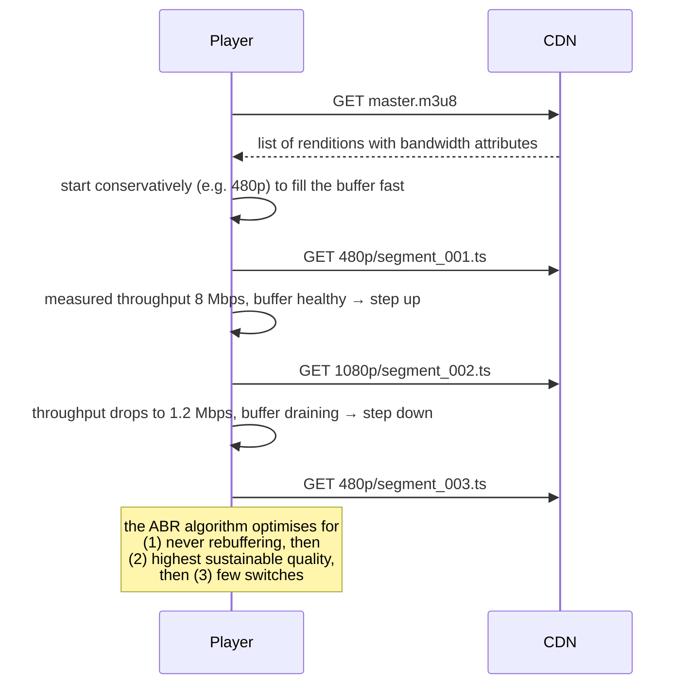
```mermaid
sequenceDiagram
    participant P as Player
    participant C as CDN

    P->>C: GET master.m3u8
    C-->>P: list of renditions with bandwidth attributes
    P->>P: start conservatively (e.g. 480p) to fill the buffer fast
    P->>C: GET 480p/segment_001.ts
    P->>P: measured throughput 8 Mbps, buffer healthy → step up
    P->>C: GET 1080p/segment_002.ts
    P->>P: throughput drops to 1.2 Mbps, buffer draining → step down
    P->>C: GET 480p/segment_003.ts
    Note over P: the ABR algorithm optimises for<br/>(1) never rebuffering, then<br/>(2) highest sustainable quality,<br/>then (3) few switches
```

**Rebuffering is far worse than lower quality.** Every ABR heuristic is built around
that ranking: buffer occupancy is weighted more heavily than measured bandwidth,
because a stall is the one thing viewers actually abandon over.

### Trade-offs

| Choice | Cost | Flips when |
|---|---|---|
| Per-title/per-shot encoding | Much more compute per video | Massive bandwidth saving for high-view content — do it for the head, not the long tail |
| Transcode everything up front | Wasted compute on videos nobody watches | Transcode low renditions eagerly, high renditions on first demand |
| Multi-CDN | Complexity, per-vendor tuning | Almost always right at scale: availability, price negotiation, regional performance |

---

## 7. Ride hailing

### Requirements

Riders request a ride; drivers publish location continuously; the system matches
them; both track the trip live; pricing including surge; payment on completion.

### Estimation

```
Drivers online      1 M concurrent
Location updates    every 4 s → 250,000 writes/s of location data
Ride requests       5,000/s peak
Matching latency    must feel instant → p99 < 2 s end to end
```

The location write volume is the defining number: 250k writes/s of ephemeral data
that is worthless 10 seconds later. **It must not go into the primary database.**

### Geospatial indexing

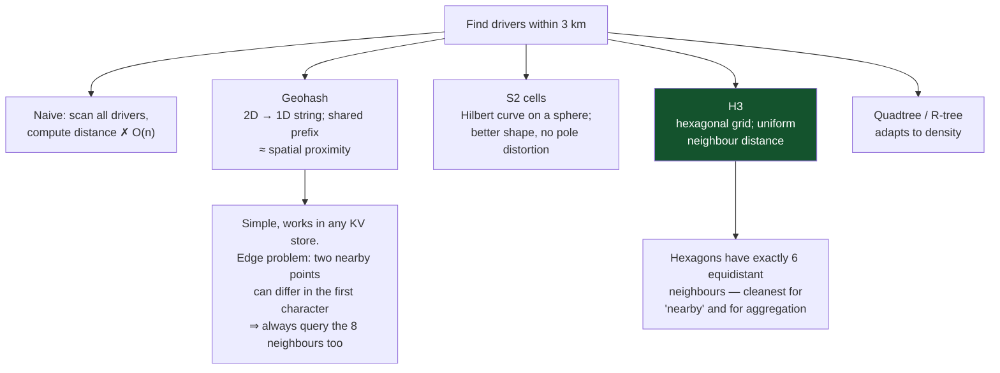
```mermaid
flowchart TD
    Q["Find drivers within 3 km"] --> A["Naive: scan all drivers,<br/>compute distance ✗ O(n)"]
    Q --> B["Geohash<br/>2D → 1D string; shared prefix<br/>≈ spatial proximity"]
    Q --> C["S2 cells<br/>Hilbert curve on a sphere;<br/>better shape, no pole distortion"]
    Q --> D["H3<br/>hexagonal grid; uniform<br/>neighbour distance"]
    Q --> E["Quadtree / R-tree<br/>adapts to density"]
    B --> BN["Simple, works in any KV store.<br/>Edge problem: two nearby points<br/>can differ in the first character<br/>⇒ always query the 8 neighbours too"]
    D --> DN["Hexagons have exactly 6 equidistant<br/>neighbours — cleanest for<br/>'nearby' and for aggregation"]
    style D fill:#14532d,color:#fff
```

### Architecture

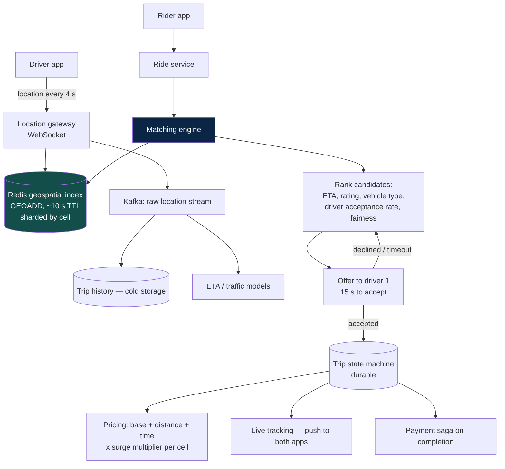
```mermaid
flowchart TD
    D["Driver app"] -->|"location every 4 s"| LG["Location gateway<br/>WebSocket"]
    LG --> LOC[("Redis geospatial index<br/>GEOADD, ~10 s TTL<br/>sharded by cell")]
    LG --> STR["Kafka: raw location stream"]
    STR --> HIST[("Trip history — cold storage")]
    STR --> ETA["ETA / traffic models"]

    R["Rider app"] --> RS["Ride service"]
    RS --> M["Matching engine"]
    M --> LOC
    M --> RANK["Rank candidates:<br/>ETA, rating, vehicle type,<br/>driver acceptance rate, fairness"]
    RANK --> OFFER["Offer to driver 1<br/>15 s to accept"]
    OFFER -->|"declined / timeout"| RANK
    OFFER -->|"accepted"| TRIP[("Trip state machine<br/>durable")]

    TRIP --> PRICE["Pricing: base + distance + time<br/>x surge multiplier per cell"]
    TRIP --> TRACK["Live tracking — push to both apps"]
    TRIP --> PAY["Payment saga on completion"]
    style LOC fill:#134e4a,color:#fff
    style M fill:#0b2545,color:#fff
```

### The hard part — matching without double-booking

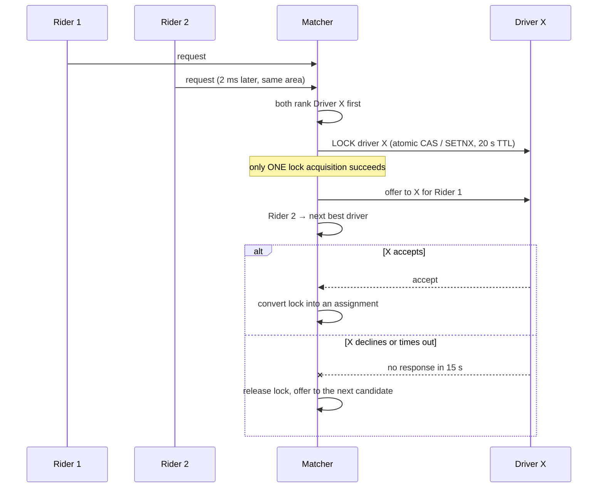
```mermaid
sequenceDiagram
    participant R1 as Rider 1
    participant R2 as Rider 2
    participant M as Matcher
    participant D as Driver X

    R1->>M: request
    R2->>M: request (2 ms later, same area)
    M->>M: both rank Driver X first
    M->>D: LOCK driver X (atomic CAS / SETNX, 20 s TTL)
    Note over M: only ONE lock acquisition succeeds
    M->>D: offer to X for Rider 1
    M->>M: Rider 2 → next best driver
    alt X accepts
        D-->>M: accept
        M->>M: convert lock into an assignment
    else X declines or times out
        D--xM: no response in 15 s
        M->>M: release lock, offer to the next candidate
    end
```

The driver lock is the concurrency control that prevents double-booking. It must
have a TTL (a driver whose app crashes must not be locked forever) and it must be
released explicitly on decline so the next rider is not delayed.

**Batched matching beats greedy matching.** Rather than assigning each request the
instant it arrives, collect requests over a short window (a few seconds) and solve
the assignment as a bipartite matching problem across the whole batch. Global
wait times improve measurably, at the cost of a small added latency per request.

### Trade-offs

| Choice | Cost | Flips when |
|---|---|---|
| Redis for live locations | Location data is lost on failure | Correct — it is worthless after 10 s. Durable history goes to Kafka in parallel |
| 4-second update interval | Coarser tracking | Adaptive: faster when on a trip or near a pickup, slower when idle — halves the write volume |
| Batched matching | Added seconds of latency | Greedy when supply is abundant; batched when it is scarce |

---

## 8. Payment system

### Requirements

Charge a card; never double-charge; handle provider timeouts, refunds and partial
refunds; reconcile with the provider daily; produce an auditable ledger; support
multiple currencies and providers.

### The ledger — double-entry, append-only

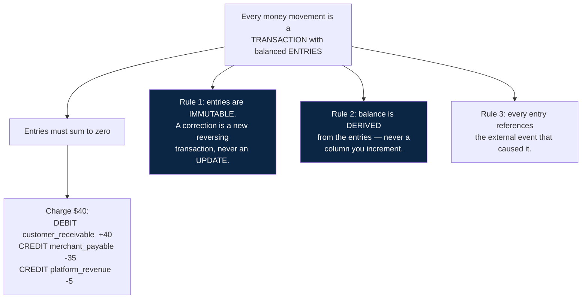
```mermaid
flowchart TD
    T["Every money movement is a<br/>TRANSACTION with balanced ENTRIES"] --> E["Entries must sum to zero"]
    E --> EX["Charge $40:<br/>DEBIT  customer_receivable  +40<br/>CREDIT merchant_payable    -35<br/>CREDIT platform_revenue    -5"]
    T --> R1["Rule 1: entries are IMMUTABLE.<br/>A correction is a new reversing<br/>transaction, never an UPDATE."]
    T --> R2["Rule 2: balance is DERIVED<br/>from the entries — never a<br/>column you increment."]
    T --> R3["Rule 3: every entry references<br/>the external event that caused it."]
    style R1 fill:#0b2545,color:#fff
    style R2 fill:#0b2545,color:#fff
```

An immutable, append-only ledger with derived balances is what makes a payment
system auditable and debuggable. A mutable `balance` column is the design that
guarantees you will one day have money that does not add up and no way to find out
why.

### The payment flow

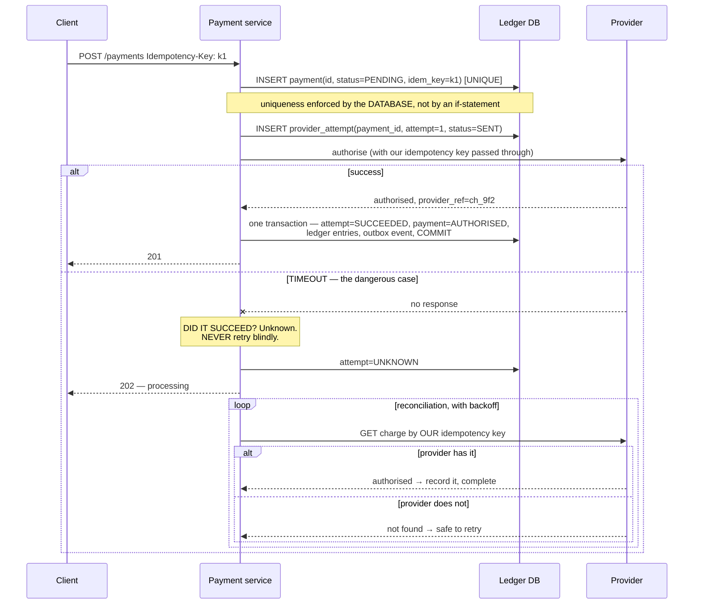
```mermaid
sequenceDiagram
    participant C as Client
    participant P as Payment service
    participant DB as Ledger DB
    participant G as Provider

    C->>P: POST /payments  Idempotency-Key: k1
    P->>DB: INSERT payment(id, status=PENDING, idem_key=k1)  [UNIQUE]
    Note over P,DB: uniqueness enforced by the DATABASE, not by an if-statement
    P->>DB: INSERT provider_attempt(payment_id, attempt=1, status=SENT)
    P->>G: authorise (with our idempotency key passed through)

    alt success
        G-->>P: authorised, provider_ref=ch_9f2
        P->>DB: one transaction — attempt=SUCCEEDED, payment=AUTHORISED,<br/>ledger entries, outbox event, COMMIT
        P-->>C: 201
    else TIMEOUT — the dangerous case
        G--xP: no response
        Note over P: DID IT SUCCEED? Unknown.<br/>NEVER retry blindly.
        P->>DB: attempt=UNKNOWN
        P-->>C: 202 — processing
        loop reconciliation, with backoff
            P->>G: GET charge by OUR idempotency key
            alt provider has it
                G-->>P: authorised → record it, complete
            else provider does not
                G-->>P: not found → safe to retry
            end
        end
    end
```

**The timeout case is the entire difficulty of payments.** A provider timeout means
the charge may or may not have happened. The only safe resolutions are: query the
provider by *your* idempotency key, or retry with the same idempotency key so the
provider itself deduplicates. Retrying with a fresh key is how customers get charged
twice.

### Reconciliation

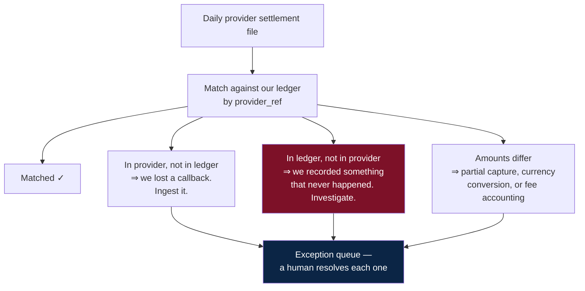
```mermaid
flowchart TD
    D["Daily provider settlement file"] --> M["Match against our ledger<br/>by provider_ref"]
    M --> OK["Matched ✓"]
    M --> A["In provider, not in ledger<br/>⇒ we lost a callback.<br/>Ingest it."]
    M --> B["In ledger, not in provider<br/>⇒ we recorded something<br/>that never happened. Investigate."]
    M --> C["Amounts differ<br/>⇒ partial capture, currency<br/>conversion, or fee accounting"]
    A & B & C --> Q["Exception queue —<br/>a human resolves each one"]
    style B fill:#7d1128,color:#fff
    style Q fill:#0b2545,color:#fff
```

**Reconciliation is not optional and cannot be skipped.** Distributed systems drift;
webhooks are lost; providers have their own incidents. A payment system without
daily reconciliation has undetected errors, not zero errors.

### Trade-offs

| Choice | Cost | Flips when |
|---|---|---|
| Strong consistency on the ledger | Lower throughput than an eventually-consistent store | Never flips. Money requires it |
| Async capture after authorisation | The customer's "success" precedes the actual capture | Standard practice — authorise at checkout, capture at fulfilment |
| Multiple providers | Routing logic, per-provider reconciliation | Worth it above modest volume: availability plus negotiating power |

---

## 9. Web crawler

### Requirements

Crawl billions of pages; respect `robots.txt` and politeness delays; detect
duplicates; prioritise valuable and fresh pages; avoid traps; recrawl at a rate
proportional to change frequency.

### Architecture

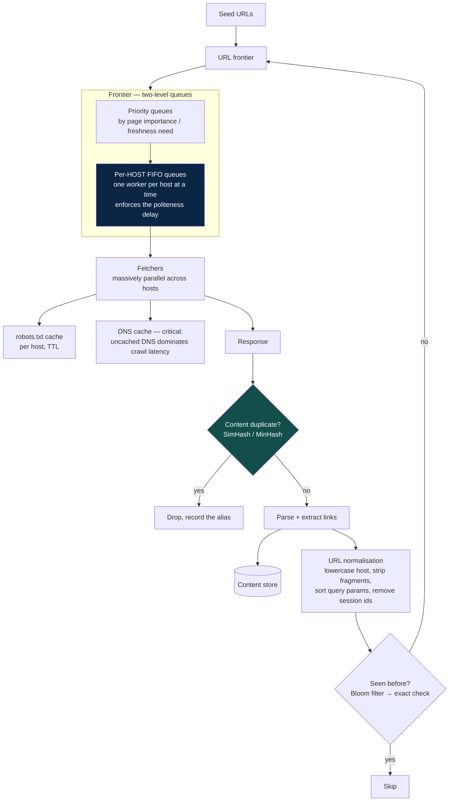
```mermaid
flowchart TD
    SEED["Seed URLs"] --> FR["URL frontier"]
    subgraph frontier["Frontier — two-level queues"]
        PRI["Priority queues<br/>by page importance / freshness need"]
        HOST["Per-HOST FIFO queues<br/>one worker per host at a time<br/>enforces the politeness delay"]
        PRI --> HOST
    end
    FR --> frontier
    HOST --> FET["Fetchers<br/>massively parallel across hosts"]
    FET --> ROB["robots.txt cache<br/>per host, TTL"]
    FET --> DNS["DNS cache — critical:<br/>uncached DNS dominates crawl latency"]
    FET --> RESP["Response"]
    RESP --> DUP{"Content duplicate?<br/>SimHash / MinHash"}
    DUP -->|"yes"| DROP["Drop, record the alias"]
    DUP -->|"no"| PARSE["Parse + extract links"]
    PARSE --> STORE[("Content store")]
    PARSE --> NORM["URL normalisation<br/>lowercase host, strip fragments,<br/>sort query params, remove session ids"]
    NORM --> SEEN{"Seen before?<br/>Bloom filter → exact check"}
    SEEN -->|"no"| FR
    SEEN -->|"yes"| SKIP["Skip"]
    style HOST fill:#0b2545,color:#fff
    style DUP fill:#134e4a,color:#fff
```

### The hard parts

**Politeness is a correctness requirement, not a courtesy.** Hitting one host with
1,000 concurrent requests is indistinguishable from a denial of service attack and
will get you blocked. The two-level frontier solves it: parallelism comes from
crawling *many hosts at once*, never from crawling one host aggressively. Each host
queue enforces a delay (from `Crawl-delay`, or derived from the host's observed
response time — a slow server gets crawled more gently).

**Duplicate detection at two levels.** Exact URL dedup uses a Bloom filter in front
of an exact store — at 100 B of URLs, an exact-only set is impractical, and the
Bloom filter's false positives (skipping a page you have not seen) are an acceptable
loss. **Near-duplicate content** dedup uses SimHash: pages differing only in an ad
or a timestamp produce hashes within a small Hamming distance and are collapsed.

**Traps.** Infinite calendars (`/calendar?date=2099-13-01`), session ids in URLs
generating unlimited variants, and deliberately generated link mazes. Defences: cap
crawl depth per host, cap total URLs per host, detect parameter patterns that
generate unbounded variants, and monitor per-host yield (unique content per fetch)
— a host with a collapsing yield is a trap.

**Recrawl scheduling.** A news homepage changes hourly; an archived PDF never does.
Estimate each page's change rate from observed history and schedule recrawls
proportionally. Getting this right is the difference between a fresh index and
spending your entire crawl budget re-fetching unchanged pages.

### Trade-offs

| Choice | Cost | Flips when |
|---|---|---|
| Bloom filter for seen-URLs | False positives skip some pages | Exact store if completeness were required and scale were smaller |
| Politeness delays | Much slower per host | Non-negotiable — the alternative is being blocked |
| BFS-ish priority order | Slower to reach deep content | Priority by estimated importance rather than pure BFS at scale |

---

## 10. Collaborative editor

### Requirements

Multiple users edit one document simultaneously; changes appear in under 100 ms;
all replicas converge to the identical document; works offline and reconciles on
reconnect; presence and cursors; full version history.

### The convergence problem

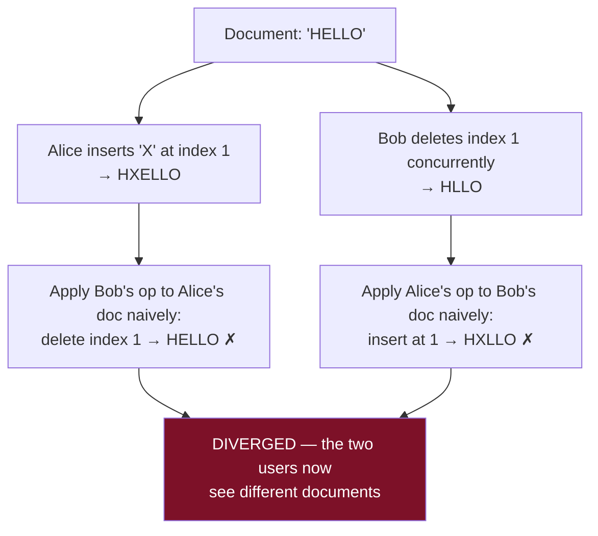
```mermaid
flowchart TD
    D["Document: 'HELLO'"] --> A["Alice inserts 'X' at index 1<br/>→ HXELLO"]
    D --> B["Bob deletes index 1 concurrently<br/>→ HLLO"]
    A --> M["Apply Bob's op to Alice's doc naively:<br/>delete index 1 → HELLO ✗"]
    B --> M2["Apply Alice's op to Bob's doc naively:<br/>insert at 1 → HXLLO ✗"]
    M & M2 --> DIV["DIVERGED — the two users now<br/>see different documents"]
    style DIV fill:#7d1128,color:#fff
```

### The two solutions

```mermaid
flowchart TD
    subgraph ot["Operational Transformation"]
        O1["Operations are (type, index, char)"]
        O2["TRANSFORM each incoming op against<br/>concurrent ops before applying"]
        O3["+ Compact operations, small payloads<br/>+ Proven at scale (Google Docs)<br/>− Transformation functions are subtle;<br/>  N op types ⇒ N² transforms<br/>− Usually needs a central server to order"]
    end
    subgraph crdt["CRDT (sequence types)"]
        C1["Each character gets a unique,<br/>densely-orderable position id"]
        C2["Insert between two ids;<br/>delete = tombstone"]
        C3["+ Merge is commutative — no transforms<br/>+ Works peer-to-peer, offline-first<br/>+ Much easier to prove correct<br/>− Metadata per character<br/>− Tombstones accumulate"]
    end
    style crdt fill:#14532d,color:#fff
```

Modern implementations (Yjs, Automerge) have reduced CRDT overhead dramatically
through run-length encoding of contiguous insertions and periodic garbage
collection of tombstones, which removes the historical objection. **CRDT is the
default choice for new systems**; OT remains where an existing implementation and a
central server already exist.

### Architecture

```mermaid
flowchart TD
    C1["Client 1"] <-->|"WebSocket"| S["Document server<br/>one owner per document"]
    C2["Client 2"] <--> S
    C3["Client 3"] <--> S

    S --> MEM["In-memory doc state<br/>+ pending update log"]
    S -->|"debounced snapshot"| DB[("Document store<br/>snapshot + update log")]
    S --> PRES["Presence: cursors, selections,<br/>ephemeral — never persisted"]
    S --> HIST["Version history:<br/>periodic snapshots + the update log"]

    C1 --> L["Local CRDT replica —<br/>edits apply INSTANTLY,<br/>then sync in the background"]
    style L fill:#14532d,color:#fff
    style S fill:#0b2545,color:#fff
```

**Local-first is what makes it feel fast.** The edit applies to the local replica
immediately with zero latency; synchronisation happens afterwards. Because CRDT
merges are commutative, there is never a rollback or a visual jump — which is
exactly what makes this architecture superior to optimistic-update-with-rollback for
text.

**Document ownership** matters for scale: route all connections for a document to
one server so its state lives in one place. That server is a single point of
failure for that document, so persist the update log continuously and make
recovery a matter of replaying it onto the last snapshot.

### Trade-offs

| Choice | Cost | Flips when |
|---|---|---|
| CRDT over OT | Per-character metadata, tombstones | OT if payload size were the binding constraint and a central server already existed |
| Server-per-document | A failure affects that document's editors | Necessary for state locality; mitigate with fast recovery from the log |
| Snapshot + log | Storage for both | Snapshot frequency tunes recovery time against storage cost |

---

## Cross-cutting lessons

Reading these ten together, the same handful of moves recur:

| Move | Appears in |
|---|---|
| **Precompute the read path** | Feed timelines, video renditions, search indexes |
| **Make the write path async** | Analytics, notifications, transcoding, fan-out |
| **Idempotency keys on every unsafe operation** | Payments, notifications, chat, ride requests |
| **A hot/cold split by entity size or popularity** | Celebrity fan-out, video encoding tiers, hot shards |
| **Ephemeral data never touches the durable store** | Driver locations, presence, cursors |
| **A derived store with a defined rebuild path** | Search, timelines, projections, ledger balances |
| **Explicit degradation before overload** | Every one of them |

---

[← previous: Security](10-security.md) · [back to the handbook](../README.md) · [next: Interview playbook →](12-interview-playbook.md)
