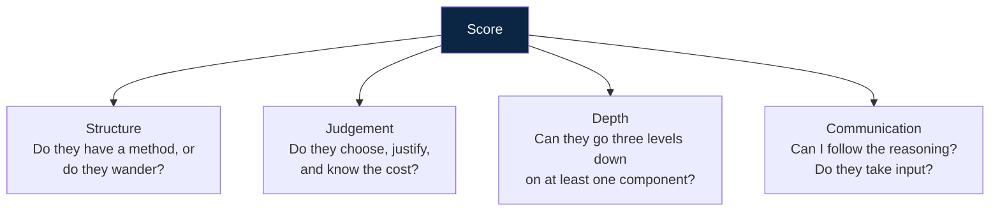
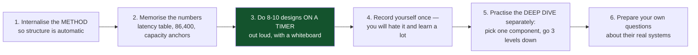

# 12 — The Interview Playbook

*Minute-by-minute structure, the scoring rubric, and the language that signals seniority.*

[← back to the handbook](../README.md)

---

## 1. What is actually being assessed

A system design interview is not a knowledge test. Interviewers are scoring four
things, roughly equally:



The most common failure is not ignorance. It is **drawing boxes with no numbers, no
justification, and no stated cost** — a design that cannot be wrong, because it
never claimed anything.

---

## 2. The 45-minute structure

| Time | Phase | Output |
|---|---|---|
| **0–5** | Requirements | 3–4 in-scope features, deferred list, NFR targets |
| **5–8** | Estimation | QPS, storage, read:write ratio, one architectural conclusion |
| **8–13** | API + data model | Endpoints, the sync/async boundary, access patterns |
| **13–25** | High-level design | 5–9 boxes, labelled arrows, the request path traced |
| **25–38** | Deep dive | One component, three levels down |
| **38–43** | Scale and failure | Bottlenecks, what breaks at 10×, failure behaviour |
| **43–45** | Trade-offs | What you gave up, and when you would flip |

### Phase 1 — Requirements (0–5 min)

Do not draw. Ask, then **restate and confirm**.

```
"Before I design anything — a few questions.

 Scope:      Should I cover posting and reading the feed, or also search,
             notifications and moderation?
 Scale:      Roughly how many daily active users? And is this read-heavy?
 Latency:    What's the target for feed load — is 200 ms p99 about right?
 Freshness:  Is it acceptable for a post to take a few seconds to appear
             in a follower's feed?
 Geography:  Single region or global?"

"So to confirm: 100 M DAU, read-heavy at roughly 100:1, feed p99 under 200 ms,
 a few seconds of staleness is fine for other people's posts but a user must
 see their own post immediately, global. I'll cover posting, following and the
 feed, and defer search and notifications. Sound right?"
```

That confirmation sentence is worth more than the next ten minutes of drawing. It
demonstrates scoping, prioritisation, and the ability to make ambiguity concrete —
which is the actual job.

### Phase 2 — Estimation (5–8 min)

Compute out loud, round aggressively, and **end with a conclusion**:

```
"100 M DAU, 2 posts each → 200 M writes/day → about 2,300/s, call it 7,000 at peak.
 20 feed views each → 2 B/day → about 23,000/s, 70,000 at peak.
 So reads are roughly 10x writes on request count.

 But the number that matters is fan-out: 2,300 posts/s times an average 200
 followers is 460,000 timeline writes per second. That's the thing that decides
 the architecture, and it's why I'm not going to fan out to everyone."
```

The last sentence is the point of the whole phase. An estimate that does not change
a decision was a ritual.

### Phase 3 — API and data model (8–13 min)

Six lines of API, then the access patterns. Keep it fast — this phase exists to
make the sync/async boundary explicit, not to design a REST contract.

### Phase 4 — High-level design (13–25 min)

Draw the boxes. Then **trace one complete request through them out loud** — this is
what turns a diagram into a design, and it is where you find your own gaps.

```
"Let me walk a feed request through. Client hits the CDN — miss, it's
 personalised. Gateway authenticates, rate limits, routes to the feed service.
 Feed service reads the precomputed timeline from Redis — that's a single range
 read, sub-millisecond. It also fetches recent posts from any celebrities this
 user follows, because those weren't fanned out. Merges the two, ranks, then
 hydrates post content from the content cache. Total: two cache reads plus a
 merge. Should be well under 50 ms."
```

### Phase 5 — Deep dive (25–38 min)

This is where the score is decided. Pick the hard part — or ask which the
interviewer wants — and go **three levels down**:

```
Level 1: "Fan-out happens asynchronously via a queue."
Level 2: "Workers consume PostCreated, look up followers, and append the post id
          to each follower's Redis list, capped at 800 entries."
Level 3: "For a user with 50 M followers that's 50 M writes from one action, which
          would saturate the fan-out tier and delay everyone else's posts. So above
          about 100k followers we skip fan-out entirely and mark the post as
          celebrity-sourced. The feed service then does a second read for posts
          from followed celebrities and merges at read time. That bounds fan-out
          cost while keeping the read path to two lookups. The cost is a second
          code path and a merge on every read — I think that's clearly worth it,
          since the alternative is that one account can degrade the whole system."
```

Level 3 — naming the failure mode, the fix, and the cost of the fix — is what
distinguishes a senior answer.

### Phase 6 — Scale and failure (38–43 min)

Volunteer these; do not wait to be asked.

```
"Bottlenecks: the fan-out tier is the first thing to saturate — it's queue-based,
 so it degrades as lag rather than errors, which is the right failure mode.
 Redis memory is the second; timelines are capped and rebuildable from the posts
 store, so I'd tier cold users to disk before adding nodes.

 Failure: if Redis is down, feeds fall back to fan-out on read — slower but
 functional. If the fan-out workers are down, posts still succeed and timelines
 catch up when they recover; users see their own posts because I insert those
 synchronously. If the ranking service is down, I serve reverse-chronological.

 At 10x, the fan-out tier scales horizontally by partition. The graph service
 becomes the concern — I'd shard the follower lists by user id and cache the
 hot ones."
```

### Phase 7 — Trade-offs (43–45 min)

```
"The main things I traded away: the feed is eventually consistent, so a post can
 take a few seconds to reach followers — acceptable here, and I'd not spend
 anything to fix it. I've got two fan-out paths, which is real complexity, and
 I'd only accept that because the celebrity case genuinely breaks the simple
 design. And I've assumed a Redis-sized hot set; if timelines grew past what's
 economical in memory, I'd move to a disk-backed store with a memory cache in
 front and accept slightly higher read latency."
```

---

## 3. The rubric, made explicit

| Dimension | Below bar | At bar | Above bar |
|---|---|---|---|
| **Requirements** | Starts drawing immediately | Asks about scale and latency | Scopes explicitly, confirms, names what is deferred and why |
| **Estimation** | Skips it, or numbers with no consequence | Computes QPS and storage | Derives an architectural conclusion from the numbers |
| **Design** | Boxes with unlabelled arrows | Coherent, complete request path | Justifies each component and names what it costs |
| **Depth** | Stays at the naming layer | Explains one component's mechanism | Three levels down, including its failure mode |
| **Failure** | Not mentioned until asked | Answers when prompted | Volunteers failure behaviour per component |
| **Trade-offs** | "It scales" | States one or two | Choice + cost + the condition that flips it |
| **Communication** | Silent or rambling | Clear, follows a structure | Signposts, checks in, incorporates hints immediately |

---

## 4. Handling the interview's dynamics

**When you are given a hint, take it.** A hint means the interviewer has decided
where they want depth. "Have you thought about what happens when a celebrity posts?"
is not a curiosity — it is the question they are scoring. Ignoring it to finish your
current thought is the most expensive mistake available.

**When you do not know something, say so and reason anyway.**

> "I don't know Cassandra's exact repair mechanism. What I need here is a store
> that takes very high write volume, scales horizontally, and gives me ordered
> range scans within a partition — that's what makes me reach for a wide-column
> store. If that's wrong for a reason I'm missing, I'd want to know."

This scores *well*. Confidently inventing details scores badly and is easy to catch.

**When you realise you were wrong, correct it cleanly and move on.**

> "Actually, that doesn't hold — with hash partitioning I can't do the range scan
> I described. Let me use a composite key: hash on user_id for distribution, sort
> by timestamp within the partition. That gives me both."

Self-correction is a positive signal, not a negative one. Defending a broken design
is the negative signal.

**Manage the clock yourself.** If you are 25 minutes in and still drawing boxes,
say: "I'm going to stop the breadth here and go deep on the fan-out, since that's
where the difficulty is — shall I?"

---

## 5. Phrases that work

| Situation | Say |
|---|---|
| Opening | "Let me make sure I understand the scope before I design anything." |
| After estimating | "That number changes the design — here's how." |
| Choosing | "I'll use X. The cost is Y, which is acceptable because Z." |
| Deferring | "I'm going to defer search — happy to come back if you'd like." |
| Uncertain | "I'm not certain of the mechanism, but the property I need is…" |
| Corrected | "You're right — let me fix that." |
| Deep dive | "Let me go a level deeper on this, since it's the hard part." |
| Failure | "If this component is *slow* rather than down, here's what happens…" |
| Closing | "The things I traded away are…, and I'd revisit if…" |

## 6. Phrases that hurt

| Instead of | Say |
|---|---|
| "It scales horizontally." | "It scales horizontally because it's stateless; the constraint moves to the database, which I'd shard by user id." |
| "We'll use Kafka." | "I need durable, replayable, ordered-per-user events with multiple consumers — that's a log, so Kafka or equivalent." |
| "We'll add a cache." | "Reads are 100:1 and the hot set is ~40 GB, so a cache absorbs most of the read load. I'll use cache-aside with a jittered TTL." |
| "It depends." | "It depends on X. If X is high I'd do A; if low, B. Given what you said earlier, I'll assume A." |
| "That's just an implementation detail." | "That's below the level I'd normally design at, but the part that matters here is…" |

---

## 7. Preparation that actually helps



The single highest-value preparation is **doing designs out loud on a timer**.
Reading about system design builds recognition; speaking a design under time
pressure builds the skill that is actually tested. Most people who fail these
interviews know the material and have never once said it aloud in 45 minutes.

Work the ten designs in [`docs/11-case-studies.md`](11-case-studies.md) that way:
timer on, talk continuously, draw as you go, and afterwards compare against the
written version to find what you skipped.

---

[← previous: Case studies](11-case-studies.md) · [back to the handbook](../README.md) · [next: Numbers and cheat sheets →](13-numbers-and-cheatsheets.md)
